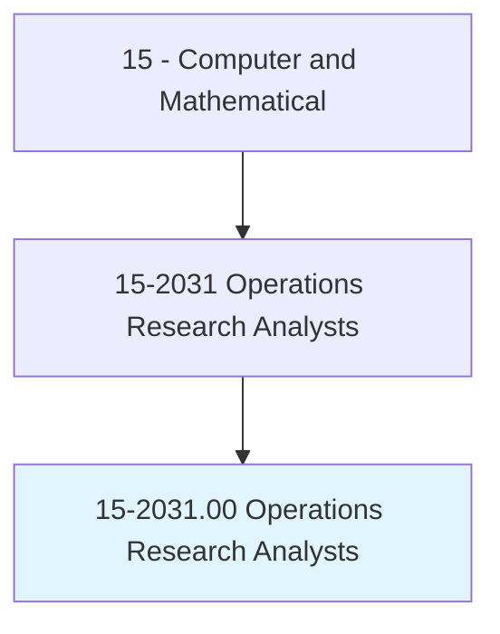
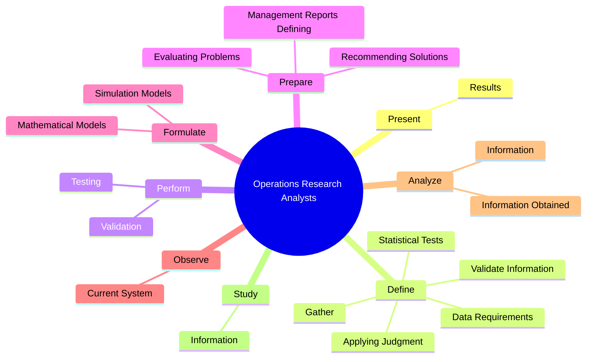
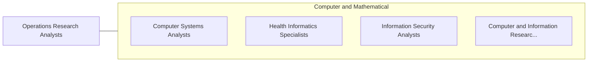

# Operations Research Analysts

> Formulate and apply mathematical modeling and other optimizing methods to develop and interpret information that assists management with decisionmaking, policy formulation, or other managerial functions. May collect and analyze data and develop decision support software, services, or products. May develop and supply optimal time, cost, or logistics networks for program evaluation, review, or implementation.

## Overview

Operations Research Analysts is an occupation within the Computer and Mathematical category. Formulate and apply mathematical modeling and other optimizing methods to develop and interpret information that assists management with decisionmaking, policy formulation, or other managerial functions. May collect and analyze data and develop decision support software, services, or products.

## Classification Hierarchy

## Key Statistics

| Metric | Value |
|--------|-------|
| SOC Code | 15-2031.00 |
| Category | [Computer and Mathematical](/occupations/Technology) |
| Task Count | 69 |
| Source | O*NET |

## Core Tasks

### present.Results

Operations Research Analysts present results as part of their core responsibilities.

**Actions:**
- `present.Results.of.MathematicalModelingAnalysisToManagementOtherEndUsers`
- `present.Results.of.DataAnalysisToManagementOtherEndUsers`

### define.DataRequirements

Operations Research Analysts define data requirements as part of their core responsibilities.

**Actions:**
- `define.DataRequirements`
- `define.Gather`
- `define.ValidateInformation`
- `define.ApplyingJudgment`

### perform.Validation

Operations Research Analysts perform validation as part of their core responsibilities.

**Actions:**
- `perform.Validation.of.Models.to.ensure.Adequacy`
- `perform.Validation.of.ReformulateModels`
- `perform.Validation.of.AsNecessary`
- `perform.Testing.of.Models.to.ensure.Adequacy`

## Skills & Competencies

### Technical Skills
- **Programming** - Advanced
- **Systems Analysis** - Advanced
- **Database Management** - Advanced

### Soft Skills
- **Communication** - Essential
- **Problem Solving** - Essential
- **Critical Thinking** - Important
- **Teamwork** - Important
- **Adaptability** - Important

## Related Occupations

## Industries

This occupation is found across multiple industries. See [Industries](/industries) for sector-specific employment data.

## Career Progression

---

*Source: O*NET 15-2031.00 - ONETOccupation*
