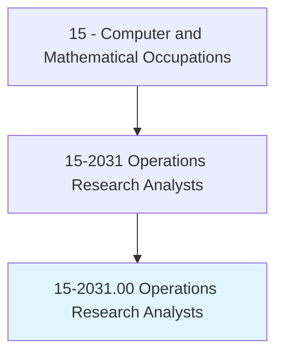
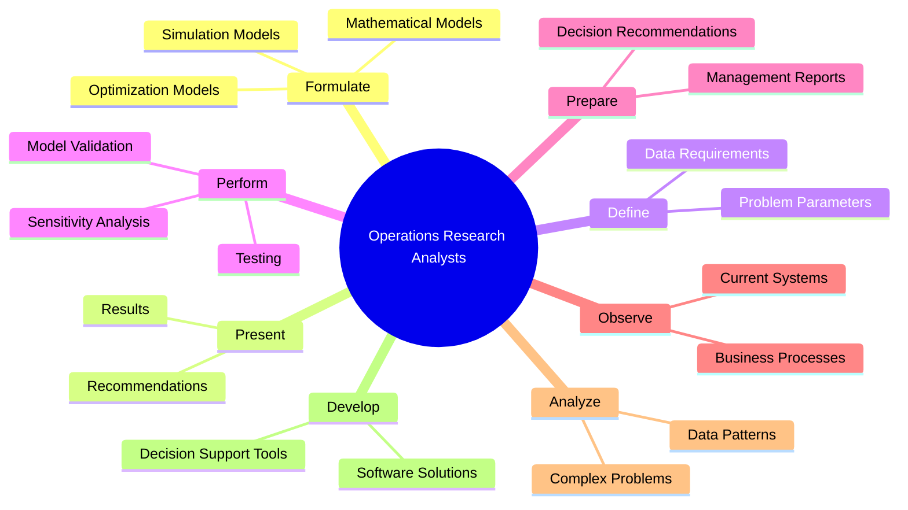
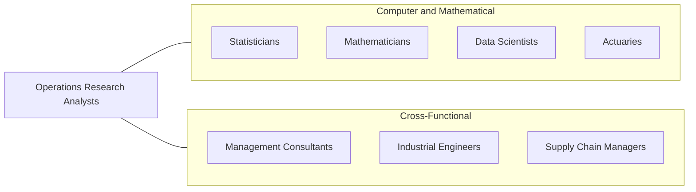
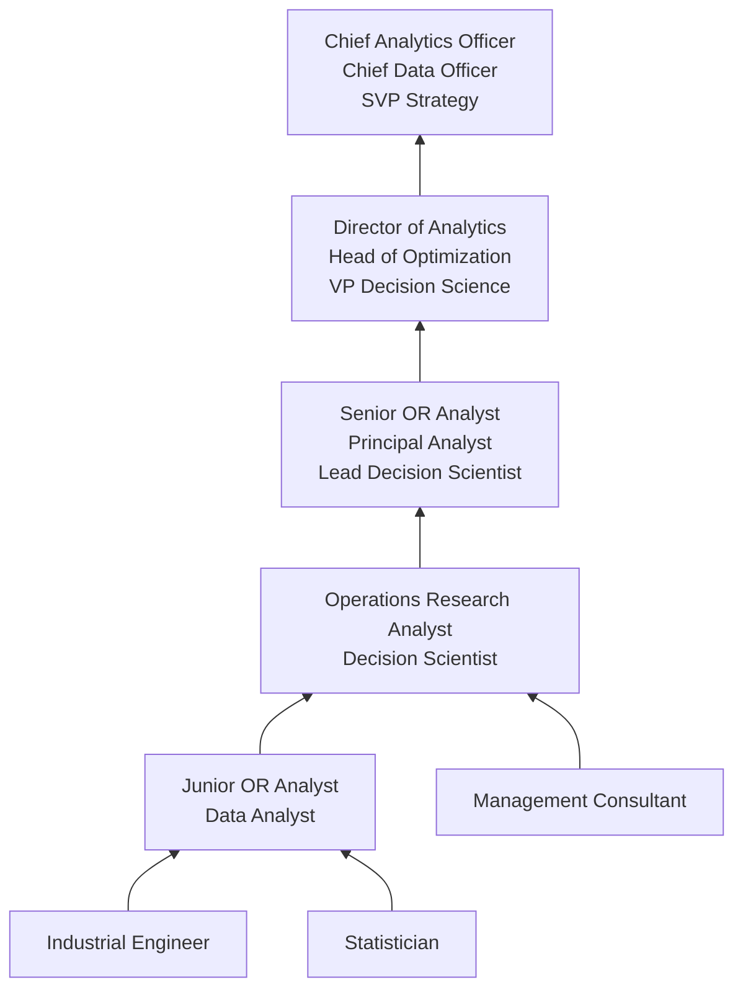

# Operations Research Analysts

> Formulate and apply mathematical modeling and other optimizing methods to develop and interpret information that assists management with decisionmaking, policy formulation, or other managerial functions. May collect and analyze data and develop decision support software, services, or products. May develop and supply optimal time, cost, or logistics networks for program evaluation, review, or implementation.

## Overview

Operations Research Analysts use advanced mathematical and analytical methods to help organizations make better decisions. They formulate mathematical models -- including linear programming, simulation, queueing theory, game theory, and network optimization -- to analyze complex systems and identify optimal solutions for business problems such as supply chain logistics, resource allocation, scheduling, pricing, and strategic planning.

The discipline originated in World War II when mathematicians and scientists were enlisted to optimize military operations, and it has since expanded into virtually every industry. Today's OR analysts work on problems ranging from airline route optimization and hospital patient flow to e-commerce pricing strategies and energy grid management. They collect data, build models, test solutions through simulation, and present recommendations to management in accessible terms.

With the rise of big data and machine learning, operations research has converged with data science, creating hybrid roles that combine OR's optimization and modeling rigor with modern data engineering and predictive analytics capabilities. OR analysts are uniquely positioned to solve decision problems where the goal is not just prediction (what will happen?) but prescription (what should we do?).

## Classification Hierarchy

## Key Statistics

| Metric | Value |
|--------|-------|
| SOC Code | 15-2031.00 |
| Job Zone | 4 (Considerable Preparation) |
| Category | [Computer and Mathematical](/occupations/Technology/index) |
| Task Count | 69 |
| Median Salary | $83,640 |
| Employment | ~104,100 |
| Growth Rate | Much Faster Than Average (23%) |
| Source | O*NET |

## Core Tasks

### formulate.OptimizationModels

Operations Research Analysts create mathematical models to optimize business decisions.

**Actions:**
- `formulate.MathematicalModels.for.BusinessOptimization`
- `formulate.SimulationModels.for.ScenarioAnalysis`
- `formulate.LinearPrograms.for.ResourceAllocation`
- `formulate.StochasticModels.for.UncertaintyAnalysis`

### present.Results

Operations Research Analysts communicate findings and recommendations to decision-makers.

**Actions:**
- `present.Results.of.MathematicalModeling.to.Management`
- `present.Results.of.DataAnalysis.to.Stakeholders`
- `prepare.ManagementReports.with.Recommendations`
- `translate.TechnicalFindings.into.ActionableInsights`

### perform.ModelValidation

Operations Research Analysts verify and refine models to ensure accuracy.

**Actions:**
- `perform.Validation.of.Models.to.ensure.Adequacy`
- `perform.SensitivityAnalysis.to.assess.Robustness`
- `perform.Testing.to.verify.ModelAssumptions`
- `reformulate.Models.based.on.ValidationResults`

### develop.DecisionSupport

Operations Research Analysts build tools and systems for ongoing decision support.

**Actions:**
- `develop.DecisionSupportSoftware.for.OperationalPlanning`
- `develop.OptimizationAlgorithms.for.AutomatedDecisions`
- `develop.DashboardTools.for.ScenarioExploration`
- `supply.OptimalNetworks.for.ProgramEvaluation`

## Tech Stack

### Optimization Software
- **CPLEX** - IBM optimization solver
- **Gurobi** - Mathematical optimization
- **FICO Xpress** - Optimization platform
- **AMPL** - Algebraic modeling language
- **LINGO** - Optimization modeling
- **Google OR-Tools** - Open-source optimization

### Simulation Tools
- **Arena** - Discrete event simulation
- **AnyLogic** - Multi-method simulation
- **Simio** - Simulation modeling
- **SimPy** - Python simulation
- **MATLAB/Simulink** - System simulation

### Programming Languages
- **Python** - Data analysis and modeling
- **R** - Statistical computing
- **SQL** - Data querying
- **Julia** - Optimization and computing
- **MATLAB** - Numerical computing
- **Java/C++** - Production algorithms

### Analytics & Visualization
- **Tableau** - Data visualization
- **Power BI** - Business intelligence
- **Excel/Solver** - Spreadsheet optimization
- **Jupyter Notebooks** - Interactive analysis
- **Pandas/NumPy** - Data manipulation

### Machine Learning
- **Scikit-learn** - Traditional ML
- **TensorFlow/PyTorch** - Deep learning
- **XGBoost** - Gradient boosting
- **PuLP** - Linear programming in Python

## Certifications

| Certification | Provider | Level |
|---------------|----------|-------|
| Certified Analytics Professional (CAP) | INFORMS | Professional |
| Six Sigma Black Belt | ASQ | Professional |
| AWS Machine Learning Specialty | Amazon | Professional |
| SAS Certified Advanced Analytics Professional | SAS | Professional |
| PMP (for OR in project context) | PMI | Professional |

## Skills & Competencies

### Technical Skills
- **Mathematical Modeling** - Expert
- **Optimization (LP, MIP, NLP)** - Expert
- **Simulation** - Expert
- **Statistical Analysis** - Advanced
- **Programming (Python/R)** - Advanced
- **Data Analysis** - Advanced
- **Machine Learning** - Intermediate to Advanced
- **Database Querying (SQL)** - Advanced
- **Decision Analysis** - Expert

### Soft Skills
- **Analytical Thinking** - Critical
- **Communication** - Critical (translating models to business language)
- **Problem Framing** - Critical
- **Business Acumen** - Essential
- **Stakeholder Management** - Essential
- **Presentation Skills** - Essential

## Related Occupations

- [Statisticians](/occupations/Technology/Statisticians)
- [Mathematicians](/occupations/Technology/Mathematicians)
- [Data Scientists](/occupations/Technology/DataScientists)
- [Actuaries](/occupations/Technology/Actuaries)

## Industry Variations

### Logistics & Supply Chain
- Route and network optimization
- Inventory management models
- Warehouse layout optimization
- Last-mile delivery optimization

### Airline / Transportation
- Fleet scheduling and assignment
- Revenue management / yield optimization
- Crew scheduling
- Network planning

### Healthcare
- Patient flow optimization
- Operating room scheduling
- Resource allocation (beds, staff, equipment)
- Epidemiological modeling

### Military / Defense
- Force planning and deployment
- Logistics support optimization
- Threat assessment modeling
- War gaming and simulation

### Finance
- Portfolio optimization
- Risk assessment models
- Pricing algorithms
- Fraud detection systems

### Technology / E-commerce
- Recommendation algorithms
- Dynamic pricing models
- A/B test design and analysis
- Marketplace optimization

## Career Progression

## Education & Training

| Requirement | Details |
|-------------|---------|
| Typical Education | Master's in Operations Research, Industrial Engineering, Applied Mathematics, or related field |
| Alternative Paths | Bachelor's in quantitative field + analytics experience |
| Work Experience | 0-2 years entry (with MS), 3-5 years mid |
| Key Knowledge Areas | Linear algebra, optimization, probability, simulation, programming |
| Continuing Education | INFORMS conferences, new solver and tool training |

## Departments

This occupation typically works in:
- Analytics / Decision Science
- [Operations](/departments/Operations)
- [Supply Chain](/departments/SupplyChain)
- [Strategy & Planning](/departments/Strategy)
- Research & Development

---

*Source: O*NET 15-2031.00 - ONETOccupation*
