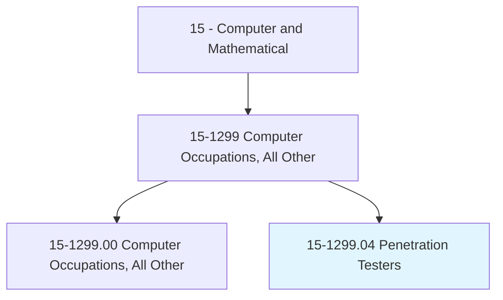
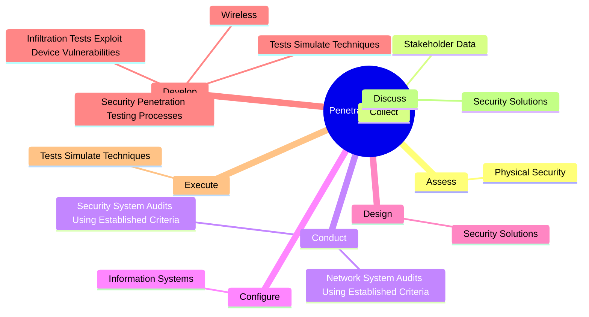
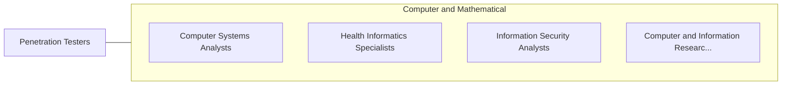

# Penetration Testers

> Evaluate network system security by conducting simulated internal and external cyberattacks using adversary tools and techniques. Attempt to breach and exploit critical systems and gain access to sensitive information to assess system security.

## Overview

Penetration Testers is a specialized variant within the Computer and Mathematical category. Evaluate network system security by conducting simulated internal and external cyberattacks using adversary tools and techniques. 

## Classification Hierarchy

## Key Statistics

| Metric | Value |
|--------|-------|
| SOC Code | 15-1299.04 |
| Category | [Computer and Mathematical](/occupations/Technology) |
| Task Count | 46 |
| Source | O*NET |

## Core Tasks

### assess.PhysicalSecurity

Penetration Testers assess physical security as part of their core responsibilities.

**Actions:**
- `assess.PhysicalSecurity.of.Servers`
- `assess.PhysicalSecurity.of.Systems`
- `assess.PhysicalSecurity.of.NetworkDevices.to.identify.VulnerabilityToTemperature`
- `assess.PhysicalSecurity.of.Vandalism`

### collect.StakeholderData

Penetration Testers collect stakeholder data as part of their core responsibilities.

**Actions:**
- `collect.StakeholderData.to.evaluate.RiskDevelopMitigationStrategies`
- `collect.StakeholderData.to.ToDevelopMitigationStrategies`

### conduct.NetworkSystemAuditsUsingEstablishedCriteria

Penetration Testers conduct network system audits using established criteria as part of their core responsibilities.

**Actions:**
- `conduct.NetworkSystemAuditsUsingEstablishedCriteria`
- `conduct.SecuritySystemAuditsUsingEstablishedCriteria`

## Skills & Competencies

### Technical Skills
- **Programming** - Advanced
- **Systems Analysis** - Advanced
- **Database Management** - Advanced

### Soft Skills
- **Communication** - Essential
- **Problem Solving** - Essential
- **Critical Thinking** - Important
- **Teamwork** - Important
- **Adaptability** - Important

## Related Occupations

## Industries

This occupation is found across multiple industries. See [Industries](/industries) for sector-specific employment data.

## Career Progression

---

*Source: O*NET 15-1299.04 - ONETOccupation*
