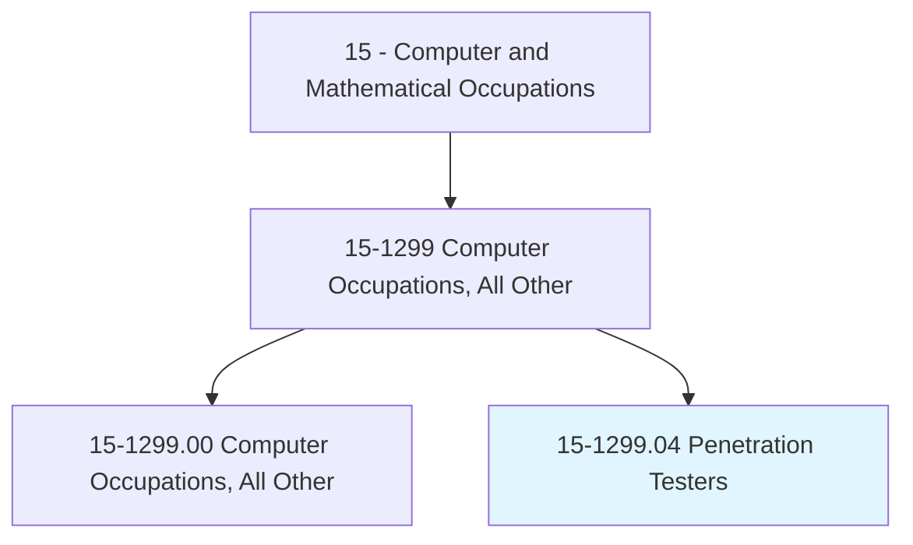
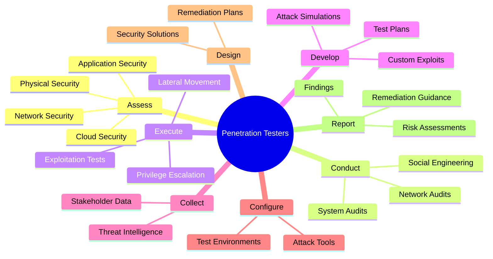
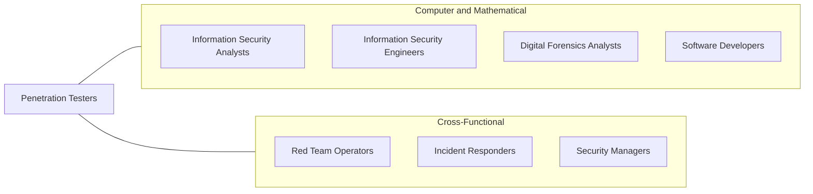
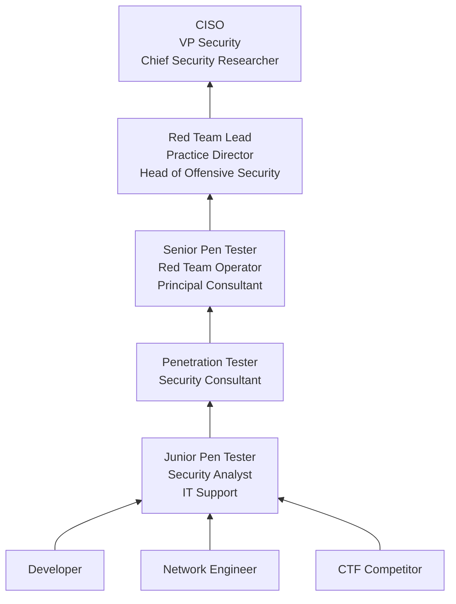

# Penetration Testers

> Evaluate network system security by conducting simulated internal and external cyberattacks using adversary tools and techniques. Attempt to breach and exploit critical systems and gain access to sensitive information to assess system security.

## Overview

Penetration Testers (pen testers) are cybersecurity professionals who simulate real-world cyberattacks against an organization's systems, networks, and applications to identify vulnerabilities before malicious actors can exploit them. They use the same tools, techniques, and procedures (TTPs) as threat actors -- including social engineering, network exploitation, web application attacks, and privilege escalation -- but in a controlled, authorized manner to improve defensive capabilities.

The role requires an adversarial mindset combined with deep technical expertise. Pen testers must understand operating systems at a kernel level, network protocols in detail, web application architectures, mobile platforms, cloud environments, and the latest exploitation techniques. They conduct methodical assessments, document findings with clear severity ratings and remediation guidance, and present results to technical teams and executive leadership.

Penetration testing has grown from a niche activity into a regulatory requirement in many industries. Standards such as PCI-DSS, HIPAA, SOC 2, and various government mandates require periodic penetration testing. The field has also expanded to include red team operations (simulating advanced persistent threats), purple team exercises (collaborative attacker-defender testing), and bug bounty programs that incentivize external security researchers.

## Classification Hierarchy

## Key Statistics

| Metric | Value |
|--------|-------|
| SOC Code | 15-1299.04 |
| Job Zone | 4 (Considerable Preparation) |
| Category | [Computer and Mathematical](/occupations/Technology/index) |
| Task Count | 46 |
| Median Salary | $112,000 |
| Employment | ~20,000 |
| Growth Rate | Much Faster Than Average (35%) |
| Source | O*NET |

## Core Tasks

### assess.SystemSecurity

Penetration Testers evaluate the security posture of systems, networks, and physical infrastructure.

**Actions:**
- `assess.NetworkSecurity.through.SimulatedAttacks`
- `assess.ApplicationSecurity.through.ExploitationTesting`
- `assess.PhysicalSecurity.of.ServersAndNetworkDevices`
- `assess.CloudSecurity.of.CloudInfrastructure`

### conduct.SecurityAudits

Penetration Testers perform systematic security assessments using established methodologies.

**Actions:**
- `conduct.NetworkAudits.using.EstablishedCriteria`
- `conduct.WebApplicationTests.using.OWASPMethodology`
- `conduct.SocialEngineering.to.assess.HumanVulnerabilities`
- `conduct.WirelessAssessments.to.identify.RogueAccessPoints`

### execute.ExploitationTests

Penetration Testers attempt to breach systems using adversary techniques.

**Actions:**
- `execute.ExploitationTests.to.demonstrate.Impact`
- `execute.PrivilegeEscalation.to.assess.AccessControls`
- `execute.LateralMovement.to.evaluate.NetworkSegmentation`
- `develop.CustomExploits.for.UniquVulnerabilities`

### report.Findings

Penetration Testers document and present their findings with actionable remediation guidance.

**Actions:**
- `report.Findings.with.SeverityRatings`
- `report.RemediationGuidance.for.TechnicalTeams`
- `present.ExecutiveSummary.to.Leadership`
- `collect.StakeholderData.to.evaluate.RiskAndMitigation`

## Tech Stack

### Exploitation Frameworks
- **Metasploit** - Exploitation framework
- **Cobalt Strike** - Red team operations
- **Burp Suite** - Web application testing
- **BloodHound** - Active Directory attack paths
- **Impacket** - Network protocol tools
- **CrackMapExec** - Network exploitation

### Reconnaissance & Scanning
- **Nmap** - Network scanner
- **Nessus/OpenVAS** - Vulnerability scanning
- **Amass/Subfinder** - Asset discovery
- **Shodan/Censys** - Internet-facing asset discovery
- **Recon-ng** - Reconnaissance framework

### Web Application Testing
- **Burp Suite Professional** - Web security testing
- **OWASP ZAP** - Open-source web testing
- **SQLMap** - SQL injection testing
- **Nikto** - Web server scanning
- **ffuf/Gobuster** - Directory/file brute forcing

### Wireless & Network
- **Aircrack-ng** - Wireless security auditing
- **Wireshark** - Packet analysis
- **Responder** - LLMNR/NBT-NS poisoning
- **bettercap** - Network attack toolkit

### Password & Credential
- **Hashcat** - Password cracking
- **John the Ripper** - Password cracking
- **Mimikatz** - Credential extraction
- **Hydra** - Brute force testing

### Operating Systems
- **Kali Linux** - Primary pen testing OS
- **Parrot OS** - Security distribution
- **Commando VM** - Windows pen testing

### Cloud Testing
- **ScoutSuite** - Multi-cloud auditing
- **Pacu** - AWS exploitation
- **PowerZure** - Azure exploitation

## Certifications

| Certification | Provider | Level |
|---------------|----------|-------|
| Offensive Security Certified Professional (OSCP) | OffSec | Professional |
| Offensive Security Experienced Penetration Tester (OSEP) | OffSec | Advanced |
| GIAC Penetration Tester (GPEN) | SANS/GIAC | Professional |
| GIAC Web Application Penetration Tester (GWAPT) | SANS/GIAC | Professional |
| Certified Ethical Hacker (CEH) | EC-Council | Intermediate |
| Certified Red Team Operator (CRTO) | Zero-Point Security | Professional |
| eLearnSecurity Junior Penetration Tester (eJPT) | INE | Entry |
| CompTIA PenTest+ | CompTIA | Intermediate |

## Skills & Competencies

### Technical Skills
- **Network Exploitation** - Expert
- **Web Application Security** - Expert
- **Operating System Internals** - Expert
- **Active Directory Attacks** - Advanced
- **Programming (Python/Bash/PowerShell)** - Advanced
- **Cloud Security Testing** - Advanced
- **Social Engineering** - Advanced
- **Wireless Security** - Advanced
- **Cryptography** - Advanced
- **Reverse Engineering** - Intermediate to Advanced

### Soft Skills
- **Adversarial Thinking** - Critical
- **Creativity** - Critical (finding novel attack paths)
- **Written Communication** - Essential (reports)
- **Ethics** - Critical (responsible disclosure)
- **Persistence** - Critical
- **Attention to Detail** - Critical

## Related Occupations

- [Information Security Analysts](/occupations/Technology/InformationSecurityAnalysts)
- [Information Security Engineers](/occupations/Technology/InformationSecurityEngineers)
- [Digital Forensics Analysts](/occupations/Technology/DigitalForensicsAnalysts)

## Industry Variations

### Consulting / Security Firms
- Multi-client engagements
- Diverse technology stacks
- Statement-of-work-driven testing
- Report-heavy deliverables

### Financial Services
- PCI-DSS compliance testing
- Trading platform assessments
- SWIFT network security
- Red team operations

### Technology
- Product security testing
- Bug bounty triage
- CI/CD security integration
- Cloud infrastructure assessment

### Government / Defense
- Classified network testing
- Red team / adversary emulation
- Critical infrastructure assessment
- Intelligence-driven testing

### Healthcare
- HIPAA compliance testing
- Medical device security
- EHR system assessment
- Network segmentation validation

## Career Progression

## Education & Training

| Requirement | Details |
|-------------|---------|
| Typical Education | Bachelor's in Cybersecurity, Computer Science, or related field |
| Alternative Paths | Self-taught through CTFs, labs, and certifications (OSCP) |
| Work Experience | 2-4 years IT/security experience recommended |
| Key Knowledge Areas | Networking, OS internals, web apps, exploitation techniques, scripting |
| Continuing Education | CTF competitions, new tool/technique training, conferences (DEF CON, Black Hat) |

## Departments

This occupation typically works in:
- [Information Security](/departments/Security)
- [Offensive Security](/departments/OffSec)
- [Consulting](/departments/Consulting)
- [Compliance & Risk](/departments/Compliance)

---

*Source: O*NET 15-1299.04 - ONETOccupation*
