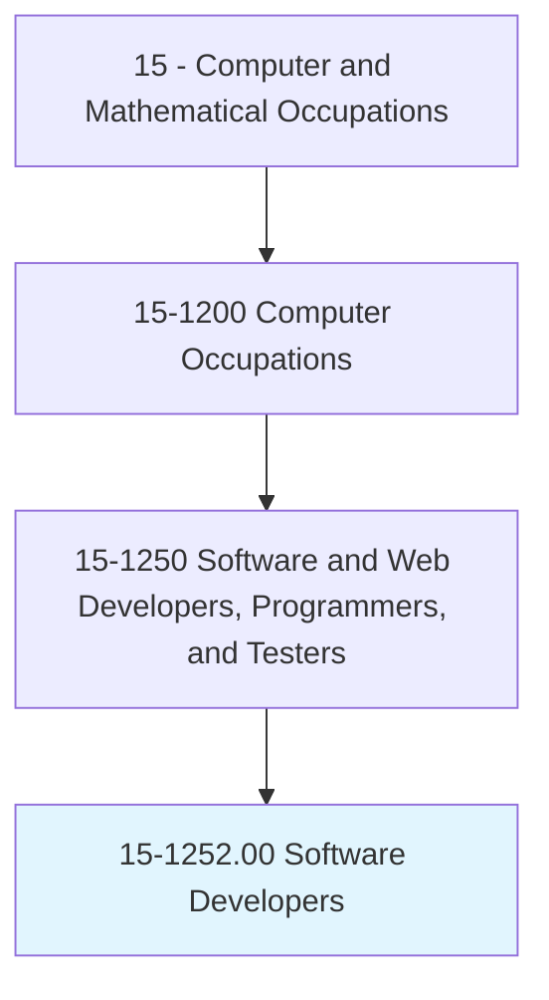
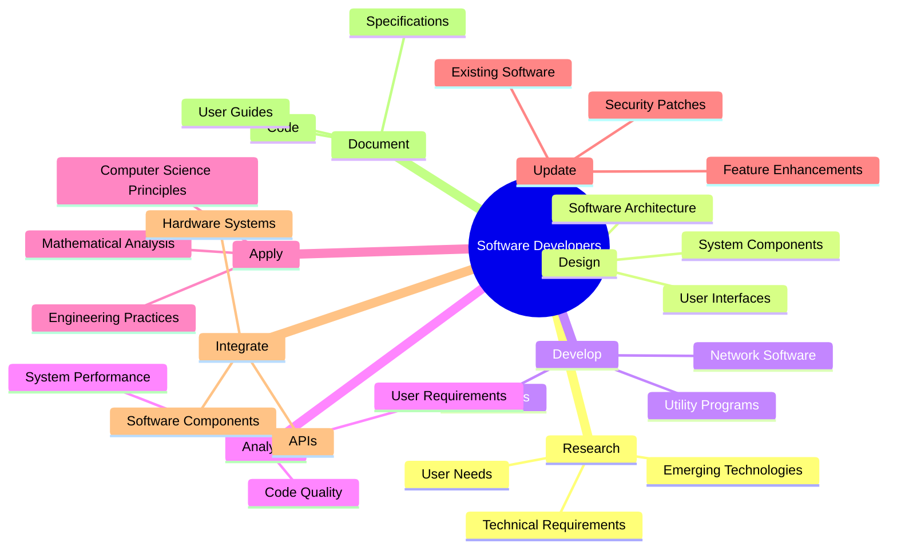
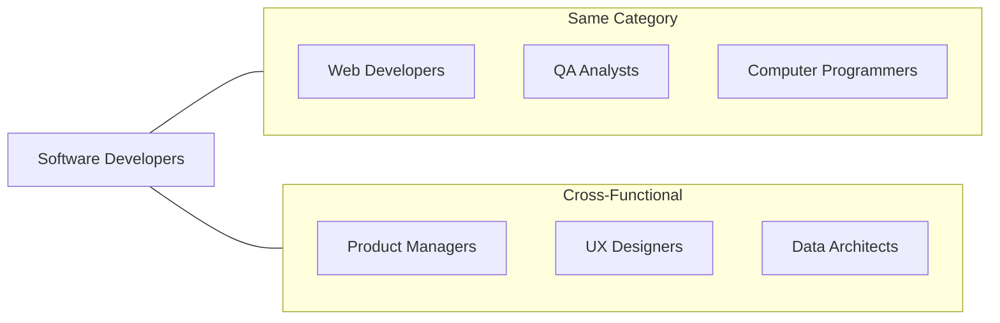
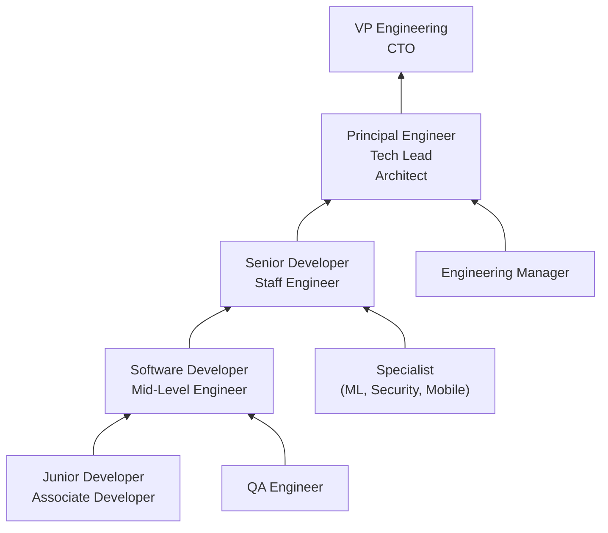

# Software Developers

> Research, design, and develop computer and network software or specialized utility programs. Analyze user needs and develop software solutions, applying principles and techniques of computer science, engineering, and mathematical analysis. Update software or enhance existing software capabilities. May work with computer hardware engineers to integrate hardware and software systems, and develop specifications and performance requirements. May maintain databases within an application area, working individually or coordinating database development as part of a team.

## Overview

Software Developers are the creative and technical minds behind computer applications, responsible for the entire software development lifecycle from requirements analysis through design, implementation, testing, and maintenance. They build everything from mobile apps and web applications to enterprise software and embedded systems. This role requires strong problem-solving abilities, expertise in programming languages and development methodologies, and the capacity to translate user needs into functional software solutions.

## Classification Hierarchy

## Key Statistics

| Metric | Value |
|--------|-------|
| SOC Code | 15-1252.00 |
| Job Zone | 4 (Considerable Preparation) |
| Category | [Computer and Mathematical](/occupations/Technology) |
| Core Tasks | 15+ |
| Growth Rate | Much Faster Than Average |
| Source | O*NET |

## Core Tasks

### research.Requirements

Software Developers investigate and understand user and system needs.

**Actions:**
- `research.UserNeeds.to.understand.Requirements` - Gather user requirements
- `research.TechnicalRequirements.to.plan.Solutions` - Assess technical needs
- `analyze.UserNeeds.to.develop.SoftwareSolutions` - Translate needs to solutions
- `research.EmergingTechnologies.to.improve.Products` - Explore new tech

### design.Software

Software Developers create software architectures and designs.

**Actions:**
- `design.ComputerSoftware.applying.ComputerSciencePrinciples` - Architect solutions
- `design.NetworkSoftware.applying.EngineeringTechniques` - Design networked systems
- `design.SpecializedUtilityPrograms.for.SpecificNeeds` - Create custom utilities
- `develop.SpecificationsAndPerformanceRequirements` - Define system specs

### develop.Applications

Software Developers build software products.

**Actions:**
- `develop.SoftwareSolutions.applying.MathematicalAnalysis` - Build analytical software
- `develop.ComputerSoftware.using.ProgrammingLanguages` - Code applications
- `develop.NetworkSoftware.for.CommunicationSystems` - Create network apps
- `coordinate.DatabaseDevelopment.as.PartOfTeam` - Lead database projects

### integrate.Systems

Software Developers connect hardware and software components.

**Actions:**
- `work.WithComputerHardwareEngineers.to.integrate.HardwareAndSoftware` - Collaborate on integration
- `integrate.HardwareSystems.with.SoftwareSystems` - Connect hardware/software
- `integrate.APIs.to.extend.Functionality` - Connect external services
- `develop.Interfaces.to.enable.Communication` - Build system interfaces

### update.Software

Software Developers enhance and maintain existing systems.

**Actions:**
- `update.Software.to.fix.Bugs` - Resolve software defects
- `enhance.ExistingSoftwareCapabilities.for.Users` - Add new features
- `maintain.DatabasesWithinApplicationArea.for.Operations` - Support database functions
- `refactor.Code.to.improve.Quality` - Improve code structure

## Tech Stack

### Programming Languages
- **JavaScript/TypeScript** - Web and full-stack development
- **Python** - Backend, data science, automation
- **Java** - Enterprise applications
- **C#** - Microsoft ecosystem, game development
- **Go** - Cloud services, microservices
- **Rust** - Systems programming
- **Swift** - iOS development
- **Kotlin** - Android development

### Frameworks & Libraries
- **React/Vue/Angular** - Frontend frameworks
- **Node.js** - JavaScript runtime
- **Django/Flask** - Python web frameworks
- **Spring Boot** - Java framework
- **.NET Core** - Microsoft framework
- **Ruby on Rails** - Web development
- **TensorFlow/PyTorch** - Machine learning

### Cloud & DevOps
- **AWS** - Cloud services
- **Azure** - Microsoft cloud
- **Google Cloud** - GCP services
- **Docker** - Containerization
- **Kubernetes** - Container orchestration
- **Terraform** - Infrastructure as code
- **CI/CD Pipelines** - Automated deployment

### Databases
- **PostgreSQL** - Relational database
- **MongoDB** - Document database
- **Redis** - In-memory data store
- **Elasticsearch** - Search engine
- **MySQL** - Relational database

### Development Tools
- **VS Code** - Code editor
- **Git/GitHub** - Version control
- **Jira** - Project management
- **Figma** - Design collaboration
- **Postman** - API development

## Certifications

| Certification | Provider | Level |
|---------------|----------|-------|
| AWS Certified Developer | Amazon | Associate |
| Azure Developer Associate | Microsoft | Associate |
| Google Professional Cloud Developer | Google | Professional |
| Certified Kubernetes Application Developer | CNCF | Professional |
| Oracle Certified Professional Java Developer | Oracle | Professional |
| Meta Front-End Developer | Meta | Professional |

## Skills & Competencies

### Technical Skills
- **Programming** - Expert (multiple languages)
- **Software Design** - Expert
- **System Architecture** - Advanced
- **Database Design** - Advanced
- **API Development** - Advanced
- **Testing & QA** - Advanced
- **DevOps** - Intermediate
- **Cloud Services** - Advanced

### Soft Skills
- **Problem Solving** - Critical
- **Analytical Thinking** - Critical
- **Communication** - Essential
- **Collaboration** - Essential
- **Continuous Learning** - Essential
- **Creativity** - Important

## Related Occupations

## Industry Variations

### Technology/SaaS
- Product development focus
- Agile methodologies
- Continuous deployment
- Full-stack requirements

### Financial Services
- High-performance systems
- Security-critical development
- Regulatory compliance
- Trading platforms

### Healthcare
- EHR systems
- Medical device software
- HIPAA compliance
- Clinical applications

### Gaming
- Game engine development
- Real-time graphics
- Multiplayer networking
- Cross-platform deployment

### E-commerce
- Scalable systems
- Payment integration
- Inventory management
- Customer experience

## Career Progression

## Education & Training

| Requirement | Details |
|-------------|---------|
| Typical Education | Bachelor's degree in Computer Science, Software Engineering, or related field |
| Alternative Paths | Bootcamps, self-taught with portfolio |
| Work Experience | 0-2 years entry, 3-5 years mid-level |
| On-the-Job Training | Continuous - new technologies and frameworks |
| Common Certifications | Cloud certifications (AWS, Azure, GCP), language-specific |

## Departments

This occupation typically works in:
- [Software Engineering](/departments/Engineering)
- [Product Development](/departments/Product)
- [Research & Development](/departments/RnD)
- [Information Technology](/departments/IT)

---

*Source: O*NET 15-1252.00 - ONETOccupation*
