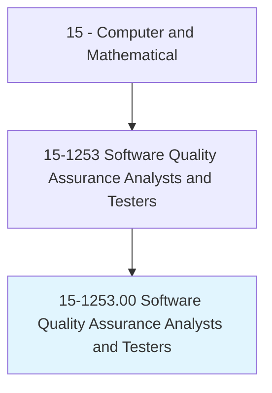
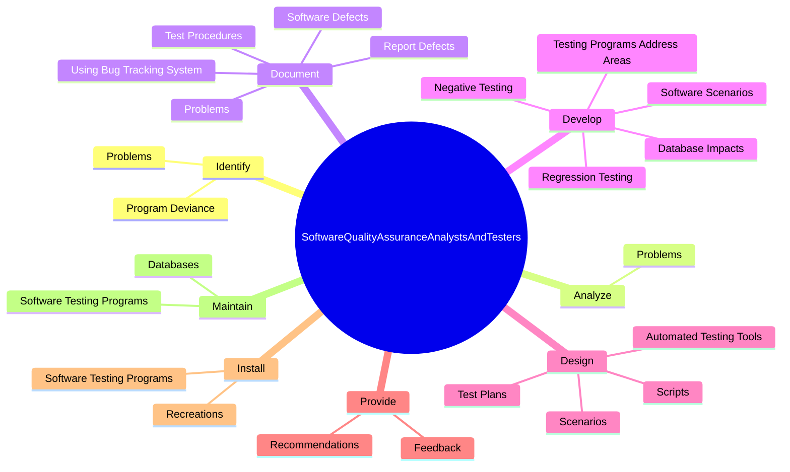
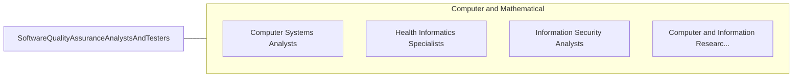

# Software Quality Assurance Analysts and Testers

> Develop and execute software tests to identify software problems and their causes. Test system modifications to prepare for implementation. Document software and application defects using a bug tracking system and report defects to software or web developers. Create and maintain databases of known defects. May participate in software design reviews to provide input on functional requirements, operational characteristics, product designs, and schedules.

## Overview

Software Quality Assurance Analysts and Testers is an occupation within the Computer and Mathematical category. Develop and execute software tests to identify software problems and their causes. Test system modifications to prepare for implementation.

## Classification Hierarchy

## Key Statistics

| Metric | Value |
|--------|-------|
| SOC Code | 15-1253.00 |
| Category | [Computer and Mathematical](/occupations/Technology) |
| Task Count | 92 |
| Source | O*NET |

## Core Tasks

### identify.Problems

Software Quality Assurance Analysts and Testers identify problems as part of their core responsibilities.

**Actions:**
- `identify.Problems.with.ProgramFunction`
- `identify.Problems.with.Output`
- `identify.Problems.with.OnlineScreen`
- `identify.Problems.with.Content`

### analyze.Problems

Software Quality Assurance Analysts and Testers analyze problems as part of their core responsibilities.

**Actions:**
- `analyze.Problems.with.ProgramFunction`
- `analyze.Problems.with.Output`
- `analyze.Problems.with.OnlineScreen`
- `analyze.Problems.with.Content`

### document.Problems

Software Quality Assurance Analysts and Testers document problems as part of their core responsibilities.

**Actions:**
- `document.Problems.with.ProgramFunction`
- `document.Problems.with.Output`
- `document.Problems.with.OnlineScreen`
- `document.Problems.with.Content`

## Skills & Competencies

### Technical Skills
- **Programming** - Advanced
- **Systems Analysis** - Advanced
- **Database Management** - Advanced

### Soft Skills
- **Communication** - Essential
- **Problem Solving** - Essential
- **Critical Thinking** - Important
- **Teamwork** - Important
- **Adaptability** - Important

## Related Occupations

## Industries

This occupation is found across multiple industries. See [Industries](/industries) for sector-specific employment data.

## Career Progression

---

*Source: O*NET 15-1253.00 - ONETOccupation*
