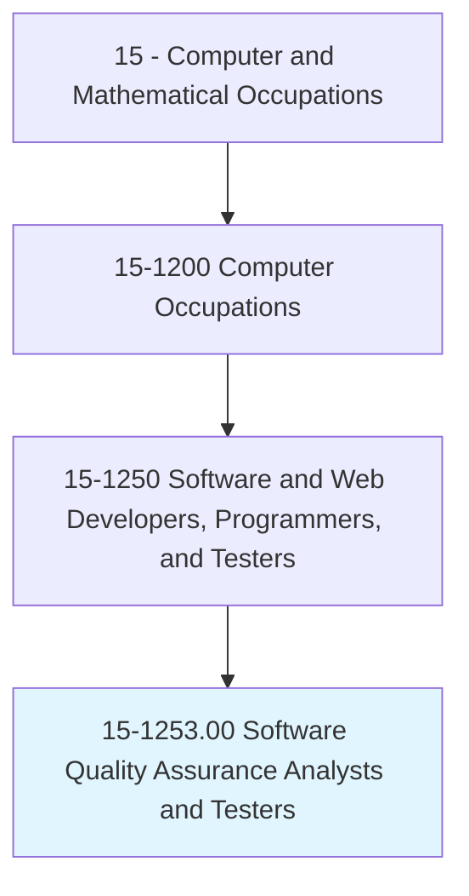
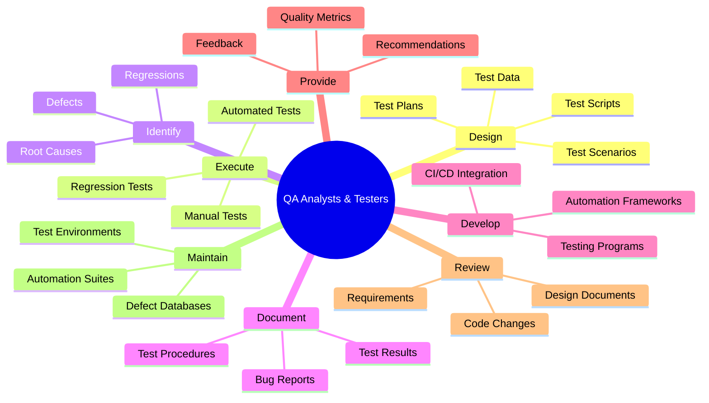
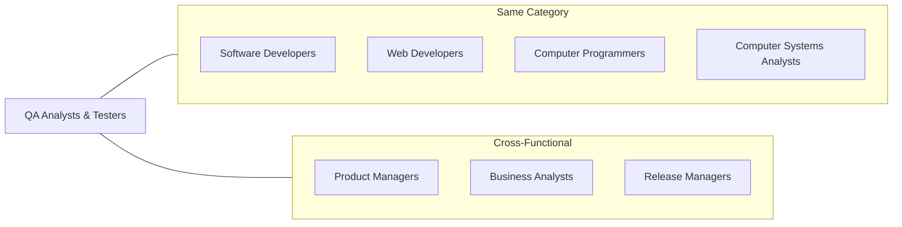
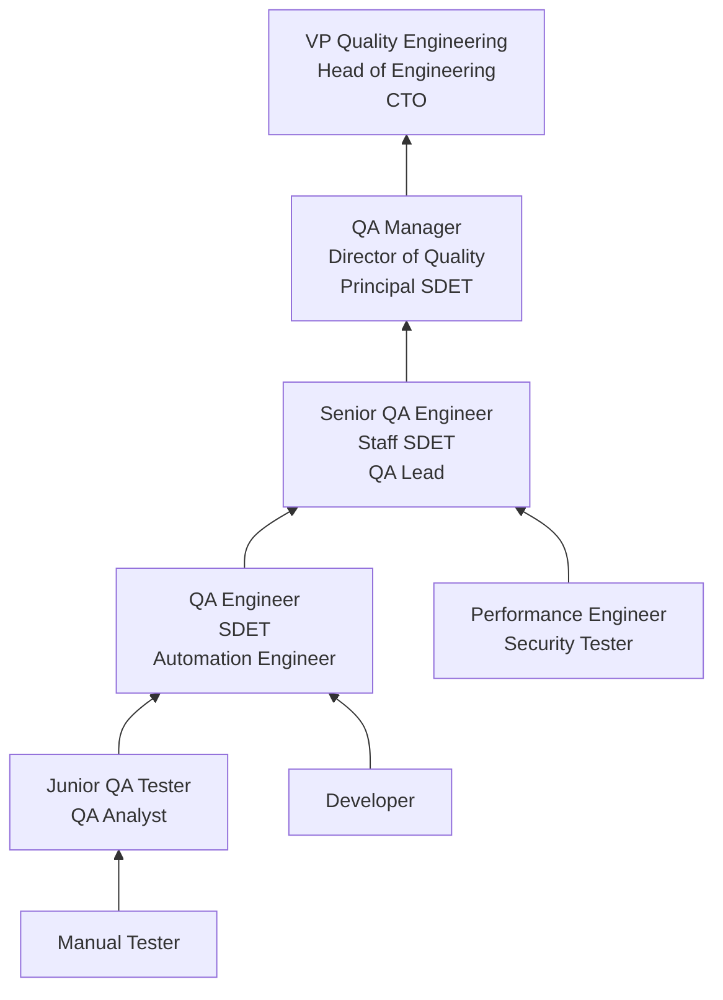

# Software Quality Assurance Analysts and Testers

> Develop and execute software tests to identify software problems and their causes. Test system modifications to prepare for implementation. Document software and application defects using a bug tracking system and report defects to software or web developers. Create and maintain databases of known defects. May participate in software design reviews to provide input on functional requirements, operational characteristics, product designs, and schedules.

## Overview

Software Quality Assurance (QA) Analysts and Testers are responsible for ensuring that software products meet quality standards before release. They design test plans, write test cases, execute manual and automated tests, identify defects, and work with development teams to resolve issues. Their work spans the entire software development lifecycle, from reviewing requirements and design documents to validating production deployments.

Modern QA has evolved far beyond manual click-testing. Today's QA professionals write automated test suites using frameworks like Selenium, Cypress, and Playwright, build continuous testing pipelines integrated with CI/CD systems, and apply techniques like performance testing, security testing, and accessibility testing. The shift-left movement has embedded quality engineering earlier in the development process, with QA professionals participating in code reviews, pair programming, and test-driven development.

The role exists on a spectrum from manual testing (exploratory testing, usability testing, acceptance testing) to highly technical test automation engineering. Many organizations are moving toward a Software Developer in Test (SDET) model where QA professionals write production-quality test code, maintain test infrastructure, and contribute to developer tooling. Regardless of specialization, QA professionals serve as the quality conscience of their teams.

## Classification Hierarchy

## Key Statistics

| Metric | Value |
|--------|-------|
| SOC Code | 15-1253.00 |
| Job Zone | 4 (Considerable Preparation) |
| Category | [Computer and Mathematical](/occupations/Technology/index) |
| Task Count | 92 |
| Median Salary | $99,620 |
| Employment | ~199,800 |
| Growth Rate | Faster Than Average (20%) |
| Source | O*NET |

## Core Tasks

### design.TestPlans

QA Analysts design comprehensive test strategies and plans for software verification.

**Actions:**
- `design.TestPlans.for.FunctionalValidation`
- `design.TestScenarios.for.EdgeCases`
- `design.TestScripts.for.AutomatedExecution`
- `design.TestData.for.ComprehensiveCoverage`

### execute.Tests

QA Analysts execute tests across multiple types and environments.

**Actions:**
- `execute.FunctionalTests.to.verify.Requirements`
- `execute.RegressionTests.to.prevent.Regressions`
- `execute.PerformanceTests.to.validate.Scalability`
- `execute.ExploratoryTests.to.discover.UnexpectedDefects`

### identify.Defects

QA Analysts find, analyze, and report software defects.

**Actions:**
- `identify.Problems.with.ProgramFunction`
- `identify.Problems.with.UserInterface`
- `analyze.RootCause.of.DefectPatterns`
- `document.Defects.using.BugTrackingSystem`

### develop.AutomationFrameworks

QA Analysts build and maintain automated testing infrastructure.

**Actions:**
- `develop.AutomationFrameworks.for.ContinuousTesting`
- `develop.TestScripts.using.SeleniumOrCypress`
- `integrate.AutomatedTests.into.CICDPipelines`
- `maintain.TestSuites.for.OngoingReliability`

## Tech Stack

### Test Automation Frameworks
- **Selenium** - Browser automation
- **Cypress** - JavaScript E2E testing
- **Playwright** - Cross-browser testing
- **Appium** - Mobile testing
- **TestNG/JUnit** - Java unit testing
- **pytest** - Python testing
- **Jest** - JavaScript unit testing
- **Robot Framework** - Keyword-driven testing

### Performance Testing
- **JMeter** - Load testing
- **Gatling** - Performance testing
- **k6** - Modern load testing
- **Locust** - Python load testing
- **Artillery** - Cloud-native load testing

### API Testing
- **Postman** - API testing platform
- **REST Assured** - Java API testing
- **Karate** - API test automation
- **SoapUI** - SOAP/REST testing

### CI/CD Integration
- **Jenkins** - Build automation
- **GitHub Actions** - CI/CD workflows
- **GitLab CI** - Pipeline automation
- **CircleCI** - Cloud CI/CD
- **Azure DevOps** - Microsoft CI/CD

### Bug Tracking & Management
- **Jira** - Issue tracking
- **Azure DevOps Boards** - Work item tracking
- **Linear** - Modern issue tracking
- **Bugzilla** - Bug tracking
- **TestRail** - Test management
- **Zephyr** - Test management for Jira
- **Xray** - Test management

### Development Tools
- **VS Code** - Code editor
- **Git/GitHub** - Version control
- **Docker** - Containerized test environments
- **BrowserStack/Sauce Labs** - Cross-browser cloud testing
- **Charles Proxy** - Network debugging

## Certifications

| Certification | Provider | Level |
|---------------|----------|-------|
| ISTQB Certified Tester Foundation | ISTQB | Foundation |
| ISTQB Certified Tester Advanced | ISTQB | Advanced |
| Certified Software Tester (CSTE) | QAI | Professional |
| AWS Certified Developer | Amazon | Associate |
| Selenium Certification | Various | Professional |
| Certified Agile Tester (CAT) | IACT | Professional |

## Skills & Competencies

### Technical Skills
- **Test Automation** - Expert
- **Manual Testing** - Expert
- **Test Planning & Design** - Expert
- **Programming (Python/Java/JavaScript)** - Advanced
- **API Testing** - Advanced
- **CI/CD Integration** - Advanced
- **Performance Testing** - Advanced
- **SQL/Database Testing** - Advanced
- **Security Testing Basics** - Intermediate
- **Accessibility Testing** - Intermediate

### Soft Skills
- **Attention to Detail** - Critical
- **Analytical Thinking** - Critical
- **Communication** - Essential (clear bug reports)
- **Curiosity** - Critical (exploratory testing)
- **Persistence** - Important (reproducing intermittent bugs)
- **Collaboration** - Essential (working with developers)

## Related Occupations

- [Software Developers](/occupations/Technology/SoftwareDevelopers)
- [Web Developers](/occupations/Technology/WebDevelopers)
- [Computer Programmers](/occupations/Technology/ComputerProgrammers)

## Industry Variations

### Technology / SaaS
- Automated test suites in CI/CD
- Shift-left testing practices
- SDET role (coding-heavy)
- Feature flag and canary testing

### Financial Services
- Regulatory compliance testing
- Transaction accuracy validation
- Performance under high load
- Security and penetration testing overlap

### Healthcare / Medical Devices
- FDA validation requirements (IQ/OQ/PQ)
- 21 CFR Part 11 compliance
- Patient safety-critical testing
- Traceability matrices

### Gaming
- Gameplay testing and balancing
- Performance across platforms
- Multiplayer stress testing
- Localization testing

### Automotive / Embedded
- Hardware-in-the-loop testing
- Safety-critical validation (ISO 26262)
- Real-time system testing
- Environmental testing

## Career Progression

## Education & Training

| Requirement | Details |
|-------------|---------|
| Typical Education | Bachelor's in Computer Science, Software Engineering, or related field |
| Alternative Paths | Bootcamps, self-taught with automation portfolio, career changers |
| Work Experience | 0-1 years entry, 2-4 years mid, 5+ years senior |
| On-the-Job Training | Moderate - learning application domain and test infrastructure |
| Key Knowledge Areas | Test design, programming, automation frameworks, CI/CD, SQL |

## Departments

This occupation typically works in:
- [Quality Engineering](/departments/QE)
- [Engineering](/departments/Engineering)
- [Product Development](/departments/Product)
- [Information Technology](/departments/IT)

---

*Source: O*NET 15-1253.00 - ONETOccupation*
