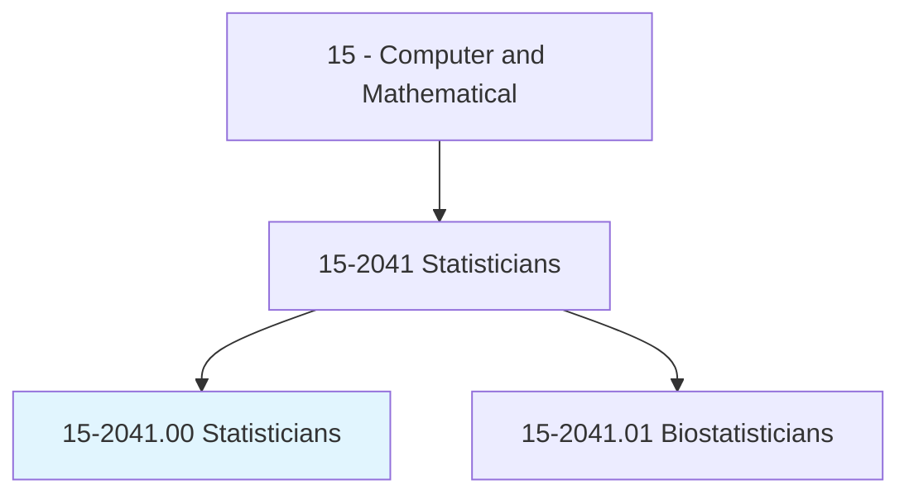
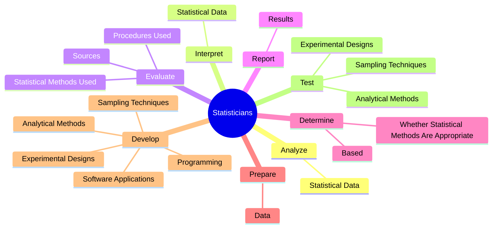
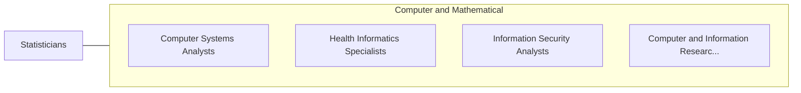

# Statisticians

> Develop or apply mathematical or statistical theory and methods to collect, organize, interpret, and summarize numerical data to provide usable information. May specialize in fields such as biostatistics, agricultural statistics, business statistics, or economic statistics. Includes mathematical and survey statisticians.

## Overview

Statisticians is an occupation within the Computer and Mathematical category. Develop or apply mathematical or statistical theory and methods to collect, organize, interpret, and summarize numerical data to provide usable information. May specialize in fields such as biostatistics, agricultural statistics, business statistics, or economic statistics.

## Classification Hierarchy

## Key Statistics

| Metric | Value |
|--------|-------|
| SOC Code | 15-2041.00 |
| Category | [Computer and Mathematical](/occupations/Technology) |
| Task Count | 96 |
| Source | O*NET |

## Core Tasks

### analyze.StatisticalData

Statisticians analyze statistical data as part of their core responsibilities.

**Actions:**
- `analyze.StatisticalData.to.identify.SignificantDifferencesInRelationshipsAmongSourcesOfInformation`

### interpret.StatisticalData

Statisticians interpret statistical data as part of their core responsibilities.

**Actions:**
- `interpret.StatisticalData.to.identify.SignificantDifferencesInRelationshipsAmongSourcesOfInformation`

### evaluate.StatisticalMethodsUsed

Statisticians evaluate statistical methods used as part of their core responsibilities.

**Actions:**
- `evaluate.StatisticalMethodsUsed.to.obtain.DataToEnsureValidity`
- `evaluate.StatisticalMethodsUsed.to.Applicability`
- `evaluate.StatisticalMethodsUsed.to.Efficiency`
- `evaluate.StatisticalMethodsUsed.to.Accuracy`

## Skills & Competencies

### Technical Skills
- **Programming** - Advanced
- **Systems Analysis** - Advanced
- **Database Management** - Advanced

### Soft Skills
- **Communication** - Essential
- **Problem Solving** - Essential
- **Critical Thinking** - Important
- **Teamwork** - Important
- **Adaptability** - Important

## Related Occupations

## Industries

This occupation is found across multiple industries. See [Industries](/industries) for sector-specific employment data.

## Career Progression

---

*Source: O*NET 15-2041.00 - ONETOccupation*
