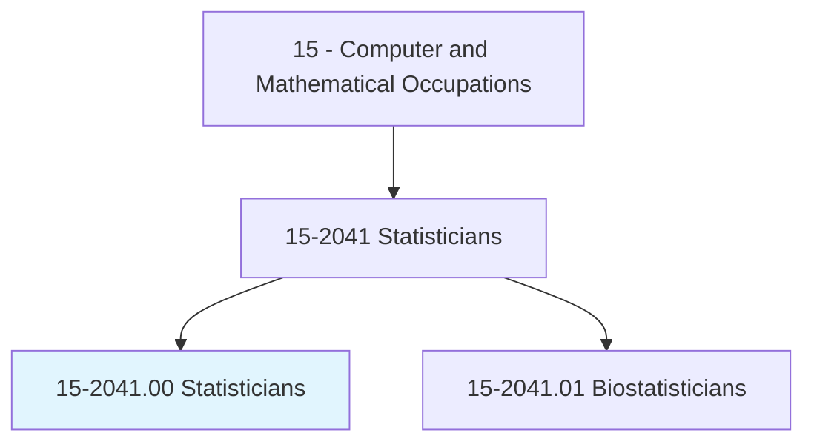
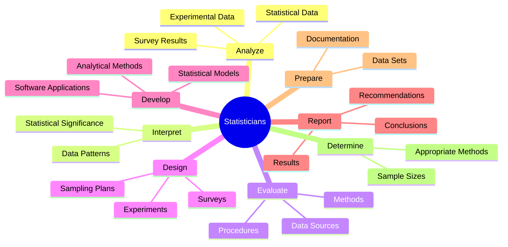
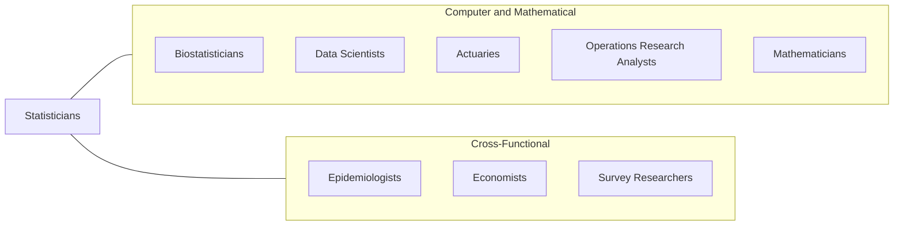
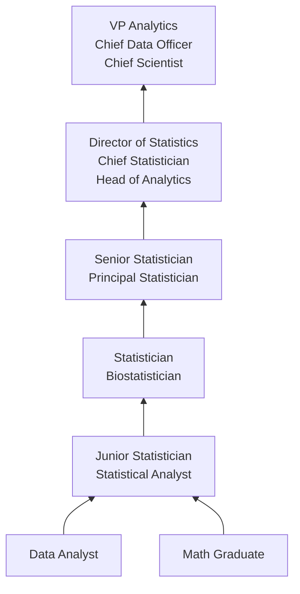

# Statisticians

> Develop or apply mathematical or statistical theory and methods to collect, organize, interpret, and summarize numerical data to provide usable information. May specialize in fields such as biostatistics, agricultural statistics, business statistics, or economic statistics. Includes mathematical and survey statisticians.

## Overview

Statisticians apply mathematical and statistical theories to collect, analyze, and interpret quantitative data, transforming numbers into actionable information that guides decisions across government, business, science, and public policy. They design surveys and experiments, develop sampling methodologies, build statistical models, and evaluate the reliability and validity of data and findings.

The field encompasses a wide range of specializations, including survey statistics (designing and analyzing population surveys), mathematical statistics (developing new statistical methods and theory), biostatistics (clinical trials and health research), econometrics (economic modeling), and environmental statistics. Regardless of specialization, statisticians bring rigor to the process of learning from data, ensuring that conclusions are supported by evidence and that uncertainty is properly quantified.

In the age of big data and machine learning, statisticians offer a critical perspective that complements data science: a deep understanding of experimental design, causal inference, hypothesis testing, and the conditions under which statistical methods produce valid results. While data scientists may build predictive models empirically, statisticians ground analysis in formal mathematical theory, ensuring that organizations understand not just what the data shows, but what it means and how confident they can be in the conclusions drawn.

## Classification Hierarchy

## Key Statistics

| Metric | Value |
|--------|-------|
| SOC Code | 15-2041.00 |
| Job Zone | 5 (Extensive Preparation) |
| Category | [Computer and Mathematical](/occupations/Technology/index) |
| Task Count | 96 |
| Median Salary | $99,960 |
| Employment | ~35,000 |
| Growth Rate | Much Faster Than Average (32%) |
| Source | O*NET |

## Core Tasks

### analyze.StatisticalData

Statisticians analyze data to identify significant patterns and relationships.

**Actions:**
- `analyze.StatisticalData.to.identify.SignificantRelationships`
- `analyze.SurveyResults.to.draw.PopulationInferences`
- `analyze.ExperimentalData.to.test.Hypotheses`
- `analyze.TimeSeriesData.to.forecast.Trends`

### design.ResearchStudies

Statisticians design experiments and surveys with appropriate statistical methodology.

**Actions:**
- `design.Experiments.with.ProperControls`
- `design.SurveyInstruments.for.ValidDataCollection`
- `design.SamplingPlans.for.RepresentativeData`
- `calculate.SampleSizes.for.AdequateStatisticalPower`

### evaluate.StatisticalMethods

Statisticians assess the appropriateness and quality of statistical approaches.

**Actions:**
- `evaluate.StatisticalMethods.to.ensure.Validity`
- `evaluate.DataSources.to.assess.Reliability`
- `evaluate.Procedures.to.determine.Applicability`
- `evaluate.Results.to.assess.Accuracy`

### develop.NewMethods

Statisticians create new statistical methods and software applications.

**Actions:**
- `develop.ExperimentalDesigns.for.ResearchStudies`
- `develop.SamplingTechniques.for.DataCollection`
- `develop.AnalyticalMethods.for.ComplexData`
- `develop.SoftwareApplications.for.StatisticalAnalysis`

## Tech Stack

### Statistical Software
- **R** - Primary statistical computing environment
- **SAS** - Enterprise statistical analysis
- **Python** - Data analysis and modeling
- **Stata** - Social science and economics
- **SPSS** - Survey and behavioral research
- **JMP** - Visual statistical discovery
- **Minitab** - Quality improvement

### Programming & Scripting
- **R (tidyverse, ggplot2)** - Data wrangling and visualization
- **Python (statsmodels, scipy)** - Statistical computing
- **SQL** - Data querying
- **Julia** - High-performance statistics
- **MATLAB** - Numerical computing

### Bayesian Analysis
- **Stan** - Bayesian inference
- **JAGS** - Bayesian modeling
- **PyMC** - Python Bayesian
- **INLA** - Approximate Bayesian
- **brms** - R Bayesian regression

### Survey & Sampling
- **Qualtrics** - Survey design
- **SurveyMonkey** - Survey platform
- **R survey package** - Complex survey analysis
- **Sampling frameworks** - Stratified, cluster, multi-stage

### Visualization & Reporting
- **ggplot2** - R visualization
- **Matplotlib/Seaborn** - Python plotting
- **Tableau** - Business visualization
- **RMarkdown/Quarto** - Reproducible reports
- **LaTeX** - Statistical publications

## Certifications

| Certification | Provider | Level |
|---------------|----------|-------|
| Accredited Professional Statistician (PStat) | ASA | Professional |
| Graduate Statistician (GStat) | RSS | Associate |
| SAS Certified Statistical Business Analyst | SAS | Professional |
| Certified Analytics Professional (CAP) | INFORMS | Professional |
| Google Data Analytics Professional | Google | Professional |

## Skills & Competencies

### Technical Skills
- **Statistical Theory** - Expert
- **Experimental Design** - Expert
- **Regression Analysis** - Expert
- **Hypothesis Testing** - Expert
- **R/SAS Programming** - Expert
- **Survey Design** - Advanced
- **Bayesian Statistics** - Advanced
- **Time Series Analysis** - Advanced
- **Machine Learning** - Intermediate to Advanced
- **Data Visualization** - Advanced

### Soft Skills
- **Analytical Thinking** - Critical
- **Written Communication** - Critical (publications, reports)
- **Oral Communication** - Essential (presenting to non-statisticians)
- **Attention to Detail** - Critical
- **Intellectual Curiosity** - Important
- **Collaboration** - Essential (interdisciplinary work)

## Related Occupations

- [Biostatisticians](/occupations/Technology/Biostatisticians)
- [Data Scientists](/occupations/Technology/DataScientists)
- [Actuaries](/occupations/Technology/Actuaries)
- [Operations Research Analysts](/occupations/Technology/OperationsResearchAnalysts)
- [Mathematicians](/occupations/Technology/Mathematicians)

## Industry Variations

### Government (Census, BLS, CDC)
- National survey design and analysis
- Economic indicator computation
- Public health surveillance
- Policy impact evaluation

### Pharmaceutical / Clinical
- Clinical trial statistical analysis
- FDA regulatory submissions
- Drug safety monitoring
- Epidemiological studies

### Technology
- A/B testing and experimentation
- Product analytics
- Recommendation algorithms
- User behavior modeling

### Finance / Insurance
- Risk modeling
- Credit scoring
- Actuarial analysis support
- Economic forecasting

### Academic / Research
- Novel method development
- Teaching and mentoring
- Grant-funded research
- Peer-reviewed publications

### Environmental / Agriculture
- Environmental impact modeling
- Crop yield estimation
- Climate data analysis
- Species population estimation

## Career Progression

## Education & Training

| Requirement | Details |
|-------------|---------|
| Typical Education | Master's or PhD in Statistics, Biostatistics, or Applied Mathematics |
| Alternative Paths | Bachelor's in Statistics + significant practical experience |
| Work Experience | 0-2 years with MS, direct entry with PhD |
| Key Knowledge Areas | Probability theory, mathematical statistics, regression, experimental design, computing |
| Continuing Education | JSM conference, ASA chapter events, new methodology training |

## Departments

This occupation typically works in:
- Statistics / Biostatistics
- Data Science & Analytics
- Research & Development
- [Quality Assurance](/departments/Quality)
- Survey Research

---

*Source: O*NET 15-2041.00 - ONETOccupation*
