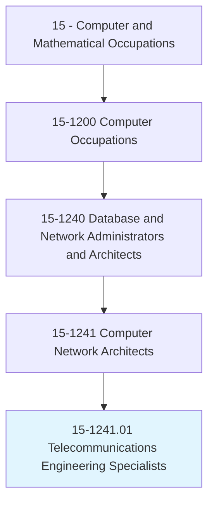
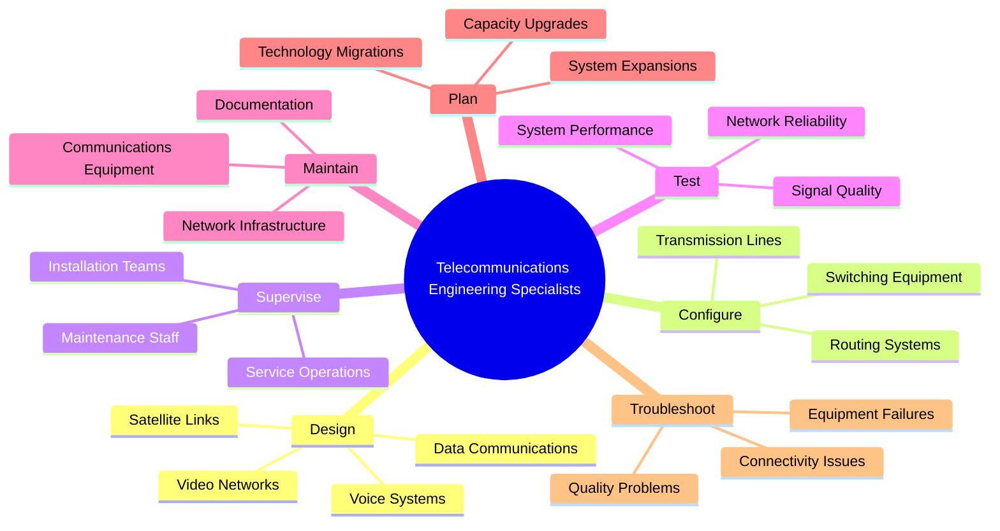
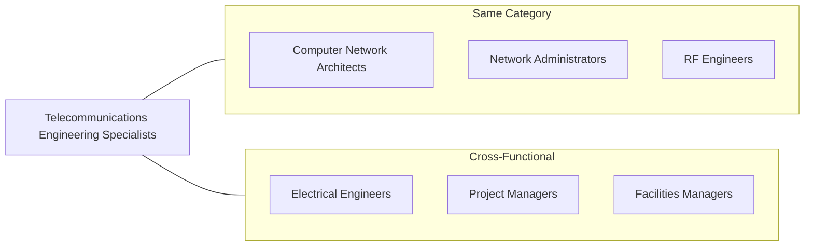
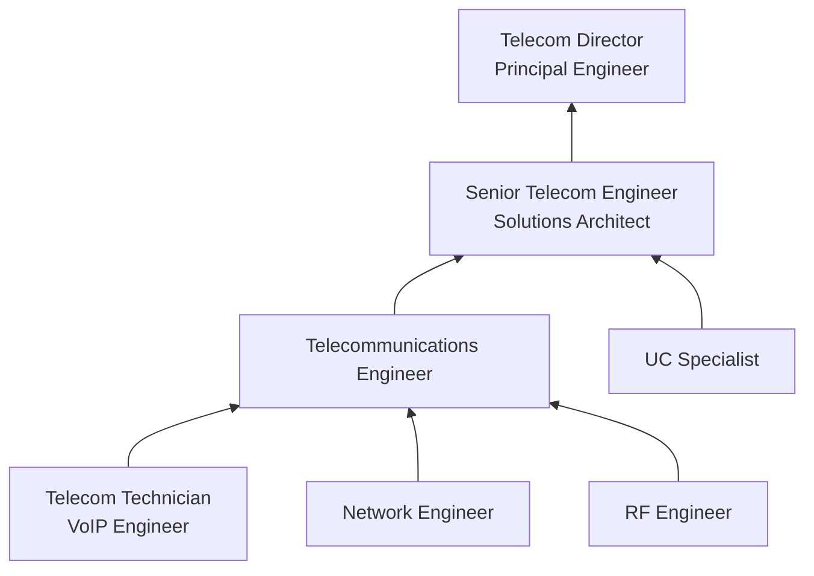

# Telecommunications Engineering Specialists

> Design or configure wired, wireless, and satellite communications systems for voice, video, and data services. Supervise installation, service, and maintenance.

## Overview

Telecommunications Engineering Specialists focus on the design, implementation, and maintenance of communication systems that enable voice, video, and data transmission. They work with a wide range of technologies including traditional telephony, VoIP, wireless networks, satellite communications, and unified communications platforms. This role requires deep expertise in signal processing, transmission protocols, and network engineering, combined with project management skills to oversee complex installations.

## Classification Hierarchy

## Key Statistics

| Metric | Value |
|--------|-------|
| SOC Code | 15-1241.01 |
| Job Zone | 4 (Considerable Preparation) |
| Category | [Computer and Mathematical](/occupations/Technology) |
| Core Tasks | 10+ |
| Source | O*NET |

## Core Tasks

### design.CommunicationsSystems

Telecommunications Engineering Specialists create comprehensive communication system designs.

**Actions:**
- `design.WiredCommunicationsSystems.for.VoiceServices` - Create wired telephony solutions
- `design.WirelessCommunicationsSystems.for.DataServices` - Build wireless network architectures
- `design.SatelliteCommunicationsSystems.for.RemoteConnectivity` - Plan satellite links
- `design.VideoConferencingSystems.for.Collaboration` - Engineer video solutions

### configure.Equipment

Telecommunications Engineering Specialists set up and optimize communication equipment.

**Actions:**
- `configure.SwitchingEquipment.for.VoiceTraffic` - Set up PBX and VoIP switches
- `configure.RoutingSystems.for.DataTransmission` - Optimize data routing
- `configure.TransmissionLines.for.SignalQuality` - Tune transmission parameters
- `configure.UnifiedCommunications.for.Integration` - Deploy UC platforms

### supervise.Operations

Telecommunications Engineering Specialists oversee installation and maintenance activities.

**Actions:**
- `supervise.InstallationTeams.during.Deployments` - Lead installation projects
- `supervise.MaintenanceStaff.for.OngoingOperations` - Manage maintenance teams
- `supervise.ServiceOperations.to.ensure.Quality` - Oversee service delivery
- `coordinate.Vendors.for.EquipmentProcurement` - Manage supplier relationships

### test.Systems

Telecommunications Engineering Specialists validate system performance and reliability.

**Actions:**
- `test.SignalQuality.to.verify.Transmission` - Measure signal parameters
- `test.SystemPerformance.to.validate.Capacity` - Benchmark system throughput
- `test.NetworkReliability.to.ensure.Availability` - Verify redundancy systems
- `troubleshoot.ConnectivityIssues.to.restore.Service` - Diagnose network problems

## Tech Stack

### Voice & Unified Communications
- **Cisco Unified Communications Manager** - Enterprise VoIP
- **Microsoft Teams** - Unified communications
- **Avaya** - Enterprise telephony
- **RingCentral** - Cloud communications
- **Zoom Phone** - Cloud VoIP

### Network & Transmission
- **Cisco IOS** - Network operating system
- **Juniper Junos** - Network management
- **ADTRAN** - Access and transport solutions
- **Ciena** - Optical networking
- **Ericsson** - Mobile infrastructure

### Wireless Technologies
- **Cisco Wireless** - Enterprise Wi-Fi
- **Aruba Networks** - Wireless solutions
- **Cambium Networks** - Fixed wireless
- **Sierra Wireless** - Cellular IoT
- **CommScope** - Distributed antenna systems

### Testing & Monitoring
- **VIAVI Solutions** - Network testing
- **Fluke Networks** - Cable testing
- **Spirent** - Communications testing
- **EXFO** - Fiber testing
- **JDSU** - Signal analysis

## Certifications

| Certification | Provider | Level |
|---------------|----------|-------|
| CCNA Collaboration | Cisco | Associate |
| CCNP Collaboration | Cisco | Professional |
| Microsoft Teams Administrator | Microsoft | Associate |
| Avaya Certified Specialist | Avaya | Professional |
| CompTIA Network+ | CompTIA | Entry |
| Fiber Optic Association Certifications | FOA | Various |

## Skills & Competencies

### Technical Skills
- **VoIP Technologies** - Expert
- **Unified Communications** - Advanced
- **Wireless Engineering** - Advanced
- **Signal Processing** - Advanced
- **Network Protocols** - Expert
- **Fiber Optics** - Advanced
- **Satellite Communications** - Intermediate

### Soft Skills
- **Project Management** - Essential
- **Technical Leadership** - Essential
- **Vendor Management** - Essential
- **Documentation** - Essential
- **Problem Solving** - Critical

## Related Occupations

## Industry Variations

### Telecommunications Carriers
- Large-scale network infrastructure
- 5G/LTE deployment
- Carrier switching systems
- Regulatory compliance focus

### Enterprise IT
- Corporate telephony systems
- Unified communications deployment
- Video conferencing infrastructure
- Contact center technologies

### Government/Defense
- Secure communications systems
- Satellite and radio networks
- Emergency communications
- Security clearance requirements

### Broadcasting/Media
- Broadcast transmission systems
- Studio-to-transmitter links
- Satellite uplink/downlink
- High-bandwidth video transport

## Career Progression

## Education & Training

| Requirement | Details |
|-------------|---------|
| Typical Education | Bachelor's degree in Telecommunications, Electrical Engineering, or Computer Science |
| Work Experience | 3-7 years in telecommunications or network engineering |
| On-the-Job Training | Moderate - vendor-specific certifications and technology updates |
| Common Certifications | CCNP Collaboration, Microsoft Teams, vendor-specific |

## Departments

This occupation typically works in:
- [Telecommunications](/departments/Telecom)
- [Network Engineering](/departments/NetworkEngineering)
- [Infrastructure](/departments/Infrastructure)
- [Information Technology](/departments/IT)

---

*Source: O*NET 15-1241.01 - ONETOccupation*
