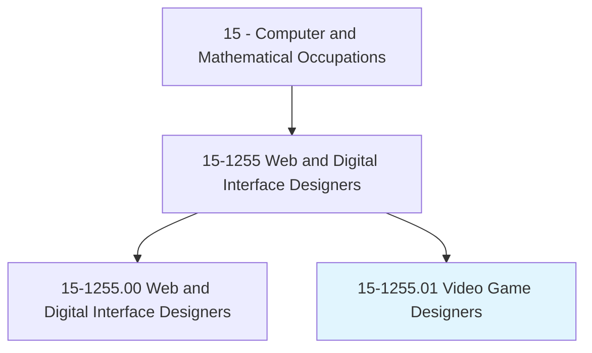
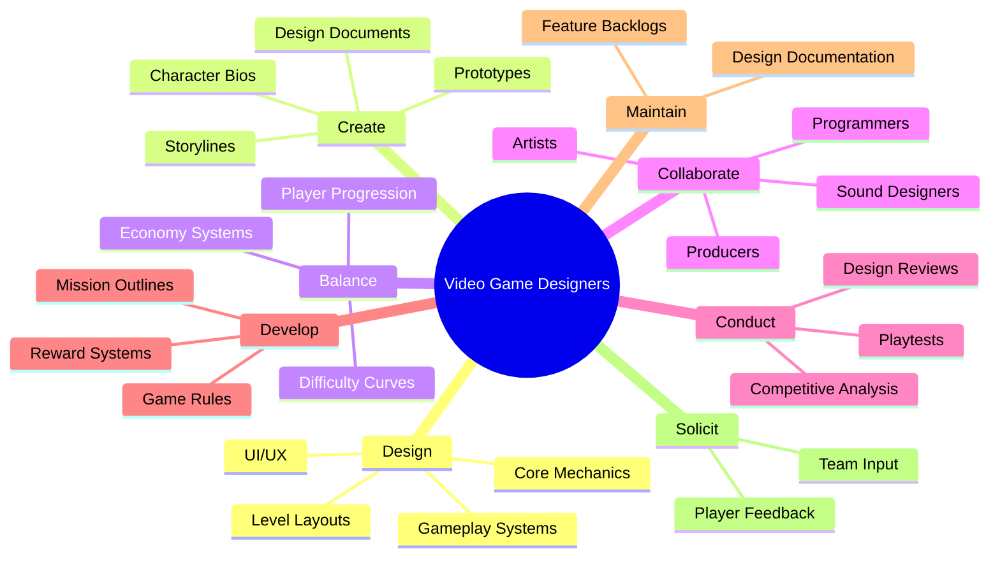
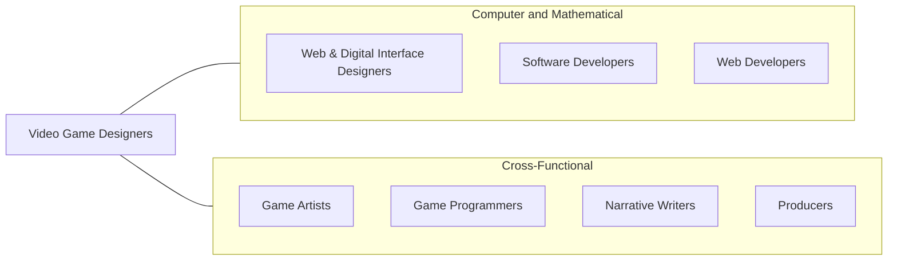
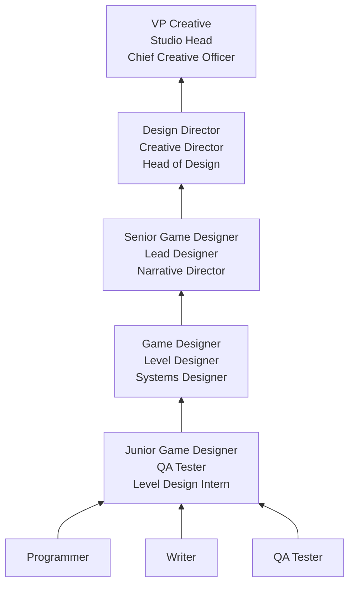

# Video Game Designers

> Design core features of video games. Specify innovative game and role-play mechanics, story lines, and character biographies. Create and maintain design documentation. Guide and collaborate with production staff to produce games as designed.

## Overview

Video Game Designers conceptualize and design the interactive experiences that make video games engaging and enjoyable. They define core gameplay mechanics, create storylines and character arcs, design levels and missions, balance difficulty curves, and document their vision in detailed design documents that guide development teams. Game designers are the architects of player experience, responsible for the moment-to-moment decisions players make and the emotions those decisions evoke.

The role sits at the creative heart of game development, requiring a unique blend of artistic vision, technical understanding, and analytical rigor. Game designers must understand player psychology, pacing, reward systems, and narrative structure while also being able to communicate their ideas effectively to programmers, artists, sound designers, and producers. They use iterative prototyping and playtesting to refine their designs, relying on player feedback and data analysis to optimize the experience.

The game industry generates over $180 billion in annual revenue globally, spanning mobile games, console titles, PC games, VR experiences, and emerging platforms. Game designers may specialize in systems design (economy, combat, progression), level design (environments and encounters), narrative design (story and dialogue), UX design (menus and interfaces), or content design (quests and missions), with career paths available at studios ranging from indie teams to AAA publishers.

## Classification Hierarchy

## Key Statistics

| Metric | Value |
|--------|-------|
| SOC Code | 15-1255.01 |
| Job Zone | 4 (Considerable Preparation) |
| Category | [Computer and Mathematical](/occupations/Technology/index) |
| Task Count | 86 |
| Median Salary | $78,860 |
| Employment | ~11,000 |
| Growth Rate | Faster Than Average |
| Source | O*NET |

## Core Tasks

### design.CoreMechanics

Video Game Designers create the fundamental gameplay systems that drive player interaction.

**Actions:**
- `design.CoreMechanics.for.EngagingGameplay`
- `design.CombatSystems.for.PlayerSatisfaction`
- `design.ProgressionSystems.for.LongTermEngagement`
- `design.EconomySystems.for.GameBalance`

### create.NarrativeContent

Video Game Designers develop storylines, characters, and narrative elements.

**Actions:**
- `create.Storylines.for.EmotionalEngagement`
- `create.CharacterBiographies.for.NarrativeDepth`
- `create.DialogueTrees.for.PlayerChoice`
- `create.WorldLore.for.Immersion`

### balance.GameplayExperiences

Video Game Designers tune and balance game systems for optimal player experience.

**Actions:**
- `balance.GameplayExperiences.to.ensure.CriticalSuccess`
- `balance.DifficultyProgression.for.AccessibleChallenge`
- `adjust.EconomyParameters.based.on.PlayerData`
- `devise.Missions.to.maintain.EngagementPacing`

### conduct.Playtests

Video Game Designers validate designs through testing and iteration.

**Actions:**
- `conduct.Playtests.to.gather.PlayerFeedback`
- `conduct.DesignReviews.with.DevelopmentTeams`
- `analyze.PlayerBehaviorData.to.inform.DesignDecisions`
- `solicit.TeamFeedback.to.refine.GameSystems`

## Tech Stack

### Game Engines
- **Unity** - Cross-platform game engine (C#)
- **Unreal Engine** - AAA game engine (Blueprints/C++)
- **Godot** - Open-source engine (GDScript)
- **GameMaker** - 2D game development
- **RPG Maker** - RPG-focused engine
- **CryEngine** - AAA visuals

### Design & Prototyping
- **Figma/Sketch** - UI/UX design
- **Miro** - Design whiteboarding
- **Machinations** - Game economy modeling
- **Twine** - Interactive narrative prototyping
- **Ink** - Narrative scripting (Inkle)
- **Articy Draft** - Game narrative design

### Level Design Tools
- **Unreal Editor** - Level design
- **Unity Editor** - Scene building
- **Tiled** - 2D level editor
- **ProBuilder** - Unity level design
- **World Machine** - Terrain generation

### Analytics & Data
- **Unity Analytics** - Player behavior tracking
- **GameAnalytics** - Game telemetry
- **Amplitude** - Product analytics
- **Tableau/Excel** - Data analysis
- **A/B testing platforms** - Feature experimentation

### Project Management
- **Jira** - Task tracking
- **Confluence** - Design documentation
- **Notion** - Knowledge management
- **Perforce** - Version control (game assets)
- **Shotgrid** - Production tracking

### Art & Audio Awareness
- **Photoshop/Illustrator** - Concept communication
- **Blender** - 3D modeling basics
- **FMOD/Wwise** - Audio middleware understanding

## Certifications

| Certification | Provider | Level |
|---------------|----------|-------|
| Unity Certified Developer | Unity | Professional |
| Unreal Authorized Instructor | Epic Games | Professional |
| Game Design Specialization | CalArts/Coursera | Foundation |
| Google UX Design Certificate | Google | Professional |

## Skills & Competencies

### Technical Skills
- **Game Design Theory** - Expert
- **Level Design** - Expert
- **Systems Design** - Advanced
- **Narrative Design** - Advanced
- **Game Engine Proficiency** - Advanced
- **Scripting (C#/Blueprints/GDScript)** - Intermediate to Advanced
- **Data Analysis** - Intermediate
- **UI/UX Design** - Advanced
- **Prototyping** - Expert
- **Documentation** - Expert

### Soft Skills
- **Creativity** - Critical
- **Player Empathy** - Critical
- **Communication** - Critical (conveying design vision)
- **Collaboration** - Critical (cross-discipline teams)
- **Iteration Mindset** - Essential
- **Critical Thinking** - Essential
- **Presentation Skills** - Important

## Related Occupations

- [Web and Digital Interface Designers](/occupations/Technology/WebAndDigitalInterfaceDesigners)
- [Software Developers](/occupations/Technology/SoftwareDevelopers)
- [Web Developers](/occupations/Technology/WebDevelopers)

## Industry Variations

### AAA Studios
- Large team collaboration (100+ people)
- Multi-year development cycles
- Specialized design roles (combat, economy, level)
- High production value expectations

### Indie / Small Studio
- Full-stack game design
- Direct involvement in implementation
- Creative ownership
- Resource-constrained innovation

### Mobile / Free-to-Play
- Monetization design (IAP, ads)
- Live operations and events
- Engagement and retention metrics
- A/B testing heavy

### VR / AR
- Spatial interaction design
- Comfort and accessibility
- Novel control schemes
- Immersive experience design

### Serious Games / Gamification
- Educational game design
- Training simulation
- Health and wellness games
- Enterprise gamification

## Career Progression

## Education & Training

| Requirement | Details |
|-------------|---------|
| Typical Education | Bachelor's in Game Design, Computer Science, or related creative field |
| Alternative Paths | Strong portfolio with shipped games, game jam participation, modding community |
| Work Experience | 0-2 years entry (often through QA), 3-5 years mid |
| Key Knowledge Areas | Game design theory, player psychology, prototyping, game engines, systems thinking |
| Portfolio | Essential - playable prototypes and design documents demonstrate ability |

## Departments

This occupation typically works in:
- Game Design
- Creative
- [Product Development](/departments/Product)
- Research & Development

---

*Source: O*NET 15-1255.01 - ONETOccupation*
