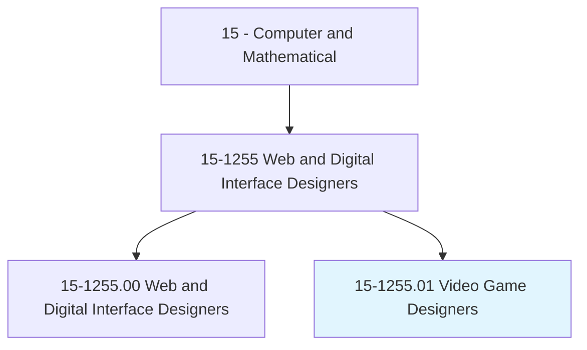
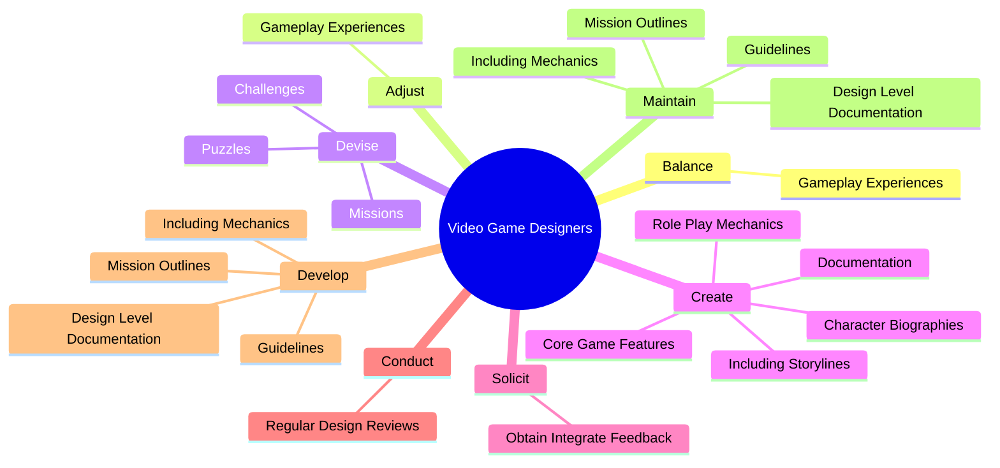

# Video Game Designers

> Design core features of video games. Specify innovative game and role-play mechanics, story lines, and character biographies. Create and maintain design documentation. Guide and collaborate with production staff to produce games as designed.

## Overview

Video Game Designers is a specialized variant within the Computer and Mathematical category. Design core features of video games. Specify innovative game and role-play mechanics, story lines, and character biographies.

## Classification Hierarchy

## Key Statistics

| Metric | Value |
|--------|-------|
| SOC Code | 15-1255.01 |
| Category | [Computer and Mathematical](/occupations/Technology) |
| Task Count | 86 |
| Source | O*NET |

## Core Tasks

### balance.GameplayExperiences

Video Game Designers balance gameplay experiences as part of their core responsibilities.

**Actions:**
- `balance.GameplayExperiences.to.ensure.CriticalSuccessOfProduct`
- `balance.GameplayExperiences.to.CommercialSuccessOfProduct`

### adjust.GameplayExperiences

Video Game Designers adjust gameplay experiences as part of their core responsibilities.

**Actions:**
- `adjust.GameplayExperiences.to.ensure.CriticalSuccessOfProduct`
- `adjust.GameplayExperiences.to.CommercialSuccessOfProduct`

### devise.Missions

Video Game Designers devise missions as part of their core responsibilities.

**Actions:**
- `devise.Missions.to.BeEncounteredInGamePlay`
- `devise.Challenges.to.BeEncounteredInGamePlay`
- `devise.Puzzles.to.BeEncounteredInGamePlay`

## Skills & Competencies

### Technical Skills
- **Programming** - Advanced
- **Systems Analysis** - Advanced
- **Database Management** - Advanced

### Soft Skills
- **Communication** - Essential
- **Problem Solving** - Essential
- **Critical Thinking** - Important
- **Teamwork** - Important
- **Adaptability** - Important

## Related Occupations

## Industries

This occupation is found across multiple industries. See [Industries](/industries) for sector-specific employment data.

## Career Progression

---

*Source: O*NET 15-1255.01 - ONETOccupation*
