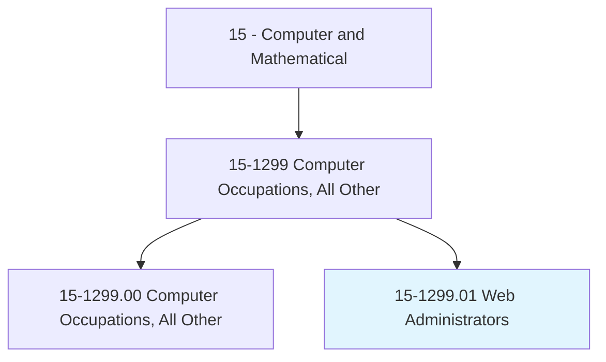
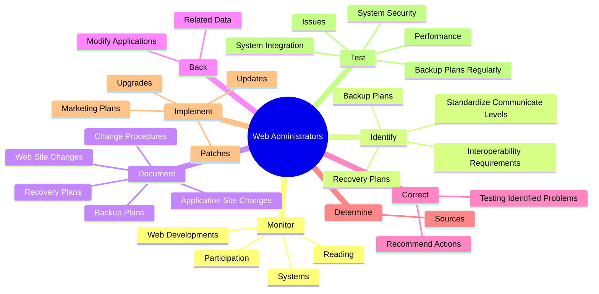
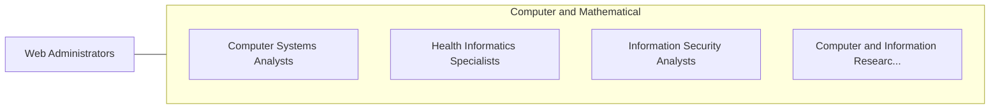

# Web Administrators

> Manage web environment design, deployment, development and maintenance activities. Perform testing and quality assurance of web sites and web applications.

## Overview

Web Administrators is a specialized variant within the Computer and Mathematical category. Manage web environment design, deployment, development and maintenance activities. 

## Classification Hierarchy

## Key Statistics

| Metric | Value |
|--------|-------|
| SOC Code | 15-1299.01 |
| Category | [Computer and Mathematical](/occupations/Technology) |
| Task Count | 121 |
| Source | O*NET |

## Core Tasks

### monitor.Systems

Web Administrators monitor systems as part of their core responsibilities.

**Actions:**
- `monitor.Systems.for.Intrusions.of.ServiceAttacks`
- `monitor.Systems.for.Denial.of.ServiceAttacks`
- `monitor.Systems.for.ReportSecurityBreaches.to.appropriate.Personnel`
- `monitor.WebDevelopments.through.ContinuingEducation.in.ProfessionalConferences`

### identify.BackupPlans

Web Administrators identify backup plans as part of their core responsibilities.

**Actions:**
- `identify.BackupPlans`
- `identify.RecoveryPlans`
- `identify.StandardizeCommunicateLevels.of.AccessSecurity`
- `identify.InteroperabilityRequirements`

### document.BackupPlans

Web Administrators document backup plans as part of their core responsibilities.

**Actions:**
- `document.BackupPlans`
- `document.RecoveryPlans`
- `document.ApplicationSiteChanges`
- `document.ChangeProcedures`

## Skills & Competencies

### Technical Skills
- **Programming** - Advanced
- **Systems Analysis** - Advanced
- **Database Management** - Advanced

### Soft Skills
- **Communication** - Essential
- **Problem Solving** - Essential
- **Critical Thinking** - Important
- **Teamwork** - Important
- **Adaptability** - Important

## Related Occupations

## Industries

This occupation is found across multiple industries. See [Industries](/industries) for sector-specific employment data.

## Career Progression

---

*Source: O*NET 15-1299.01 - ONETOccupation*
