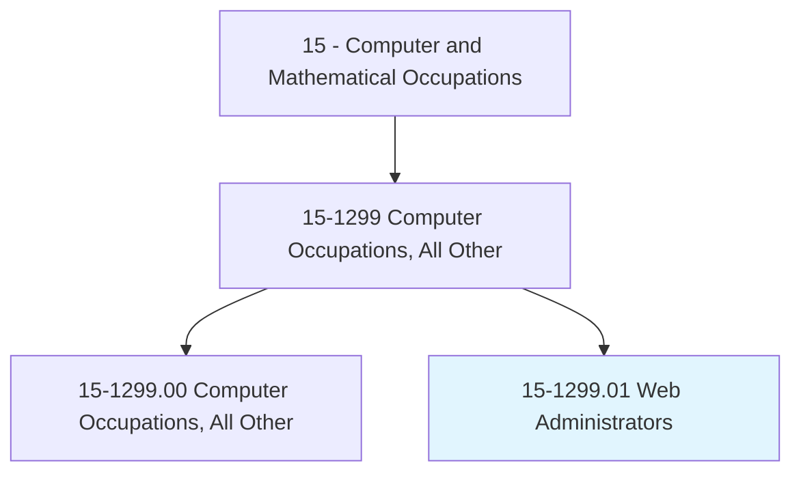
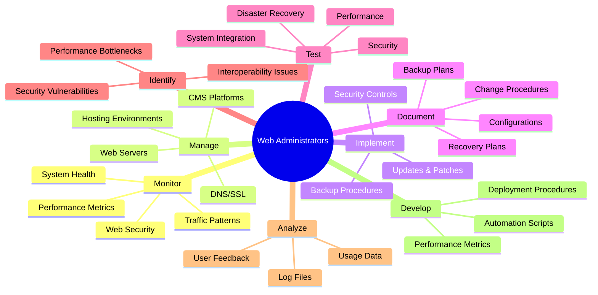
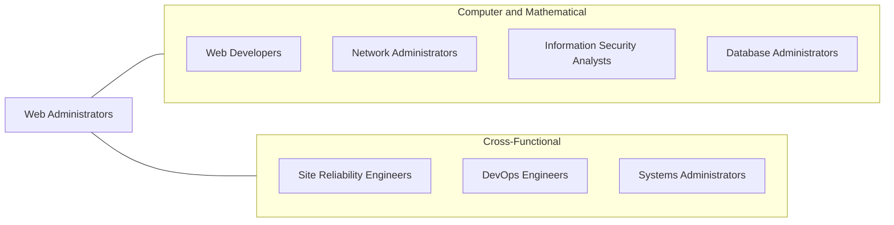
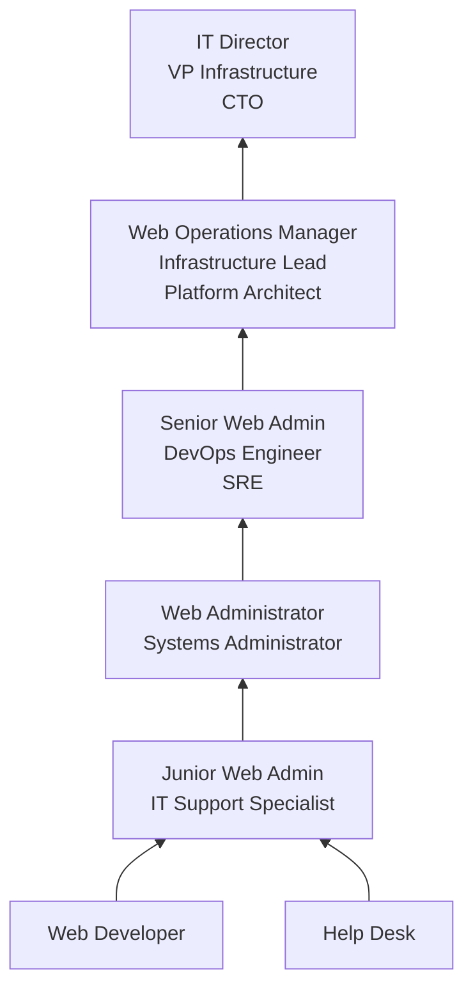

# Web Administrators

> Manage web environment design, deployment, development and maintenance activities. Perform testing and quality assurance of web sites and web applications.

## Overview

Web Administrators manage the infrastructure, deployment, and day-to-day operations of organizational websites and web applications. They oversee web server configuration, monitor site performance and security, implement updates and patches, manage content management systems, and ensure web properties remain available, secure, and performant. The role bridges web development and IT operations, requiring both technical infrastructure skills and web technology knowledge.

Unlike web developers who build applications, web administrators focus on the operational side: keeping sites running, monitoring uptime, managing hosting environments, implementing backup and recovery procedures, and responding to security incidents. They configure web servers (Apache, Nginx, IIS), manage SSL certificates, optimize caching strategies, and ensure compliance with accessibility and security standards. In many organizations, they also manage the CMS platform and coordinate with content creators and developers.

The role has evolved with the shift to cloud hosting, containerized deployments, and DevOps practices. Modern web administrators work with cloud platforms (AWS, Azure, GCP), container orchestration tools, CDN services, and automated deployment pipelines. Organizations increasingly expect web administrators to implement infrastructure as code, manage CI/CD workflows, and apply site reliability engineering (SRE) principles to maintain high availability and performance.

## Classification Hierarchy

## Key Statistics

| Metric | Value |
|--------|-------|
| SOC Code | 15-1299.01 |
| Job Zone | 4 (Considerable Preparation) |
| Category | [Computer and Mathematical](/occupations/Technology/index) |
| Task Count | 121 |
| Median Salary | $82,050 |
| Employment | ~25,000 |
| Growth Rate | Average |
| Source | O*NET |

## Core Tasks

### monitor.WebInfrastructure

Web Administrators continuously monitor web systems for availability, security, and performance.

**Actions:**
- `monitor.Systems.for.SecurityBreaches`
- `monitor.Systems.for.DenialOfServiceAttacks`
- `monitor.PerformanceMetrics.for.UptimeCompliance`
- `monitor.WebDevelopments.through.ContinuingEducation`

### manage.WebServers

Web Administrators configure and maintain web server infrastructure.

**Actions:**
- `manage.WebServers.for.OptimalPerformance`
- `manage.CMSPlatforms.for.ContentDelivery`
- `manage.SSLCertificates.for.SecureCommunication`
- `manage.DNSRecords.for.DomainResolution`

### implement.SecurityAndUpdates

Web Administrators keep web infrastructure secure and current.

**Actions:**
- `implement.SecurityPatches.for.VulnerabilityMitigation`
- `implement.Updates.for.SystemStability`
- `implement.BackupProcedures.for.DataRecovery`
- `implement.AccessControls.for.ContentSecurity`

### document.OperationalProcedures

Web Administrators maintain comprehensive documentation of systems and procedures.

**Actions:**
- `document.BackupPlans.for.DisasterRecovery`
- `document.RecoveryPlans.for.BusinessContinuity`
- `document.ChangeProcedures.for.AuditCompliance`
- `document.SystemConfigurations.for.KnowledgeTransfer`

## Tech Stack

### Web Servers
- **Apache** - HTTP server
- **Nginx** - High-performance web server
- **IIS** - Microsoft web server
- **LiteSpeed** - Performance-optimized server
- **Caddy** - Automatic HTTPS

### Content Management Systems
- **WordPress** - Web CMS
- **Drupal** - Enterprise CMS
- **Sitecore** - .NET CMS
- **Adobe Experience Manager** - Enterprise CMS
- **Contentful** - Headless CMS

### Cloud & Hosting
- **AWS (EC2, S3, CloudFront)** - Cloud hosting
- **Azure App Service** - Microsoft hosting
- **Google Cloud** - GCP services
- **Cloudflare** - CDN and security
- **Vercel/Netlify** - JAMstack hosting
- **DigitalOcean** - Cloud VMs

### Monitoring & Analytics
- **Google Analytics** - Web analytics
- **Datadog** - Infrastructure monitoring
- **New Relic** - APM
- **Uptime Robot** - Availability monitoring
- **Pingdom** - Performance monitoring
- **ELK Stack** - Log analysis

### DevOps & Automation
- **Docker** - Containerization
- **Kubernetes** - Orchestration
- **Ansible/Puppet** - Configuration management
- **Terraform** - Infrastructure as code
- **GitHub Actions/Jenkins** - CI/CD
- **Let's Encrypt/Certbot** - SSL automation

### Security
- **Cloudflare WAF** - Web application firewall
- **ModSecurity** - Open-source WAF
- **Fail2Ban** - Brute force protection
- **Qualys/Nessus** - Vulnerability scanning
- **OWASP Tools** - Security testing

## Certifications

| Certification | Provider | Level |
|---------------|----------|-------|
| AWS Solutions Architect | Amazon | Associate |
| CompTIA Linux+ | CompTIA | Foundation |
| Microsoft Azure Administrator | Microsoft | Associate |
| Red Hat Certified System Administrator | Red Hat | Professional |
| Certified Kubernetes Administrator (CKA) | CNCF | Professional |
| CompTIA Security+ | CompTIA | Foundation |

## Skills & Competencies

### Technical Skills
- **Web Server Configuration** - Expert
- **Linux/Unix Administration** - Expert
- **Cloud Platforms (AWS/Azure/GCP)** - Advanced
- **CMS Administration** - Advanced
- **SSL/TLS Management** - Advanced
- **DNS Management** - Advanced
- **Scripting (Bash/Python)** - Advanced
- **Monitoring & Logging** - Advanced
- **Backup & Recovery** - Expert
- **Web Security** - Advanced

### Soft Skills
- **Problem Solving** - Critical
- **Attention to Detail** - Critical
- **Communication** - Essential
- **Time Management** - Essential (incident response)
- **Documentation** - Important
- **Continuous Learning** - Essential

## Related Occupations

- [Web Developers](/occupations/Technology/WebDevelopers)
- [Network and Computer Systems Administrators](/occupations/Technology/NetworkAndComputerSystemsAdministrators)
- [Information Security Analysts](/occupations/Technology/InformationSecurityAnalysts)
- [Database Administrators](/occupations/Technology/DatabaseAdministrators)

## Industry Variations

### Technology / SaaS
- High-availability web infrastructure
- Auto-scaling and load balancing
- Multi-region deployments
- Infrastructure as code

### E-commerce
- Payment system security (PCI-DSS)
- Peak traffic management (Black Friday)
- CDN optimization for conversions
- Uptime SLA management

### Media / Publishing
- High-traffic content delivery
- CMS administration and customization
- SEO and performance optimization
- Multi-site management

### Government
- Section 508 accessibility compliance
- FedRAMP hosting requirements
- Content security and classification
- Multi-agency web standards

### Education
- Learning management system (LMS) hosting
- Student portal administration
- FERPA compliance
- Multi-campus web management

## Career Progression

## Education & Training

| Requirement | Details |
|-------------|---------|
| Typical Education | Bachelor's in Computer Science, Information Technology, or related field |
| Alternative Paths | Associate degree + certifications, self-taught with experience |
| Work Experience | 1-3 years in IT or web development for entry |
| Key Knowledge Areas | Web servers, Linux, networking, security, cloud platforms, CMS |
| Continuing Education | Cloud certifications, security training, web technology updates |

## Departments

This occupation typically works in:
- [Information Technology](/departments/Technology)
- Web Operations
- [Marketing (Digital)](/departments/Marketing)
- [Engineering](/departments/Technology)

---

*Source: O*NET 15-1299.01 - ONETOccupation*
