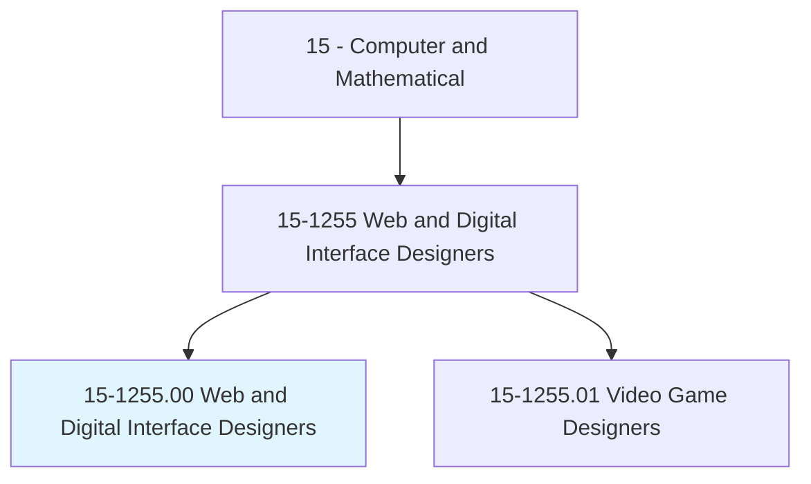
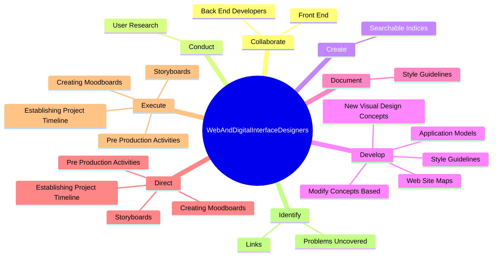
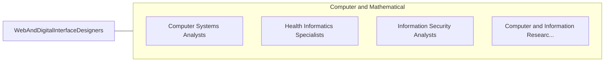

# Web and Digital Interface Designers

> Design digital user interfaces or websites. Develop and test layouts, interfaces, functionality, and navigation menus to ensure compatibility and usability across browsers or devices. May use web framework applications as well as client-side code and processes. May evaluate web design following web and accessibility standards, and may analyze web use metrics and optimize websites for marketability and search engine ranking. May design and test interfaces that facilitate the human-computer interaction and maximize the usability of digital devices, websites, and software with a focus on aesthetics and design. May create graphics used in websites and manage website content and links.

## Overview

Web and Digital Interface Designers is an occupation within the Computer and Mathematical category. Design digital user interfaces or websites. Develop and test layouts, interfaces, functionality, and navigation menus to ensure compatibility and usability across browsers or devices.

## Classification Hierarchy

## Key Statistics

| Metric | Value |
|--------|-------|
| SOC Code | 15-1255.00 |
| Category | [Computer and Mathematical](/occupations/Technology) |
| Task Count | 49 |
| Source | O*NET |

## Core Tasks

### collaborate.FrontEnd

Web and Digital Interface Designers collaborate front end as part of their core responsibilities.

**Actions:**
- `collaborate.FrontEnd.to.complete.FullScopeOfWebDevelopmentProjects`
- `collaborate.BackEndDevelopers.to.complete.FullScopeOfWebDevelopmentProjects`

### conduct.UserResearch

Web and Digital Interface Designers conduct user research as part of their core responsibilities.

**Actions:**
- `conduct.UserResearch.to.determine.DesignRequirements`
- `conduct.UserResearch.to.analyze.UserFeedbackToImproveDesignQuality`

### create.SearchableIndices

Web and Digital Interface Designers create searchable indices as part of their core responsibilities.

**Actions:**
- `create.SearchableIndices.for.WebPageContent`

## Skills & Competencies

### Technical Skills
- **Programming** - Advanced
- **Systems Analysis** - Advanced
- **Database Management** - Advanced

### Soft Skills
- **Communication** - Essential
- **Problem Solving** - Essential
- **Critical Thinking** - Important
- **Teamwork** - Important
- **Adaptability** - Important

## Related Occupations

## Industries

This occupation is found across multiple industries. See [Industries](/industries) for sector-specific employment data.

## Career Progression

---

*Source: O*NET 15-1255.00 - ONETOccupation*
