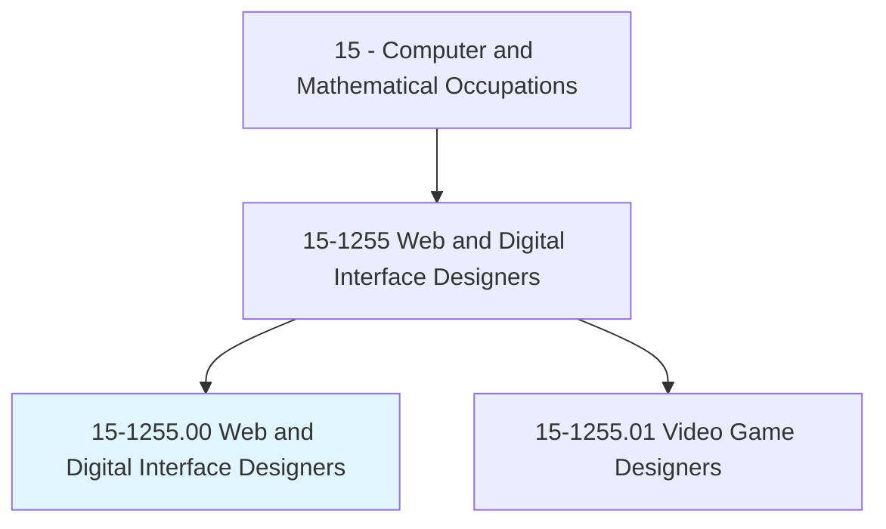
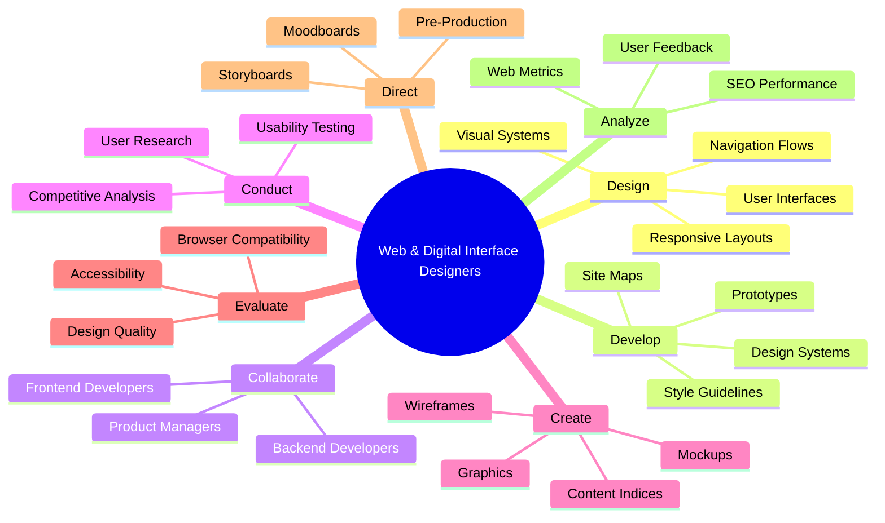
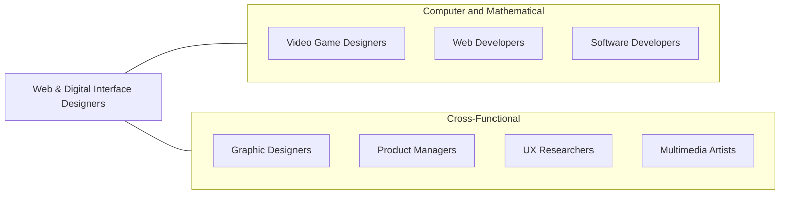
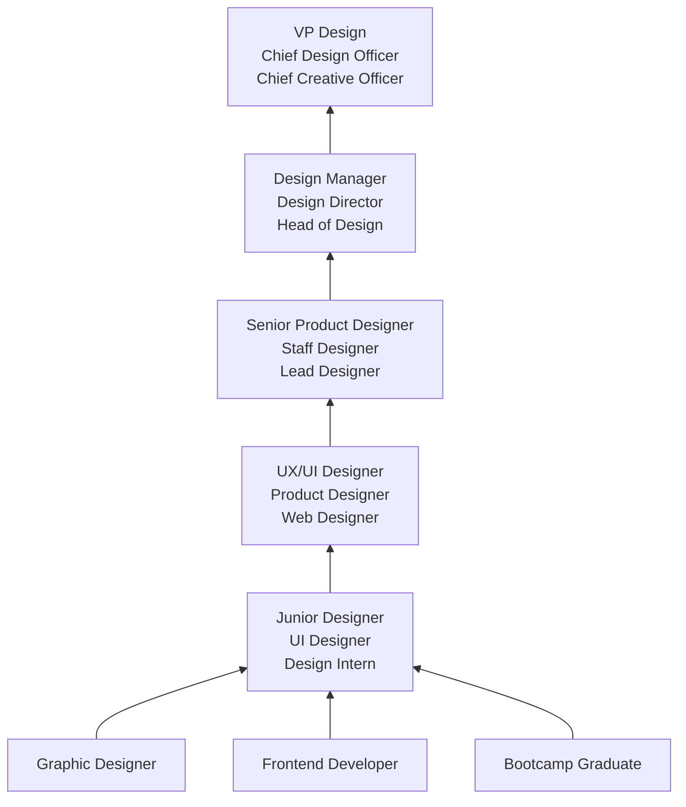

# Web and Digital Interface Designers

> Design digital user interfaces or websites. Develop and test layouts, interfaces, functionality, and navigation menus to ensure compatibility and usability across browsers or devices. May use web framework applications as well as client-side code and processes. May evaluate web design following web and accessibility standards, and may analyze web use metrics and optimize websites for marketability and search engine ranking. May design and test interfaces that facilitate the human-computer interaction and maximize the usability of digital devices, websites, and software with a focus on aesthetics and design. May create graphics used in websites and manage website content and links.

## Overview

Web and Digital Interface Designers create the visual design and user experience of websites, web applications, mobile apps, and other digital products. They combine graphic design skills, UX research methodology, and frontend technical knowledge to design interfaces that are visually compelling, intuitive to use, and accessible to all users. Their work directly shapes how people interact with digital products and services.

The role encompasses a broad spectrum of design activities, from visual design (typography, color, layout, iconography) to interaction design (navigation flows, micro-interactions, animations) to user experience research (user testing, persona development, journey mapping). Digital interface designers must understand design systems, responsive design principles, accessibility standards (WCAG), and the technical constraints of web and mobile platforms. Many also write frontend code (HTML, CSS, JavaScript) to prototype or implement their designs.

The field has matured significantly with the rise of design systems, component-based design, and tools like Figma that enable real-time collaboration between designers and developers. Modern digital interface designers are expected to think systematically about design consistency, work within established design systems, create production-ready assets, and measure the impact of their designs through analytics and user research.

## Classification Hierarchy

## Key Statistics

| Metric | Value |
|--------|-------|
| SOC Code | 15-1255.00 |
| Job Zone | 3 (Medium Preparation) |
| Category | [Computer and Mathematical](/occupations/Technology/index) |
| Task Count | 49 |
| Median Salary | $82,710 |
| Employment | ~105,400 |
| Growth Rate | Faster Than Average (16%) |
| Source | O*NET |

## Core Tasks

### design.UserInterfaces

Digital Interface Designers create visual designs and interaction patterns for digital products.

**Actions:**
- `design.UserInterfaces.for.WebApplications`
- `design.ResponsiveLayouts.for.CrossDeviceCompatibility`
- `design.NavigationSystems.for.IntuitiveUsability`
- `design.InteractionPatterns.for.UserEngagement`

### develop.DesignSystems

Digital Interface Designers create and maintain scalable design systems.

**Actions:**
- `develop.DesignSystems.for.ConsistentBrandExperience`
- `develop.StyleGuidelines.for.DesignConsistency`
- `develop.ComponentLibraries.for.DeveloperHandoff`
- `develop.VisualDesignConcepts.for.NewProducts`

### conduct.UserResearch

Digital Interface Designers gather user insights to inform design decisions.

**Actions:**
- `conduct.UserResearch.to.determine.DesignRequirements`
- `conduct.UsabilityTesting.to.validate.DesignDecisions`
- `analyze.UserFeedback.to.improve.DesignQuality`
- `analyze.WebMetrics.to.optimize.UserExperience`

### collaborate.WithDevelopers

Digital Interface Designers work closely with development teams to implement designs.

**Actions:**
- `collaborate.FrontendDevelopers.to.complete.WebProjects`
- `collaborate.BackendDevelopers.for.FunctionalIntegration`
- `create.DesignSpecs.for.DeveloperImplementation`
- `review.ImplementedDesigns.for.QualityAssurance`

## Tech Stack

### Design Tools
- **Figma** - Primary design and prototyping tool
- **Sketch** - macOS design tool
- **Adobe XD** - Adobe design tool
- **InVision** - Prototyping and collaboration
- **Framer** - Interactive prototyping
- **Principle** - Animation design

### Visual Design
- **Adobe Photoshop** - Image editing
- **Adobe Illustrator** - Vector graphics
- **Affinity Designer** - Vector design
- **Canva** - Quick graphics
- **Lottie** - Animation format

### Prototyping & Testing
- **Figma Prototyping** - Interactive prototypes
- **Maze** - Remote usability testing
- **UserTesting** - User research platform
- **Hotjar** - Heatmaps and recordings
- **Optimal Workshop** - Information architecture testing
- **Lookback** - User research sessions

### Frontend Awareness
- **HTML/CSS** - Markup and styling basics
- **JavaScript** - Interaction understanding
- **Tailwind CSS** - Utility-first CSS
- **Webflow** - Visual web development
- **Framer** - No-code web design

### Design Systems
- **Figma Libraries** - Shared components
- **Storybook** - UI component documentation
- **Zeroheight** - Design system documentation
- **Tokens Studio** - Design tokens

### Analytics
- **Google Analytics** - Web analytics
- **Mixpanel** - Product analytics
- **FullStory** - Session replay
- **Amplitude** - Behavioral analytics
- **Lighthouse** - Performance and accessibility auditing

## Certifications

| Certification | Provider | Level |
|---------------|----------|-------|
| Google UX Design Professional | Google | Professional |
| Nielsen Norman Group UX Certification | NN/g | Professional |
| Interaction Design Foundation | IxDF | Foundation/Advanced |
| Adobe Certified Professional | Adobe | Professional |
| Web Accessibility Specialist (WAS) | IAAP | Professional |
| HFI Certified Usability Analyst | HFI | Professional |

## Skills & Competencies

### Technical Skills
- **UI Design (Figma/Sketch)** - Expert
- **Visual Design** - Expert
- **Prototyping** - Expert
- **Design Systems** - Advanced
- **Responsive Design** - Expert
- **Accessibility (WCAG)** - Advanced
- **HTML/CSS** - Intermediate to Advanced
- **User Research Methods** - Advanced
- **Information Architecture** - Advanced
- **Typography & Color Theory** - Expert

### Soft Skills
- **Visual Creativity** - Critical
- **User Empathy** - Critical
- **Communication** - Essential (presenting design rationale)
- **Collaboration** - Essential (cross-functional teams)
- **Attention to Detail** - Critical
- **Receptiveness to Feedback** - Essential
- **Storytelling** - Important (design narratives)

## Related Occupations

- [Video Game Designers](/occupations/Technology/VideoGameDesigners)
- [Web Developers](/occupations/Technology/WebDevelopers)
- [Software Developers](/occupations/Technology/SoftwareDevelopers)

## Industry Variations

### Technology / SaaS
- Product design for complex applications
- Design systems at scale
- Data-driven design optimization
- Collaborative design with engineering

### E-commerce
- Conversion-optimized design
- Product page and checkout UX
- Mobile-first design
- Personalization interfaces

### Agency / Consulting
- Multi-brand design projects
- Client presentation and pitching
- Rapid design iterations
- Diverse industry exposure

### Financial Services
- Complex data visualization
- Trust and security-focused design
- Regulatory compliance interfaces
- Mobile banking experiences

### Healthcare
- Patient-facing portal design
- Accessibility-first design
- Medical device interfaces
- HIPAA-compliant UX patterns

### Media & Publishing
- Content-focused layouts
- Reading experience optimization
- Subscription flow design
- Multi-platform content delivery

## Career Progression

## Education & Training

| Requirement | Details |
|-------------|---------|
| Typical Education | Bachelor's in Graphic Design, UX Design, HCI, Visual Arts, or related field |
| Alternative Paths | Design bootcamps (Designlab, Springboard), self-taught with portfolio |
| Work Experience | 0-2 years entry, 3-5 years mid, 7+ years senior |
| Portfolio | Essential - primary factor in hiring decisions |
| Key Knowledge Areas | Visual design, UX principles, prototyping, accessibility, frontend basics |

## Departments

This occupation typically works in:
- Design
- [Product Development](/departments/Product)
- [Marketing (Digital)](/departments/Marketing)
- [Engineering](/departments/Technology)
- User Experience

---

*Source: O*NET 15-1255.00 - ONETOccupation*
