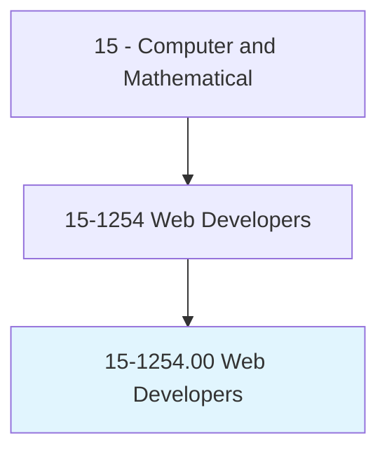
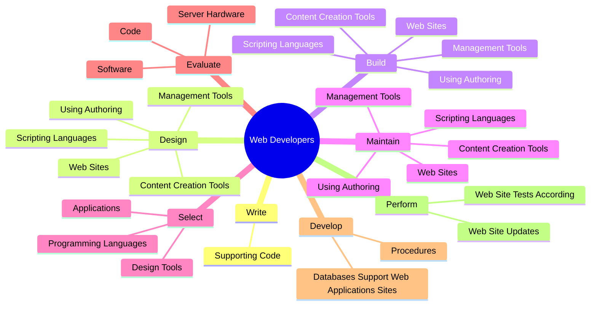

# Web Developers

> Develop and implement websites, web applications, application databases, and interactive web interfaces. Evaluate code to ensure that it is properly structured, meets industry standards, and is compatible with browsers and devices. Optimize website performance, scalability, and server-side code and processes. May develop website infrastructure and integrate websites with other computer applications.

## Overview

Web Developers is an occupation within the Computer and Mathematical category. Develop and implement websites, web applications, application databases, and interactive web interfaces. Evaluate code to ensure that it is properly structured, meets industry standards, and is compatible with browsers and devices.

## Classification Hierarchy

## Key Statistics

| Metric | Value |
|--------|-------|
| SOC Code | 15-1254.00 |
| Category | [Computer and Mathematical](/occupations/Technology) |
| Task Count | 118 |
| Source | O*NET |

## Core Tasks

### write.SupportingCode

Web Developers write supporting code as part of their core responsibilities.

**Actions:**
- `write.SupportingCode.for.WebApplicationsSites`
- `write.SupportingCode.for.WebSites`

### design.WebSites

Web Developers design web sites as part of their core responsibilities.

**Actions:**
- `design.WebSites`
- `design.UsingAuthoring`
- `design.ScriptingLanguages`
- `design.ContentCreationTools`

### build.WebSites

Web Developers build web sites as part of their core responsibilities.

**Actions:**
- `build.WebSites`
- `build.UsingAuthoring`
- `build.ScriptingLanguages`
- `build.ContentCreationTools`

## Skills & Competencies

### Technical Skills
- **Programming** - Advanced
- **Systems Analysis** - Advanced
- **Database Management** - Advanced

### Soft Skills
- **Communication** - Essential
- **Problem Solving** - Essential
- **Critical Thinking** - Important
- **Teamwork** - Important
- **Adaptability** - Important

## Related Occupations

## Industries

This occupation is found across multiple industries. See [Industries](/industries) for sector-specific employment data.

## Career Progression

---

*Source: O*NET 15-1254.00 - ONETOccupation*
