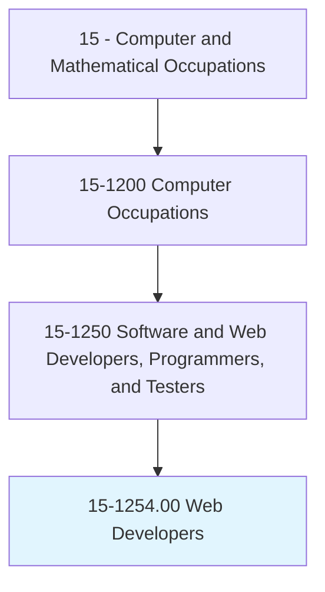
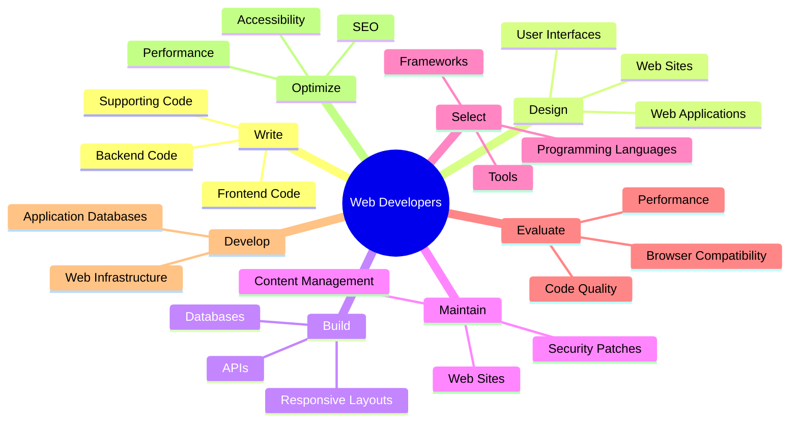
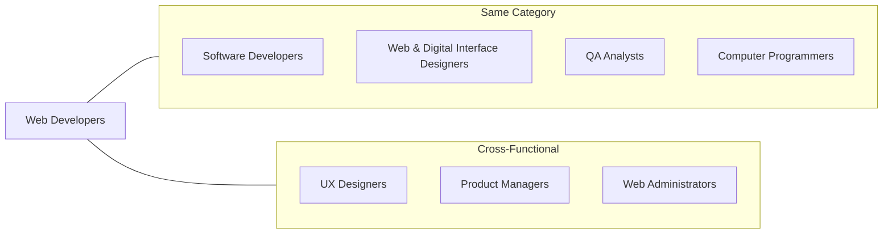
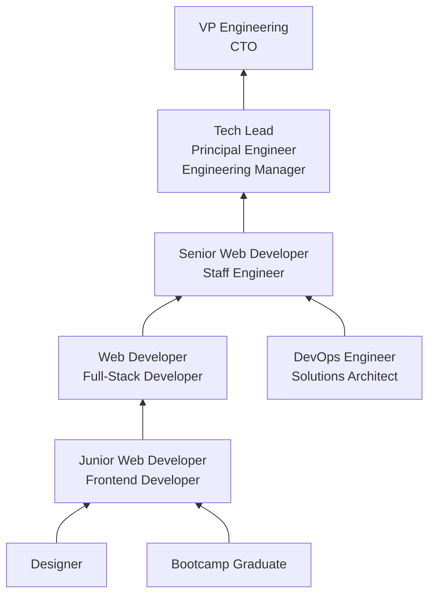

# Web Developers

> Develop and implement websites, web applications, application databases, and interactive web interfaces. Evaluate code to ensure that it is properly structured, meets industry standards, and is compatible with browsers and devices. Optimize website performance, scalability, and server-side code and processes. May develop website infrastructure and integrate websites with other computer applications.

## Overview

Web Developers design, build, and maintain websites and web applications that power modern digital experiences. They write code using a combination of frontend technologies (HTML, CSS, JavaScript) and backend languages (Python, Node.js, PHP, Ruby) to create everything from simple marketing sites to complex, data-driven web applications. The role requires both technical programming skills and an understanding of user experience, performance optimization, and web standards.

Modern web development has evolved far beyond static pages. Today's web developers build progressive web apps (PWAs), single-page applications (SPAs), real-time collaborative tools, and server-rendered applications that rival native software in capability. They work with sophisticated build systems, component-based architectures, and cloud deployment pipelines to deliver fast, secure, and accessible web experiences at scale.

The field is divided into three primary specializations: frontend developers who focus on the user-facing interface, backend developers who build server-side logic and APIs, and full-stack developers who work across both layers. Regardless of specialization, web developers must keep pace with the rapid evolution of web technologies and standards.

## Classification Hierarchy

## Key Statistics

| Metric | Value |
|--------|-------|
| SOC Code | 15-1254.00 |
| Job Zone | 3 (Medium Preparation) |
| Category | [Computer and Mathematical](/occupations/Technology/index) |
| Task Count | 118 |
| Median Salary | $80,730 |
| Employment | ~199,400 |
| Growth Rate | Much Faster Than Average (30%) |
| Source | O*NET |

## Core Tasks

### write.FrontendCode

Web Developers write client-side code that runs in the browser to create interactive user experiences.

**Actions:**
- `write.FrontendCode.using.HTMLCSSJavaScript`
- `write.SupportingCode.for.WebApplications`
- `build.ResponsiveLayouts.for.CrossDeviceCompatibility`
- `implement.Interactivity.using.JavaScriptFrameworks`

### design.WebApplications

Web Developers design the architecture and user interface of web-based systems.

**Actions:**
- `design.WebSites.using.AuthoringTools`
- `design.WebApplications.using.ComponentArchitecture`
- `design.UserInterfaces.for.Accessibility`
- `design.DatabaseSchemas.for.WebApplications`

### build.APIs

Web Developers build server-side APIs and services that power web applications.

**Actions:**
- `build.RESTfulAPIs.for.DataAccess`
- `build.GraphQLEndpoints.for.FlexibleQueries`
- `build.WebSockets.for.RealTimeCommunication`
- `develop.DatabasesSupport.for.WebApplications`

### optimize.Performance

Web Developers optimize sites for speed, search engines, and accessibility.

**Actions:**
- `optimize.WebsitePerformance.using.Caching`
- `optimize.ServerSideCode.for.Scalability`
- `optimize.Assets.for.FastLoading`
- `evaluate.Code.to.ensure.BrowserCompatibility`

## Tech Stack

### Frontend Languages & Frameworks
- **HTML5/CSS3** - Markup and styling
- **JavaScript/TypeScript** - Client-side programming
- **React** - Component-based UI library
- **Vue.js** - Progressive framework
- **Angular** - Full-featured framework
- **Svelte** - Compiled framework
- **Next.js/Nuxt.js** - Full-stack frameworks
- **Tailwind CSS** - Utility-first CSS

### Backend Languages & Frameworks
- **Node.js/Express** - JavaScript runtime
- **Python/Django/Flask** - Python web frameworks
- **PHP/Laravel** - PHP ecosystem
- **Ruby on Rails** - Ruby web framework
- **Go** - High-performance services
- **Java/Spring Boot** - Enterprise applications

### Databases
- **PostgreSQL** - Relational database
- **MySQL** - Relational database
- **MongoDB** - Document database
- **Redis** - Caching and sessions
- **SQLite** - Lightweight database
- **Firebase** - Real-time database

### DevOps & Deployment
- **Git/GitHub** - Version control
- **Docker** - Containerization
- **Vercel/Netlify** - Frontend hosting
- **AWS/GCP/Azure** - Cloud platforms
- **Nginx/Apache** - Web servers
- **CI/CD Pipelines** - Automated deployment
- **Cloudflare** - CDN and security

### Development Tools
- **VS Code** - Code editor
- **Chrome DevTools** - Browser debugging
- **Postman** - API testing
- **Figma** - Design handoff
- **Webpack/Vite** - Build tools
- **npm/yarn/pnpm** - Package managers

## Certifications

| Certification | Provider | Level |
|---------------|----------|-------|
| Meta Front-End Developer | Meta | Professional |
| Meta Back-End Developer | Meta | Professional |
| AWS Certified Cloud Practitioner | Amazon | Foundation |
| Google UX Design Certificate | Google | Professional |
| Certified Web Developer | W3Schools | Foundation |
| freeCodeCamp Certifications | freeCodeCamp | Foundation |

## Skills & Competencies

### Technical Skills
- **HTML/CSS** - Expert
- **JavaScript/TypeScript** - Expert
- **Frontend Frameworks (React/Vue/Angular)** - Advanced
- **Backend Development** - Advanced
- **Database Design** - Advanced
- **API Development** - Advanced
- **Version Control (Git)** - Expert
- **Responsive Design** - Expert
- **Web Accessibility (WCAG)** - Advanced
- **SEO Fundamentals** - Intermediate

### Soft Skills
- **Problem Solving** - Critical
- **Attention to Detail** - Critical
- **Communication** - Essential
- **Continuous Learning** - Essential
- **Collaboration** - Essential
- **Time Management** - Important

## Related Occupations

- [Software Developers](/occupations/Technology/SoftwareDevelopers)
- [Web and Digital Interface Designers](/occupations/Technology/WebAndDigitalInterfaceDesigners)
- [Web Administrators](/occupations/Technology/WebAdministrators)
- [Software Quality Assurance Analysts and Testers](/occupations/Technology/SoftwareQualityAssuranceAnalystsAndTesters)

## Industry Variations

### Technology / SaaS
- Full-stack SPA development
- Microservices architecture
- Real-time collaboration features
- CI/CD and automated testing

### E-commerce
- Shopping cart and checkout systems
- Payment gateway integration
- Product catalog management
- Performance optimization for conversions

### Media & Publishing
- Content management systems
- High-traffic site optimization
- Paywall and subscription systems
- SEO-driven development

### Agency / Consulting
- Client project management
- Multiple technology stacks
- Rapid prototyping
- WordPress/CMS customization

### Healthcare
- Patient portal development
- HIPAA-compliant web applications
- Telehealth platforms
- Accessibility compliance

## Career Progression

## Education & Training

| Requirement | Details |
|-------------|---------|
| Typical Education | Bachelor's in Computer Science or related field |
| Alternative Paths | Coding bootcamps, self-taught with portfolio, associate degree |
| Work Experience | 0-1 years entry, 2-4 years mid-level, 5+ years senior |
| On-the-Job Training | Continuous - rapid framework and tooling evolution |
| Portfolio | Strong portfolio often more important than formal degree |

## Departments

This occupation typically works in:
- [Engineering](/departments/Engineering)
- [Product Development](/departments/Product)
- [Marketing (Digital)](/departments/Marketing)
- [Information Technology](/departments/IT)
- [Design](/departments/Design)

---

*Source: O*NET 15-1254.00 - ONETOccupation*
