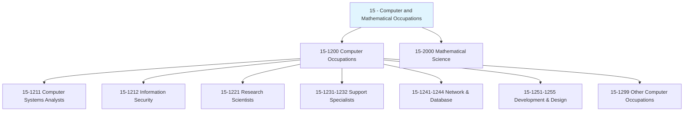
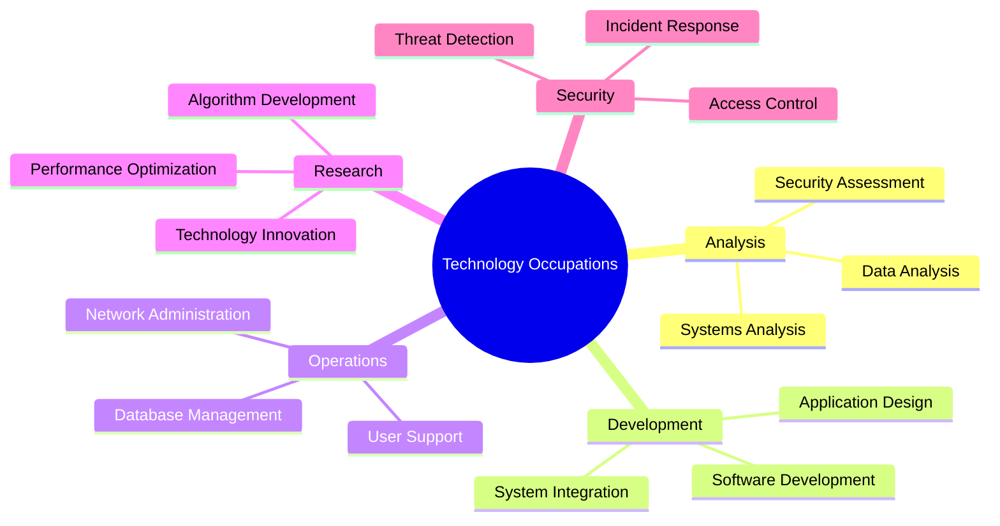
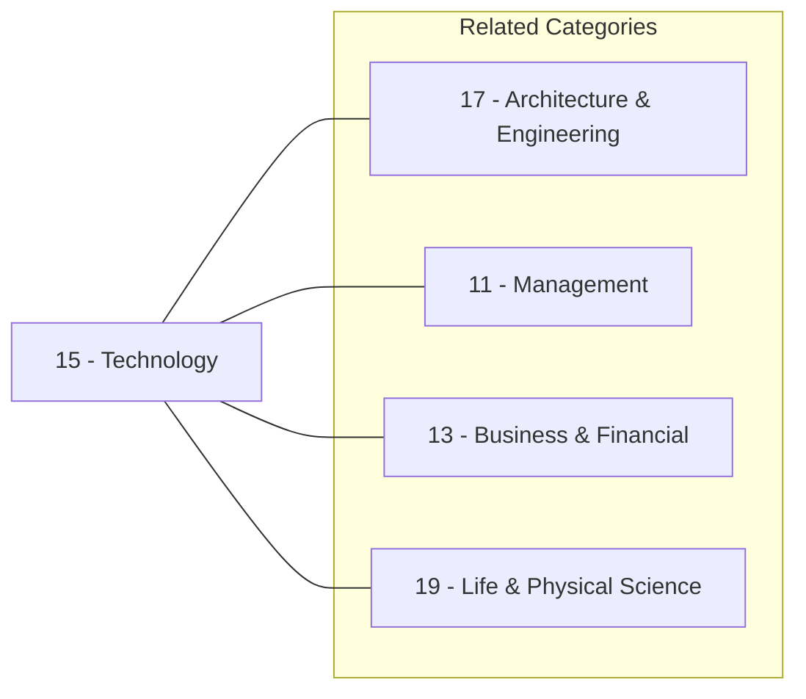
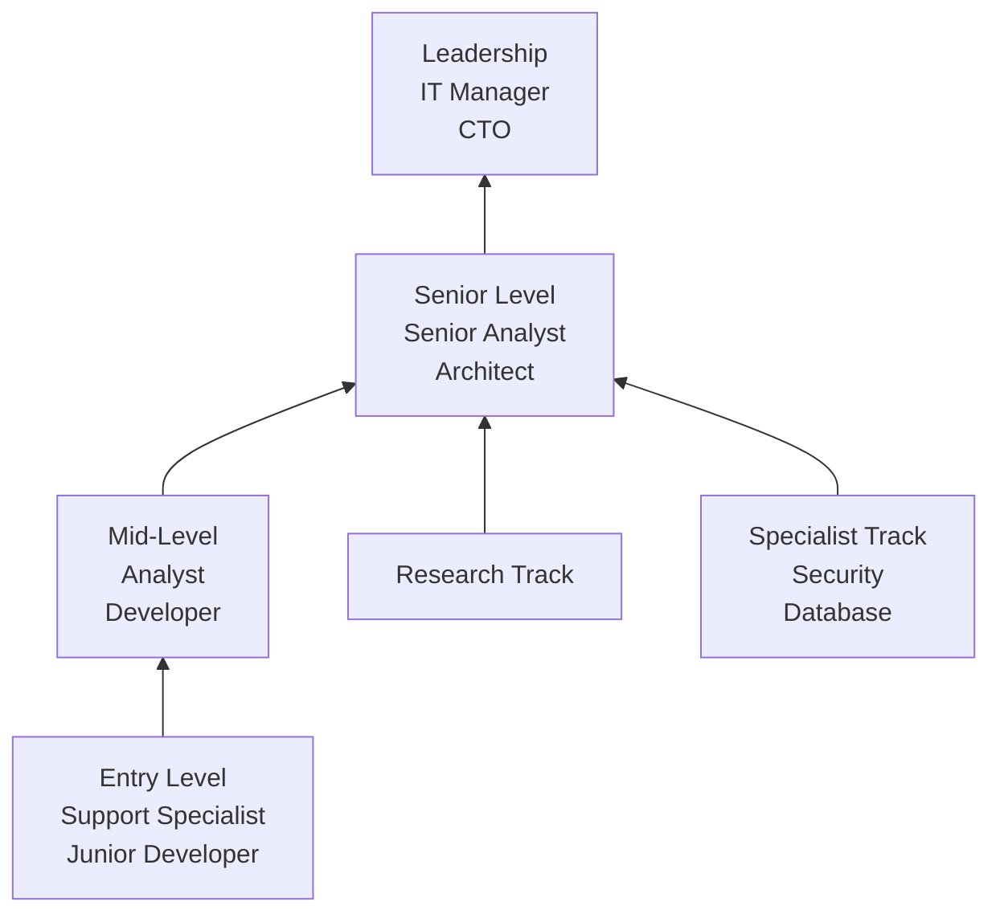

# Technology

> Computer and Mathematical occupations that research, design, develop, and apply technology solutions across all industries.

## Overview

Technology occupations (SOC Major Group 15) encompass professionals who work with computers, information systems, and mathematical applications. These roles span from theoretical research and software development to network administration and data analysis. As digital transformation continues to reshape every industry, technology professionals play an increasingly critical role in organizational success.

## Classification Hierarchy

## Key Statistics

| Metric | Value |
|--------|-------|
| SOC Code | 15-0000 |
| Total Occupations | 30+ |
| Categories | Computer Occupations, Mathematical Science |
| Growth Rate | Above Average |

## Occupations in this Category

### Computer Systems & Analysis

- [Computer Systems Analysts](./ComputerSystemsAnalysts.mdx) - Analyze and implement system solutions
- [Health Informatics Specialists](./HealthInformaticsSpecialists.mdx) - Bridge healthcare and technology

### Security & Research

- [Information Security Analysts](./InformationSecurityAnalysts.mdx) - Protect digital assets and networks
- [Computer and Information Research Scientists](./ComputerResearchScientists.mdx) - Advance computing theory and practice

### Support & Administration

- [Computer Network Support Specialists](./ComputerNetworkSupportSpecialists.mdx) - Maintain network operations

## Task Categories

## Skills & Competencies

### Technical Skills

- **Programming Languages** - Java, Python, JavaScript, C++
- **Database Technologies** - SQL, NoSQL, Data Warehousing
- **Network Technologies** - LAN, WAN, Cloud Infrastructure
- **Security Tools** - SIEM, Firewalls, Encryption
- **Systems Analysis** - Requirements Gathering, Process Modeling

### Soft Skills

- **Analytical Thinking** - Critical for problem-solving
- **Communication** - Translating technical to business
- **Collaboration** - Cross-functional teamwork
- **Continuous Learning** - Keeping pace with technology change

## Related Categories

## Industries

Technology professionals work across virtually all industries:

- Information Technology - Primary employment sector
- [Finance and Insurance](/industries/Finance) - High demand for analysts and developers
- [Healthcare](/industries/Healthcare/index) - Growing need for health informatics
- [Professional Services](/industries/Scientific) - Consulting and implementation
- [Government](/industries/PublicAdministration) - Federal and state IT roles
- [Manufacturing](/industries/Manufacturing/index) - Industrial automation and systems

## Career Progression

## Education & Training

| Requirement | Details |
|-------------|---------|
| Typical Education | Bachelor's degree in Computer Science, Information Systems, or related field |
| Advanced Roles | Master's degree or PhD for research positions |
| Certifications | CompTIA, Cisco, AWS, Microsoft, CISSP, PMP |
| Continuous Learning | Essential due to rapid technology change |

## Departments

Technology occupations typically work in:

- [Information Technology](/departments/Technology)
- [Engineering](/departments/Technology)
- Research & Development
- [Operations](/departments/Operations/index)
- [Security](/departments/Security)

---

*Source: O*NET SOC Major Group 15 - Computer and Mathematical Occupations*
