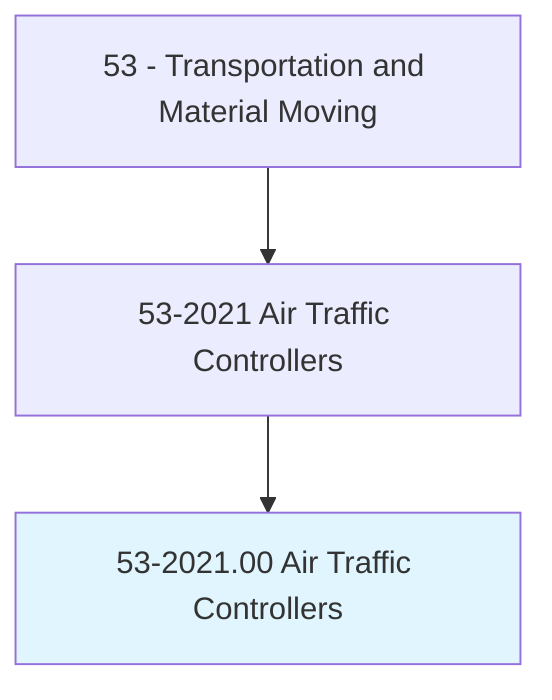
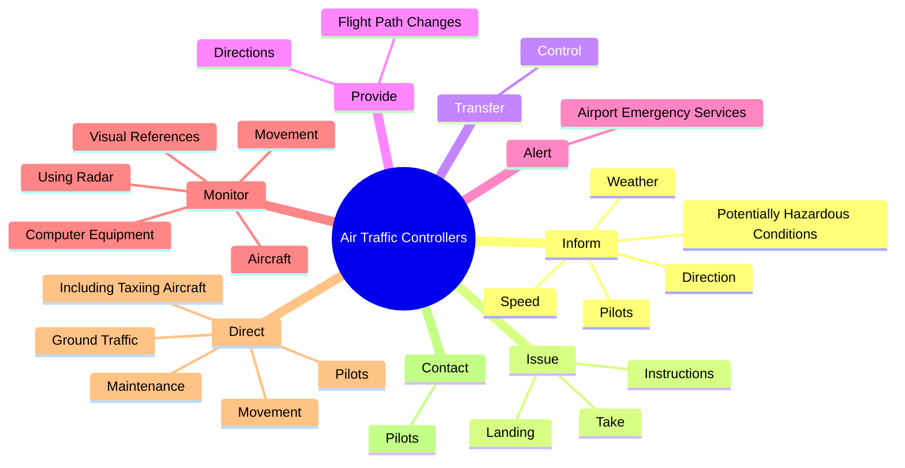
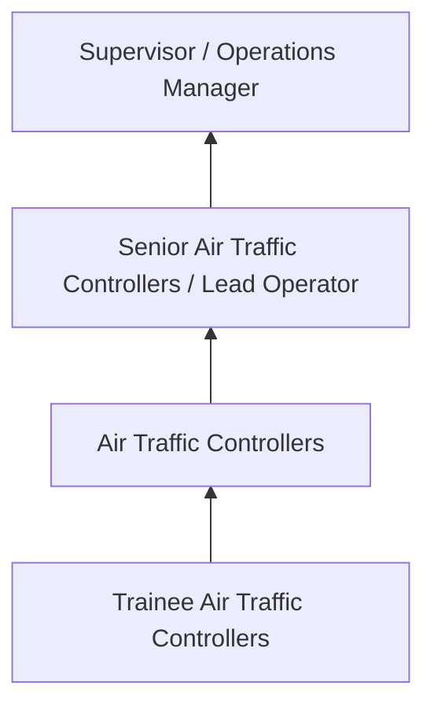
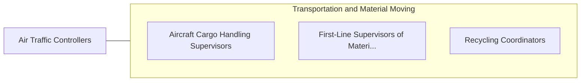

# Air Traffic Controllers

> Control air traffic on and within vicinity of airport, and movement of air traffic between altitude sectors and control centers, according to established procedures and policies. Authorize, regulate, and control commercial airline flights according to government or company regulations to expedite and ensure flight safety.

## Overview

Air Traffic Controllers professionals control air traffic on and within vicinity of airport, and movement of air traffic between altitude sectors and control centers, according to established procedures and policies. This occupation falls within the Transportation and Material Moving category and requires a combination of specialized knowledge, technical skills, and practical experience.

These professionals work across diverse settings and organizational contexts, applying their expertise to meet the demands of their field. They must stay current with industry standards, emerging practices, and regulatory requirements that affect their work. The role demands both independent judgment and collaborative skills, as practitioners regularly interact with colleagues, stakeholders, and the public.

As the field continues to evolve, Air Traffic Controllers professionals increasingly leverage technology and data-driven approaches to enhance their effectiveness. Career opportunities span the public and private sectors, with demand influenced by economic conditions, demographic shifts, and technological advancement.

## Classification Hierarchy



## Key Statistics

| Metric | Value |
|--------|-------|
| SOC Code | 53-2021.00 |
| Job Zone | N/A |
| Category | [Transportation and Material Moving](/occupations/Transportation/index) |
| Core Tasks | 77+ |
| Salary Range | $30,000 - $75,000 |
| Median Salary | $45,000 |
| Growth Outlook | 6% (As fast as average) |
| Source | O*NET |

## Core Tasks



### inform.Pilots

Air Traffic Controllers inform pilots as part of their core responsibilities.

**Actions:**
- `inform.Pilots.about.NearbyPlanesHazardousConditions.of.Wind` - Inform pilots about nearby planes or potentially hazardous conditions, such a...
- `inform.Pilots.about.NearbyPlanesHazardousConditions.of.VisibilityProblems` - Inform pilots about nearby planes or potentially hazardous conditions, such a...
- `inform.PotentiallyHazardousConditions.of.Wind` - Inform pilots about nearby planes or potentially hazardous conditions, such a...
- `inform.PotentiallyHazardousConditions.of.VisibilityProblems` - Inform pilots about nearby planes or potentially hazardous conditions, such a...
- `inform.Weather.of.Wind` - Inform pilots about nearby planes or potentially hazardous conditions, such a...

### direct.Movement

Air Traffic Controllers direct movement as part of their core responsibilities.

**Actions:**
- `direct.Movement.of.AircraftWithinAssignedAirSpaceGroundAtAirports.to.minimize.DelaysMaximizeSafety` - Monitor or direct the movement of aircraft within an assigned air space or on...
- `direct.Movement.of.OnGroundAtAirports.to.minimize.DelaysMaximizeSafety` - Monitor or direct the movement of aircraft within an assigned air space or on...
- `direct.Pilots.to.RunwaysWhenSpaceIsAvailable` - Direct pilots to runways when space is available or direct them to maintain a...
- `direct.Pilots.to.direct.ThemToMaintainTrafficPatternUntilThereIsSpaceForThemToLand` - Direct pilots to runways when space is available or direct them to maintain a...
- `direct.GroundTraffic` - Direct ground traffic, including taxiing aircraft, maintenance or baggage veh...

### monitor.Movement

Air Traffic Controllers monitor movement as part of their core responsibilities.

**Actions:**
- `monitor.Movement.of.AircraftWithinAssignedAirSpaceGroundAtAirports.to.minimize.DelaysMaximizeSafety` - Monitor or direct the movement of aircraft within an assigned air space or on...
- `monitor.Movement.of.OnGroundAtAirports.to.minimize.DelaysMaximizeSafety` - Monitor or direct the movement of aircraft within an assigned air space or on...
- `monitor.Aircraft.within.SpecificAirspace` - Monitor aircraft within a specific airspace, using radar, computer equipment,...
- `monitor.UsingRadar` - Monitor aircraft within a specific airspace, using radar, computer equipment,...
- `monitor.ComputerEquipment` - Monitor aircraft within a specific airspace, using radar, computer equipment,...

### maintain.RadioContact

Air Traffic Controllers maintain radio contact as part of their core responsibilities.

**Actions:**
- `maintain.RadioContact.with.AdjacentControlTowers` - Maintain radio or telephone contact with adjacent control towers, terminal co...
- `maintain.RadioContact.with.TerminalControlUnits` - Maintain radio or telephone contact with adjacent control towers, terminal co...
- `maintain.RadioContact.with.OtherAreaControlCenters.to.coordinate.AircraftMovement` - Maintain radio or telephone contact with adjacent control towers, terminal co...
- `maintain.TelephoneContact.with.AdjacentControlTowers` - Maintain radio or telephone contact with adjacent control towers, terminal co...
- `maintain.TelephoneContact.with.TerminalControlUnits` - Maintain radio or telephone contact with adjacent control towers, terminal co...


## Skills & Competencies

### Technical Skills
- **Equipment Operation** - Advanced
- **Safety Procedures** - Advanced
- **Navigation Systems** - Proficient
- **Load Management** - Proficient
- **Vehicle Inspection** - Proficient
- **Regulatory Compliance** - Proficient

### Soft Skills
- **Situational Awareness** - Critical
- **Reliability** - Critical
- **Time Management** - Essential
- **Communication** - Essential
- **Physical Stamina** - Essential

## Education & Certifications

| Requirement | Details |
|-------------|---------|
| Typical Education | High school diploma or equivalent; some positions require post-secondary training |
| Work Experience | 0-2 years on-the-job experience |
| On-the-Job Training | Moderate - safety and equipment operation training |
| Certifications | CDL, hazmat endorsements, or transportation-specific licenses |

## Career Progression



## Industry Variations

### Freight and Logistics
Commercial transportation of goods. Air Traffic Controllers professionals focus on efficiency, safety, and timely delivery across supply chains.

### Public Transit
Passenger transportation services. Emphasis on schedules, safety, and customer service in public-facing roles.

### Warehousing and Distribution
Material handling and storage operations. Focus on inventory management and order fulfillment efficiency.

### Specialized Transport
Hazardous materials, oversized loads, or temperature-controlled transport requiring additional certifications and safety protocols.

## Technology & Tools

- **GPS and navigation systems**
- **Fleet management software**
- **Electronic logging devices (ELD)**
- **Warehouse management systems (WMS)**
- **Transportation management systems (TMS)**

## Related Occupations



## Industries

- [Trucking and Freight](/industries/Trucking) - High Employment
- [Warehousing and Storage](/industries/Warehousing) - High Employment
- [Air Transportation](/industries/AirTransportation) - Moderate Employment
- [Rail Transportation](/industries/RailTransportation) - Moderate Employment

## Departments

This occupation typically works in:
- [Operations](/departments/Operations/index)
- [Logistics](/departments/SupplyChain)
- Fleet Management

## GraphDL Semantic Structure

```graphdl
Air Traffic Controllers perform:
- inform.Pilots.about.NearbyPlanesHazardousConditions.of.Wind
- inform.Pilots.about.NearbyPlanesHazardousConditions.of.VisibilityProblems
- inform.PotentiallyHazardousConditions.of.Wind
- inform.PotentiallyHazardousConditions.of.VisibilityProblems
- inform.Weather.of.Wind
- inform.Weather.of.VisibilityProblems
```

---

*Source: O*NET 53-2021.00 - ONETOccupation*
