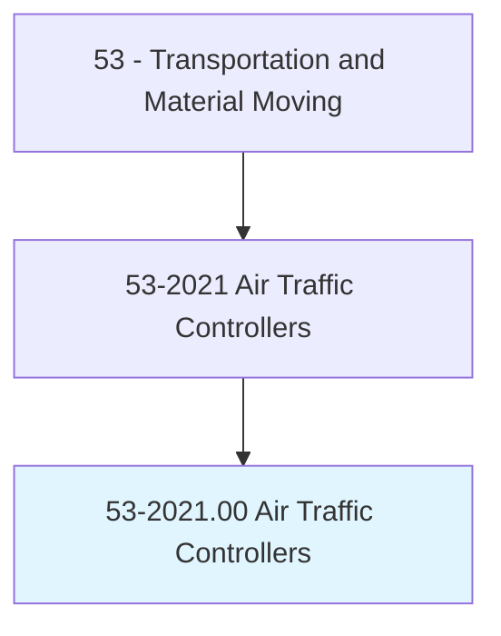
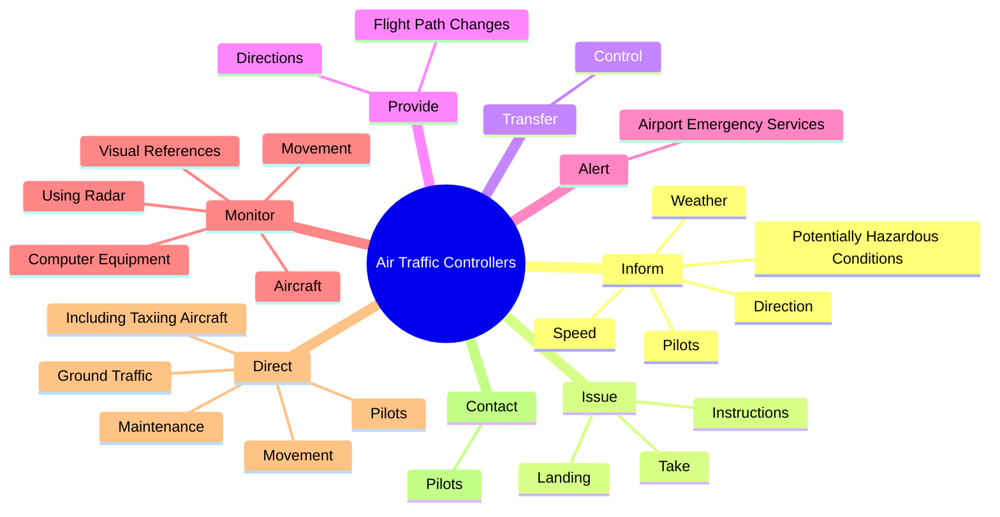
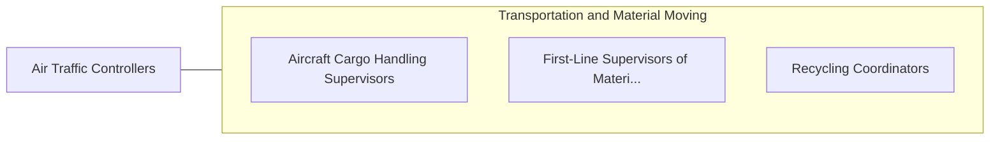

# Air Traffic Controllers

> Control air traffic on and within vicinity of airport, and movement of air traffic between altitude sectors and control centers, according to established procedures and policies. Authorize, regulate, and control commercial airline flights according to government or company regulations to expedite and ensure flight safety.

## Overview

Air Traffic Controllers is an occupation within the Transportation and Material Moving category. Control air traffic on and within vicinity of airport, and movement of air traffic between altitude sectors and control centers, according to established procedures and policies. 

## Classification Hierarchy

## Key Statistics

| Metric | Value |
|--------|-------|
| SOC Code | 53-2021.00 |
| Category | [Transportation and Material Moving](/occupations/Transportation) |
| Task Count | 77 |
| Source | O*NET |

## Core Tasks

### inform.Pilots

Air Traffic Controllers inform pilots as part of their core responsibilities.

**Actions:**
- `inform.Pilots.about.NearbyPlanesHazardousConditions.of.Wind`
- `inform.Pilots.about.NearbyPlanesHazardousConditions.of.VisibilityProblems`
- `inform.PotentiallyHazardousConditions.of.Wind`
- `inform.PotentiallyHazardousConditions.of.VisibilityProblems`

### issue.Landing

Air Traffic Controllers issue landing as part of their core responsibilities.

**Actions:**
- `issue.Landing`
- `issue.Take.off.Authorizations`
- `issue.Instructions`

### transfer.Control

Air Traffic Controllers transfer control as part of their core responsibilities.

**Actions:**
- `transfer.Control.of.DepartingFlightsToTrafficControlCenters`
- `transfer.Control.of.AcceptControl.of.ArrivingFlights`

## Skills & Competencies

### Technical Skills
- **Vehicle Operation** - Advanced
- **Logistics** - Advanced
- **Safety Compliance** - Advanced

### Soft Skills
- **Communication** - Essential
- **Problem Solving** - Essential
- **Critical Thinking** - Important
- **Teamwork** - Important
- **Adaptability** - Important

## Related Occupations

## Industries

This occupation is found across multiple industries. See [Industries](/industries) for sector-specific employment data.

## Career Progression

---

*Source: O*NET 53-2021.00 - ONETOccupation*
