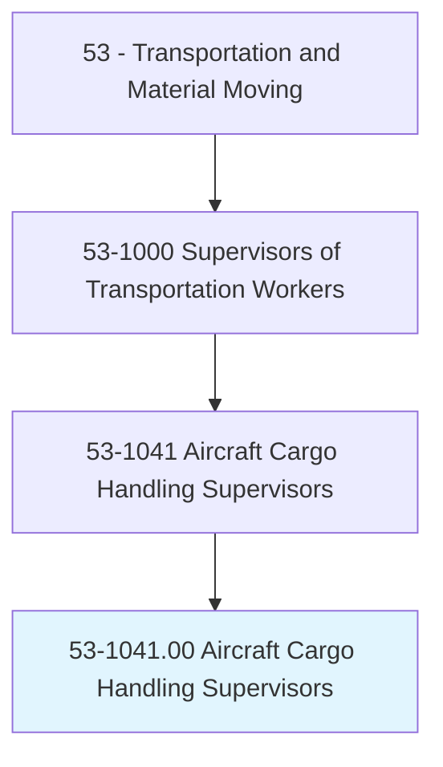
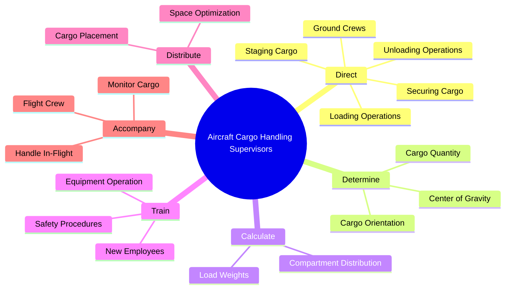
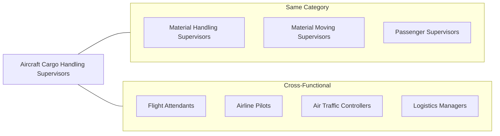
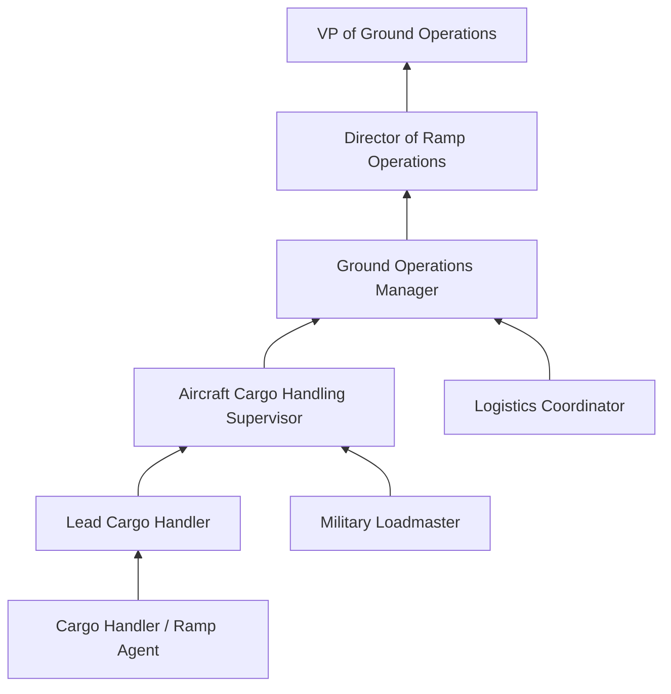

# Aircraft Cargo Handling Supervisors

> Supervise and coordinate the activities of ground crew in the loading, unloading, securing, and staging of aircraft cargo or baggage. May determine the quantity and orientation of cargo and compute aircraft center of gravity. May accompany aircraft as member of flight crew and monitor and handle cargo in flight, and assist and brief passengers on safety and emergency procedures. Includes loadmasters.

## Overview

Aircraft Cargo Handling Supervisors play a critical role in aviation operations, ensuring the safe and efficient loading and unloading of aircraft cargo and baggage. These professionals coordinate ground crew activities, calculate weight distribution to maintain aircraft balance, and ensure compliance with strict aviation safety regulations. Working in fast-paced airport environments, they must balance operational efficiency with uncompromising safety standards. Some may serve as loadmasters, accompanying aircraft during flight to monitor cargo and assist with in-flight operations.

## Classification Hierarchy

## Key Statistics

| Metric | Value |
|--------|-------|
| SOC Code | 53-1041.00 |
| Job Zone | 3 (Medium Preparation) |
| Category | [Transportation](/occupations/Transportation/index) |
| Core Tasks | 6 |
| Supplemental Tasks | 3 |
| Source | O*NET |

## Core Tasks

### direct.GroundCrews

Aircraft Cargo Handling Supervisors direct ground crew activities to ensure safe and efficient cargo operations.

**Actions:**
- `direct.GroundCrews.in.Loading` - Coordinate crew during aircraft loading operations
- `direct.GroundCrews.in.Unloading` - Supervise unloading procedures and timing
- `direct.GroundCrews.in.Securing` - Ensure cargo is properly secured for flight
- `direct.GroundCrews.in.Staging.of.AircraftCargo` - Organize cargo staging areas for efficient loading
- `direct.GroundCrews.in.Baggage` - Coordinate passenger baggage handling operations

### determine.CargoOrientation

Aircraft Cargo Handling Supervisors calculate critical weight and balance parameters for safe flight.

**Actions:**
- `determine.Quantity.of.Cargo` - Assess total cargo volume and weight
- `determine.Orientation.of.Cargo` - Plan optimal cargo positioning
- `determine.Quantity.of.ComputeAircraftsCenter.of.Gravity` - Calculate aircraft center of gravity for flight safety

### train.NewEmployees

Aircraft Cargo Handling Supervisors develop and deliver training programs for crew members.

**Actions:**
- `train.NewEmployees.in.SafetyProcedures` - Instruct on aviation safety protocols
- `train.NewEmployees.in.EquipmentOperation` - Train on specialized cargo handling equipment
- `train.NewEmployees.in.Areas` - Provide comprehensive onboarding training

### distribute.Cargo

Aircraft Cargo Handling Supervisors optimize cargo distribution for space and weight efficiency.

**Actions:**
- `distribute.Cargo.to.maximize.UseOfSpace` - Maximize cargo capacity while maintaining safety

### calculate.LoadWeights

Aircraft Cargo Handling Supervisors perform weight calculations for aircraft compartments.

**Actions:**
- `calculate.LoadWeights.for.DifferentAircraftCompartments` - Compute weight distribution across cargo holds
- `calculate.LoadWeights.for.UsingCharts` - Use weight and balance charts for calculations
- `calculate.LoadWeights.for.Computers` - Utilize computerized load planning systems

### accompany.Aircraft

Some Aircraft Cargo Handling Supervisors serve as loadmasters during flight.

**Actions:**
- `accompany.AircraftAsMember.of.FlightCrew.to.Monitor` - Monitor cargo during flight operations
- `accompany.AircraftAsMember.of.HandleCargo.in.Flight` - Manage in-flight cargo requirements

## Skills & Competencies

### Technical Skills
- **Weight and Balance Calculations** - Advanced
- **Aviation Regulations (FAA/DOT)** - Advanced
- **Cargo Handling Equipment** - Advanced
- **Load Planning Software** - Intermediate
- **Aircraft Systems Knowledge** - Intermediate
- **Hazardous Materials Handling** - Intermediate

### Soft Skills
- **Leadership** - Critical
- **Decision Making** - Critical
- **Attention to Detail** - Critical
- **Communication** - Essential
- **Time Management** - Essential
- **Problem Solving** - Essential

## Related Occupations

## Industries

- [Air Transportation](/industries/AirTransportation) - Primary Employment
- [Support Activities for Transportation](/industries/TransportationSupport) - High Employment
- [Couriers and Messengers](/industries/CouriersMessengers) - Moderate Employment
- [Federal Government](/industries/Government) - Military and Government Aviation
- [Scheduled Air Transportation](/industries/TransportationAndWarehousing/AirTransportation/ScheduledAirTransportation) - Cargo Airlines

## Career Progression

## Education & Training

| Requirement | Details |
|-------------|---------|
| Typical Education | High school diploma or equivalent |
| Work Experience | 2-4 years in cargo handling or ramp operations |
| On-the-Job Training | Moderate - specific airline and aircraft training |
| Common Certifications | FAA certification, Dangerous Goods handling, OSHA safety |

## Departments

This occupation typically works in:
- [Ground Operations](/departments/GroundOperations)
- [Cargo Operations](/departments/CargoOperations)
- [Ramp Services](/departments/RampServices)
- [Flight Operations](/departments/FlightOperations)

## Industry Variations

### Commercial Airlines
- Focus on quick turnaround times for passenger flights
- High volume baggage handling emphasis
- Integration with passenger service operations

### Cargo Airlines
- Larger cargo volumes and specialized freight
- Weight and balance calculations more complex
- 24/7 operations common

### Military Aviation
- Loadmaster designation common
- Tactical and strategic airlift operations
- Additional combat and emergency procedures training

### Ground Handling Companies
- Contract services for multiple airlines
- Standardized procedures across carriers
- High focus on efficiency metrics

## Regulatory Compliance

Aircraft Cargo Handling Supervisors must ensure compliance with:
- **FAA Regulations** - Federal Aviation Administration safety standards
- **TSA Security Requirements** - Cargo screening and security protocols
- **OSHA Standards** - Occupational safety on the ramp
- **IATA Guidelines** - International cargo handling standards
- **DOT Hazmat Regulations** - Dangerous goods handling requirements

## Technology & Tools

### Equipment
- Belt loaders and cargo conveyors
- Container/pallet loaders (K-loaders)
- Forklifts and tugs
- Unit Load Devices (ULDs)

### Software Systems
- Load planning software (Lido, SITA)
- Departure control systems
- Weight and balance applications
- Resource management systems

---

*Source: O*NET 53-1041.00 - ONETOccupation*
