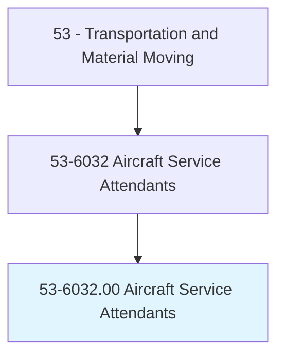
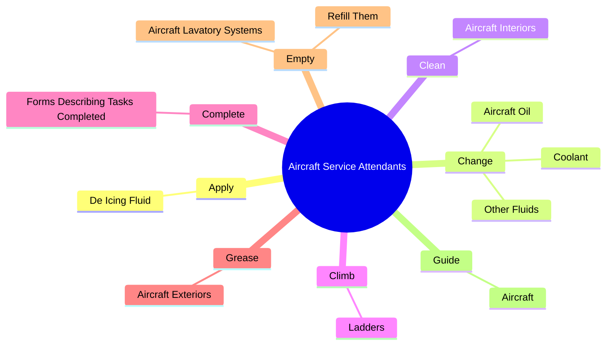
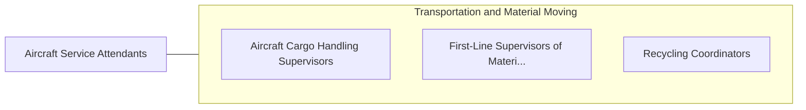

# Aircraft Service Attendants

> Service aircraft with fuel. May de-ice aircraft, refill water and cooling agents, empty sewage tanks, service air and oxygen systems, or clean and polish exterior.

## Overview

Aircraft Service Attendants is an occupation within the Transportation and Material Moving category. Service aircraft with fuel. 

## Classification Hierarchy

## Key Statistics

| Metric | Value |
|--------|-------|
| SOC Code | 53-6032.00 |
| Category | [Transportation and Material Moving](/occupations/Transportation/index) |
| Task Count | 34 |
| Source | O*NET |

## Core Tasks

### apply.DeIcingFluid

Aircraft Service Attendants apply de icing fluid as part of their core responsibilities.

**Actions:**
- `apply.DeIcingFluid.to.AircraftFromBasketsLiftedByTruckMountedCranes`

### change.AircraftOil

Aircraft Service Attendants change aircraft oil as part of their core responsibilities.

**Actions:**
- `change.AircraftOil`
- `change.Coolant`
- `change.OtherFluids`

### clean.AircraftInteriors

Aircraft Service Attendants clean aircraft interiors as part of their core responsibilities.

**Actions:**
- `clean.AircraftInteriors.by.PickingUpWaste`
- `clean.AircraftInteriors.by.WipingDownWindows`
- `clean.AircraftInteriors.by.Vacuuming`

## Skills & Competencies

### Technical Skills
- **Vehicle Operation** - Advanced
- **Logistics** - Advanced
- **Safety Compliance** - Advanced

### Soft Skills
- **Communication** - Essential
- **Problem Solving** - Essential
- **Critical Thinking** - Important
- **Teamwork** - Important
- **Adaptability** - Important

## Related Occupations

## Industries

This occupation is found across multiple industries. See [Industries](/industries) for sector-specific employment data.

## Career Progression

---

*Source: O*NET 53-6032.00 - ONETOccupation*
