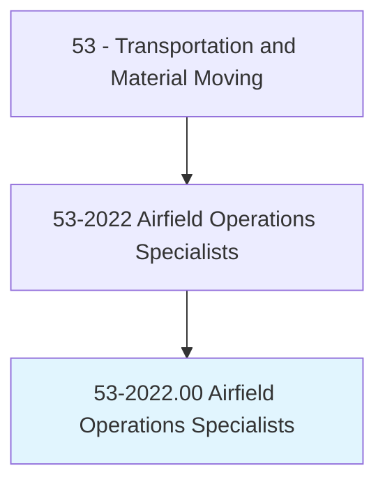
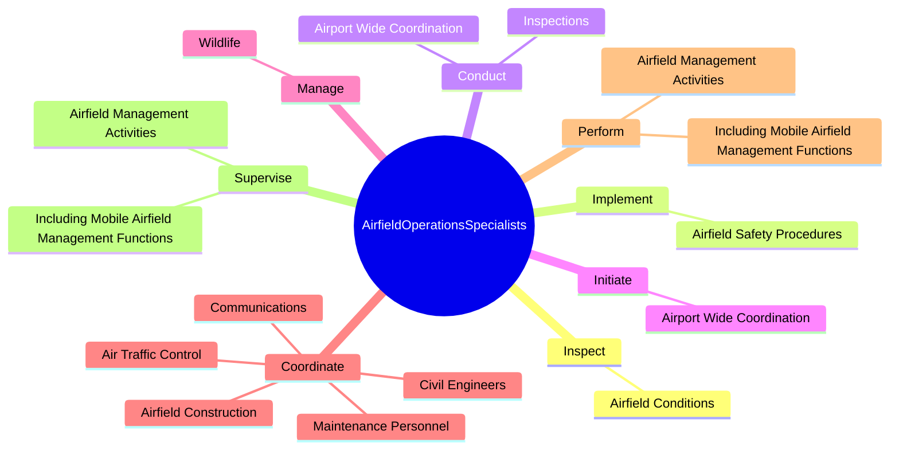
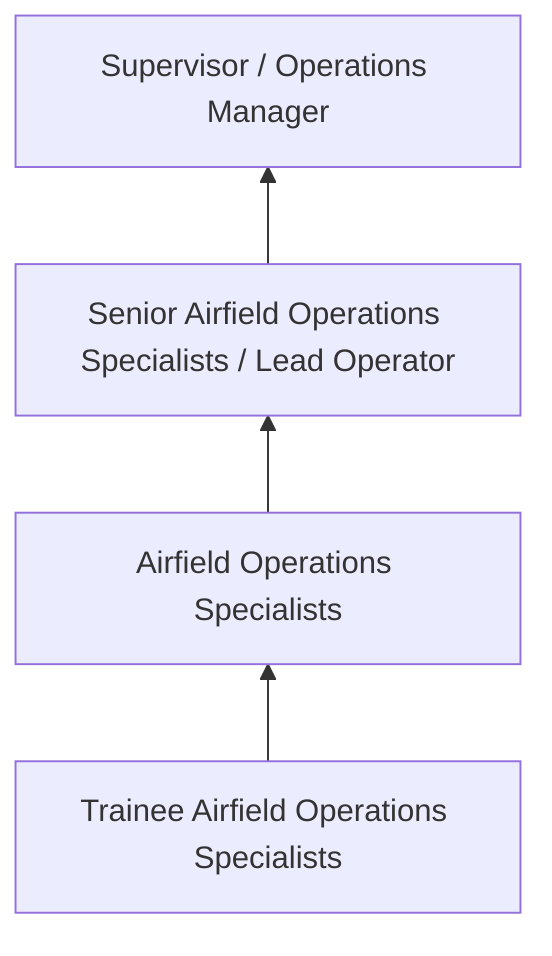
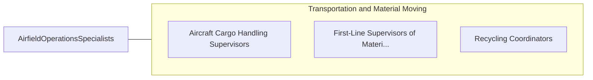

# Airfield Operations Specialists

> Ensure the safe takeoff and landing of commercial and military aircraft. Duties include coordination between air-traffic control and maintenance personnel, dispatching, using airfield landing and navigational aids, implementing airfield safety procedures, monitoring and maintaining flight records, and applying knowledge of weather information.

## Overview

Airfield Operations Specialists professionals ensure the safe takeoff and landing of commercial and military aircraft. This occupation falls within the Transportation and Material Moving category and requires a combination of specialized knowledge, technical skills, and practical experience.

These professionals work across diverse settings and organizational contexts, applying their expertise to meet the demands of their field. They must stay current with industry standards, emerging practices, and regulatory requirements that affect their work. The role demands both independent judgment and collaborative skills, as practitioners regularly interact with colleagues, stakeholders, and the public.

As the field continues to evolve, Airfield Operations Specialists professionals increasingly leverage technology and data-driven approaches to enhance their effectiveness. Career opportunities span the public and private sectors, with demand influenced by economic conditions, demographic shifts, and technological advancement.

## Classification Hierarchy



## Key Statistics

| Metric | Value |
|--------|-------|
| SOC Code | 53-2022.00 |
| Job Zone | N/A |
| Category | [Transportation and Material Moving](/occupations/Transportation/index) |
| Core Tasks | 87+ |
| Salary Range | $30,000 - $75,000 |
| Median Salary | $45,000 |
| Growth Outlook | 6% (As fast as average) |
| Source | O*NET |

## Core Tasks



### maintain.Air

Airfield Operations Specialists maintain air as part of their core responsibilities.

**Actions:**
- `maintain.Air.to.GroundRadioContactWithAircraftCommanders` - Maintain air-to-ground and point-to-point radio contact with aircraft command...
- `maintain.Point.to.PointRadioContactWithAircraftCommanders` - Maintain air-to-ground and point-to-point radio contact with aircraft command...
- `maintain.FlightLogs.of.IncomingFlights` - Maintain flight and event logs, air crew flying records, and flight operation...
- `maintain.FlightLogs.of.OutgoingFlights` - Maintain flight and event logs, air crew flying records, and flight operation...
- `maintain.EventLogs.of.IncomingFlights` - Maintain flight and event logs, air crew flying records, and flight operation...

### provide.Aircrews

Airfield Operations Specialists provide aircrews as part of their core responsibilities.

**Actions:**
- `provide.Aircrews.with.Information` - Provide aircrews with information and services needed for airfield management...
- `provide.Aircrews.with.ServicesNeeded.for.AirfieldManagementPlanning` - Provide aircrews with information and services needed for airfield management...
- `provide.Aircrews.with.FlightPlanning` - Provide aircrews with information and services needed for airfield management...
- `provide.Information.on.SafeOperation.of.Aircraft` - Procure, produce, and provide information on the safe operation of aircraft, ...
- `provide.Information.on.FlightPlanningPublications` - Procure, produce, and provide information on the safe operation of aircraft, ...

### coordinate.Communications

Airfield Operations Specialists coordinate communications as part of their core responsibilities.

**Actions:**
- `coordinate.Communications.between.AirTrafficControlPersonnel` - Coordinate communications between air traffic control and maintenance personnel.
- `coordinate.MaintenancePersonnel` - Coordinate communications between air traffic control and maintenance personnel.
- `coordinate.AirfieldConstruction` - Plan and coordinate airfield construction.
- `coordinate.AirTrafficControl.to.ensure.SupportOfAirfieldManagementActivities` - Coordinate with agencies, such as air traffic control, civil engineers, or co...
- `coordinate.CivilEngineers.to.ensure.SupportOfAirfieldManagementActivities` - Coordinate with agencies, such as air traffic control, civil engineers, or co...

### post.VisualDisplayBoardsBoards

Airfield Operations Specialists post visual display boards boards as part of their core responsibilities.

**Actions:**
- `post.VisualDisplayBoardsBoards` - Post visual display boards and status boards.
- `post.StatusBoards` - Post visual display boards and status boards.
- `post.WeatherInformationPlanData` - Receive and post weather information and flight plan data, such as air routes...
- `post.FlightPlanData` - Receive and post weather information and flight plan data, such as air routes...
- `post.AirRoutes` - Receive and post weather information and flight plan data, such as air routes...


## Skills & Competencies

### Technical Skills
- **Equipment Operation** - Advanced
- **Safety Procedures** - Advanced
- **Navigation Systems** - Proficient
- **Load Management** - Proficient
- **Vehicle Inspection** - Proficient
- **Regulatory Compliance** - Proficient

### Soft Skills
- **Situational Awareness** - Critical
- **Reliability** - Critical
- **Time Management** - Essential
- **Communication** - Essential
- **Physical Stamina** - Essential

## Education & Certifications

| Requirement | Details |
|-------------|---------|
| Typical Education | High school diploma or equivalent; some positions require post-secondary training |
| Work Experience | 0-2 years on-the-job experience |
| On-the-Job Training | Moderate - safety and equipment operation training |
| Certifications | CDL, hazmat endorsements, or transportation-specific licenses |

## Career Progression



## Industry Variations

### Freight and Logistics
Commercial transportation of goods. Airfield Operations Specialists professionals focus on efficiency, safety, and timely delivery across supply chains.

### Public Transit
Passenger transportation services. Emphasis on schedules, safety, and customer service in public-facing roles.

### Warehousing and Distribution
Material handling and storage operations. Focus on inventory management and order fulfillment efficiency.

### Specialized Transport
Hazardous materials, oversized loads, or temperature-controlled transport requiring additional certifications and safety protocols.

## Technology & Tools

- **GPS and navigation systems**
- **Fleet management software**
- **Electronic logging devices (ELD)**
- **Warehouse management systems (WMS)**
- **Transportation management systems (TMS)**

## Related Occupations



## Industries

- [Trucking and Freight](/industries/Trucking) - High Employment
- [Warehousing and Storage](/industries/Warehousing) - High Employment
- [Air Transportation](/industries/AirTransportation) - Moderate Employment
- [Rail Transportation](/industries/RailTransportation) - Moderate Employment

## Departments

This occupation typically works in:
- [Operations](/departments/Operations/index)
- [Logistics](/departments/SupplyChain)
- Fleet Management

## GraphDL Semantic Structure

```graphdl
Airfield Operations Specialists perform:
- inspect.AirfieldConditions.to.ensure.ComplianceWithFederalRegulatoryRequirements
- implement.AirfieldSafetyProcedures.to.ensure.SafeOperatingEnvironmentForPersonnelOperation
- implement.AirfieldSafetyProcedures.to.AircraftOperation
- conduct.Inspections.of.AirportProperty.to.maintain.ControlledAccessToAirfields
- conduct.Inspections.of.Perimeter.to.maintain.ControlledAccessToAirfields
- initiate.AirportWideCoordination.of.SnowRemoval.on.Runways
```

---

*Source: O*NET 53-2022.00 - ONETOccupation*
