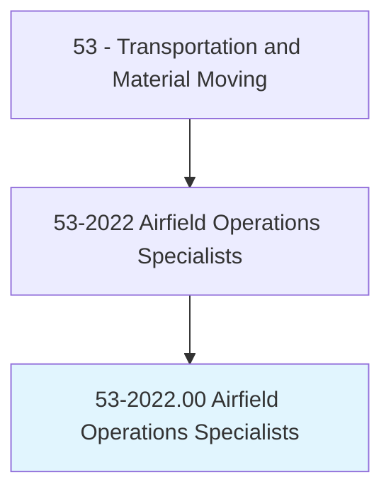
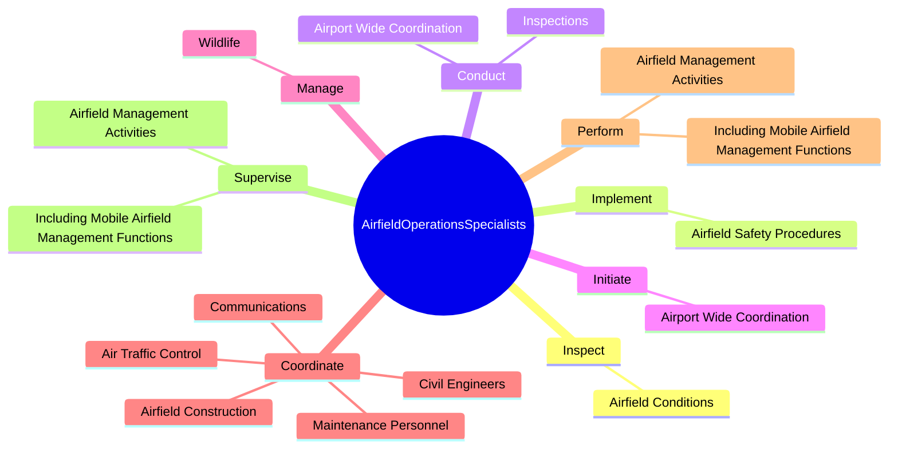
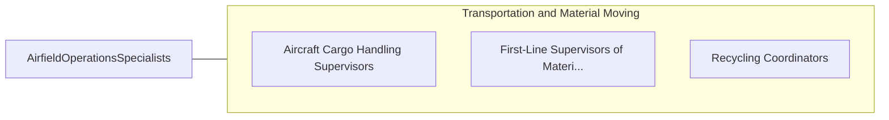

# Airfield Operations Specialists

> Ensure the safe takeoff and landing of commercial and military aircraft. Duties include coordination between air-traffic control and maintenance personnel, dispatching, using airfield landing and navigational aids, implementing airfield safety procedures, monitoring and maintaining flight records, and applying knowledge of weather information.

## Overview

Airfield Operations Specialists is an occupation within the Transportation and Material Moving category. Ensure the safe takeoff and landing of commercial and military aircraft. 

## Classification Hierarchy

## Key Statistics

| Metric | Value |
|--------|-------|
| SOC Code | 53-2022.00 |
| Category | [Transportation and Material Moving](/occupations/Transportation) |
| Task Count | 87 |
| Source | O*NET |

## Core Tasks

### inspect.AirfieldConditions

Airfield Operations Specialists inspect airfield conditions as part of their core responsibilities.

**Actions:**
- `inspect.AirfieldConditions.to.ensure.ComplianceWithFederalRegulatoryRequirements`

### implement.AirfieldSafetyProcedures

Airfield Operations Specialists implement airfield safety procedures as part of their core responsibilities.

**Actions:**
- `implement.AirfieldSafetyProcedures.to.ensure.SafeOperatingEnvironmentForPersonnelOperation`
- `implement.AirfieldSafetyProcedures.to.AircraftOperation`

### conduct.Inspections

Airfield Operations Specialists conduct inspections as part of their core responsibilities.

**Actions:**
- `conduct.Inspections.of.AirportProperty.to.maintain.ControlledAccessToAirfields`
- `conduct.Inspections.of.Perimeter.to.maintain.ControlledAccessToAirfields`
- `conduct.AirportWideCoordination.of.SnowRemoval.on.Runways`
- `conduct.AirportWideCoordination.of.Taxiways`

## Skills & Competencies

### Technical Skills
- **Vehicle Operation** - Advanced
- **Logistics** - Advanced
- **Safety Compliance** - Advanced

### Soft Skills
- **Communication** - Essential
- **Problem Solving** - Essential
- **Critical Thinking** - Important
- **Teamwork** - Important
- **Adaptability** - Important

## Related Occupations

## Industries

This occupation is found across multiple industries. See [Industries](/industries) for sector-specific employment data.

## Career Progression

---

*Source: O*NET 53-2022.00 - ONETOccupation*
