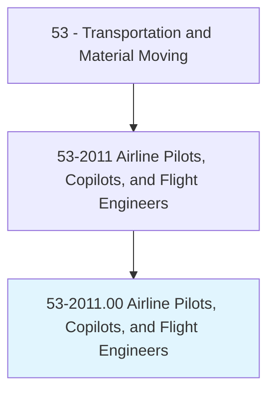
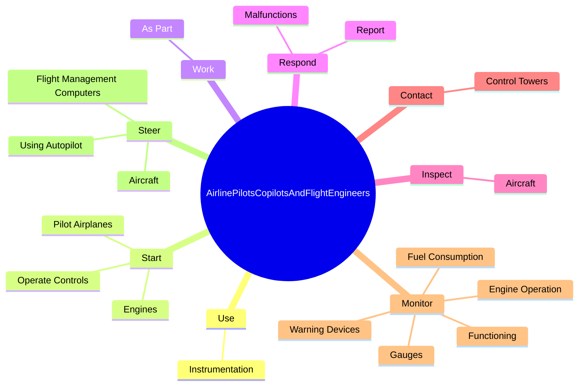
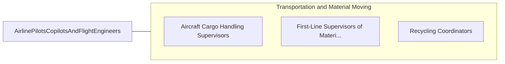

# Airline Pilots, Copilots, and Flight Engineers

> Pilot and navigate the flight of fixed-wing aircraft, usually on scheduled air carrier routes, for the transport of passengers and cargo. Requires Federal Air Transport certificate and rating for specific aircraft type used. Includes regional, national, and international airline pilots and flight instructors of airline pilots.

## Overview

Airline Pilots, Copilots, and Flight Engineers is an occupation within the Transportation and Material Moving category. Pilot and navigate the flight of fixed-wing aircraft, usually on scheduled air carrier routes, for the transport of passengers and cargo. Requires Federal Air Transport certificate and rating for specific aircraft type used.

## Classification Hierarchy

## Key Statistics

| Metric | Value |
|--------|-------|
| SOC Code | 53-2011.00 |
| Category | [Transportation and Material Moving](/occupations/Transportation) |
| Task Count | 85 |
| Source | O*NET |

## Core Tasks

### use.Instrumentation

Airline Pilots, Copilots, and Flight Engineers use instrumentation as part of their core responsibilities.

**Actions:**
- `use.Instrumentation.to.guide.FlightsWhenVisibilityIsPoor`

### start.Engines

Airline Pilots, Copilots, and Flight Engineers start engines as part of their core responsibilities.

**Actions:**
- `start.Engines.to.transport.Passengers`
- `start.Engines.to.mail`
- `start.Engines.to.Freight`
- `start.Engines.to.AdheringToFlightPlans`

### work.AsPart

Airline Pilots, Copilots, and Flight Engineers work as part as part of their core responsibilities.

**Actions:**
- `work.AsPart.of.FlightTeam.with.OtherCrewMembers`
- `work.AsPart.of.EspeciallyDuringTakeoffs`
- `work.AsPart.of.Landings`

## Skills & Competencies

### Technical Skills
- **Vehicle Operation** - Advanced
- **Logistics** - Advanced
- **Safety Compliance** - Advanced

### Soft Skills
- **Communication** - Essential
- **Problem Solving** - Essential
- **Critical Thinking** - Important
- **Teamwork** - Important
- **Adaptability** - Important

## Related Occupations

## Industries

This occupation is found across multiple industries. See [Industries](/industries) for sector-specific employment data.

## Career Progression

---

*Source: O*NET 53-2011.00 - ONETOccupation*
