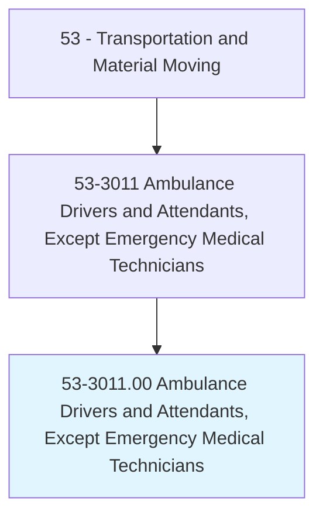
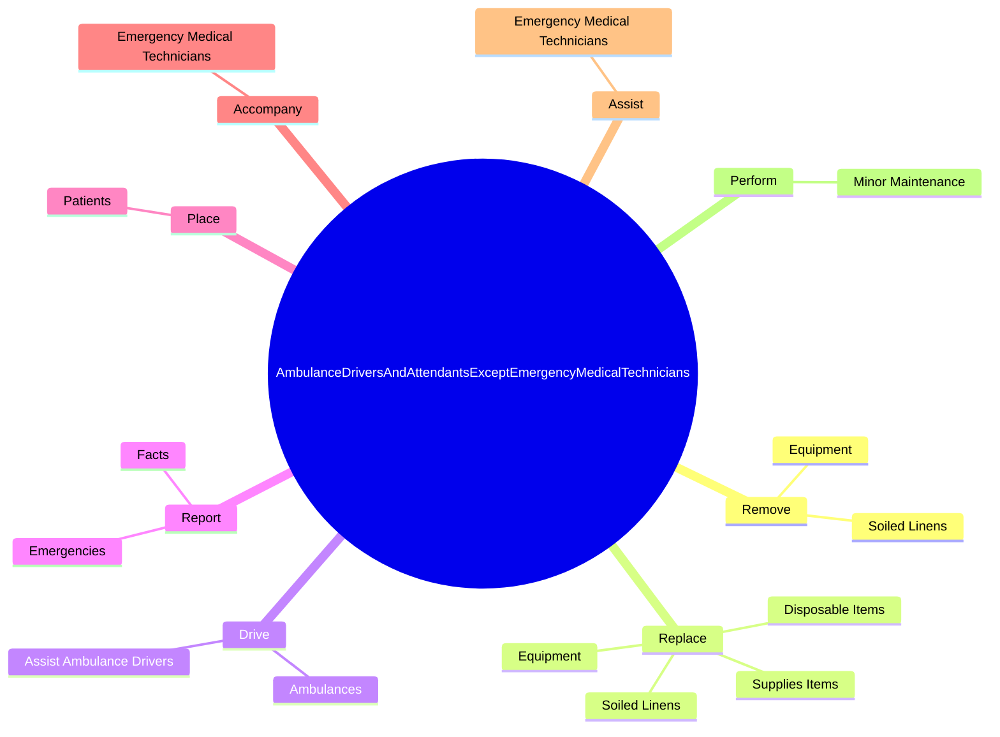
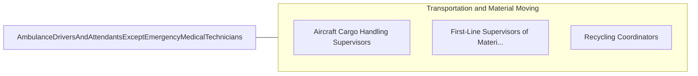

# Ambulance Drivers and Attendants, Except Emergency Medical Technicians

> Drive ambulance or assist ambulance driver in transporting sick, injured, or convalescent persons. Assist in lifting patients.

## Overview

Ambulance Drivers and Attendants, Except Emergency Medical Technicians is an occupation within the Transportation and Material Moving category. Drive ambulance or assist ambulance driver in transporting sick, injured, or convalescent persons. 

## Classification Hierarchy

## Key Statistics

| Metric | Value |
|--------|-------|
| SOC Code | 53-3011.00 |
| Category | [Transportation and Material Moving](/occupations/Transportation) |
| Task Count | 35 |
| Source | O*NET |

## Core Tasks

### remove.SoiledLinens

Ambulance Drivers and Attendants, Except Emergency Medical Technicians remove soiled linens as part of their core responsibilities.

**Actions:**
- `remove.SoiledLinens.to.maintain.SanitaryConditions`
- `remove.Equipment.to.maintain.SanitaryConditions`

### replace.SoiledLinens

Ambulance Drivers and Attendants, Except Emergency Medical Technicians replace soiled linens as part of their core responsibilities.

**Actions:**
- `replace.SoiledLinens.to.maintain.SanitaryConditions`
- `replace.Equipment.to.maintain.SanitaryConditions`
- `replace.SuppliesItems.on.Ambulances`
- `replace.DisposableItems.on.Ambulances`

### drive.Ambulances

Ambulance Drivers and Attendants, Except Emergency Medical Technicians drive ambulances as part of their core responsibilities.

**Actions:**
- `drive.Ambulances.in.TransportingSick`
- `drive.Ambulances.in.Injured`
- `drive.Ambulances.in.ConvalescentPersons`
- `drive.AssistAmbulanceDrivers.in.TransportingSick`

## Skills & Competencies

### Technical Skills
- **Vehicle Operation** - Advanced
- **Logistics** - Advanced
- **Safety Compliance** - Advanced

### Soft Skills
- **Communication** - Essential
- **Problem Solving** - Essential
- **Critical Thinking** - Important
- **Teamwork** - Important
- **Adaptability** - Important

## Related Occupations

## Industries

This occupation is found across multiple industries. See [Industries](/industries) for sector-specific employment data.

## Career Progression

---

*Source: O*NET 53-3011.00 - ONETOccupation*
