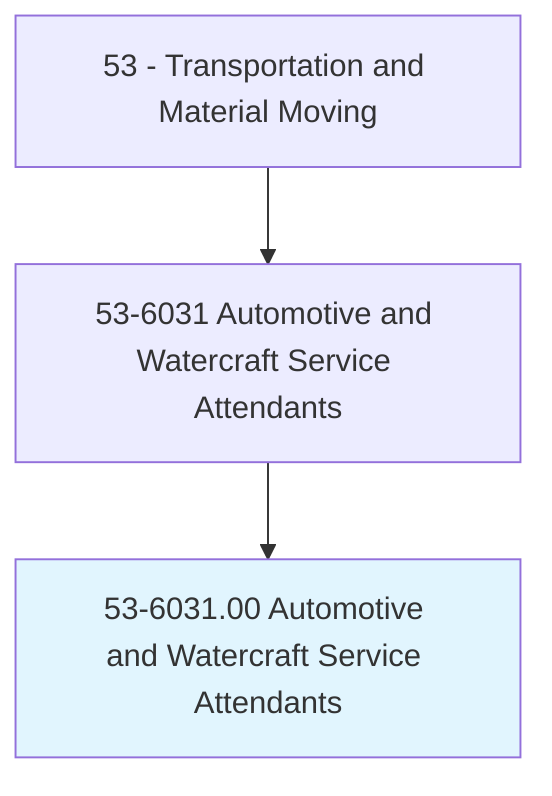
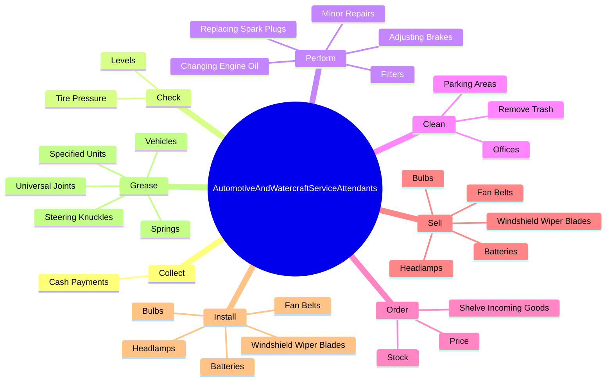
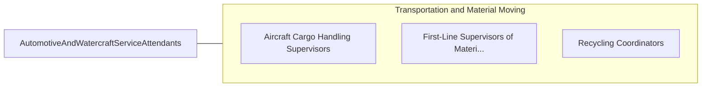

# Automotive and Watercraft Service Attendants

> Service automobiles, buses, trucks, boats, and other automotive or marine vehicles with fuel, lubricants, and accessories. Collect payment for services and supplies. May lubricate vehicle, change motor oil, refill antifreeze, or replace lights or other accessories, such as windshield wiper blades or fan belts. May repair or replace tires.

## Overview

Automotive and Watercraft Service Attendants is an occupation within the Transportation and Material Moving category. Service automobiles, buses, trucks, boats, and other automotive or marine vehicles with fuel, lubricants, and accessories. Collect payment for services and supplies.

## Classification Hierarchy

## Key Statistics

| Metric | Value |
|--------|-------|
| SOC Code | 53-6031.00 |
| Category | [Transportation and Material Moving](/occupations/Transportation/index) |
| Task Count | 75 |
| Source | O*NET |

## Core Tasks

### collect.CashPayments

Automotive and Watercraft Service Attendants collect cash payments as part of their core responsibilities.

**Actions:**
- `collect.CashPayments.from.Customers`
- `collect.CashPayments.from.MakeChange`
- `collect.CashPayments.from.ChargePurchasesToCustomersCreditCards`
- `collect.CashPayments.from.ProvidingCustomers.with.Receipts`

### check.TirePressure

Automotive and Watercraft Service Attendants check tire pressure as part of their core responsibilities.

**Actions:**
- `check.TirePressure.of.Fuel`
- `check.TirePressure.of.Mot`
- `check.TirePressure.of.Oil`
- `check.TirePressure.of.Transmission`

### perform.MinorRepairs

Automotive and Watercraft Service Attendants perform minor repairs as part of their core responsibilities.

**Actions:**
- `perform.MinorRepairs`
- `perform.AdjustingBrakes`
- `perform.ReplacingSparkPlugs`
- `perform.ChangingEngineOil`

## Skills & Competencies

### Technical Skills
- **Vehicle Operation** - Advanced
- **Logistics** - Advanced
- **Safety Compliance** - Advanced

### Soft Skills
- **Communication** - Essential
- **Problem Solving** - Essential
- **Critical Thinking** - Important
- **Teamwork** - Important
- **Adaptability** - Important

## Related Occupations

## Industries

This occupation is found across multiple industries. See [Industries](/industries) for sector-specific employment data.

## Career Progression

---

*Source: O*NET 53-6031.00 - ONETOccupation*
