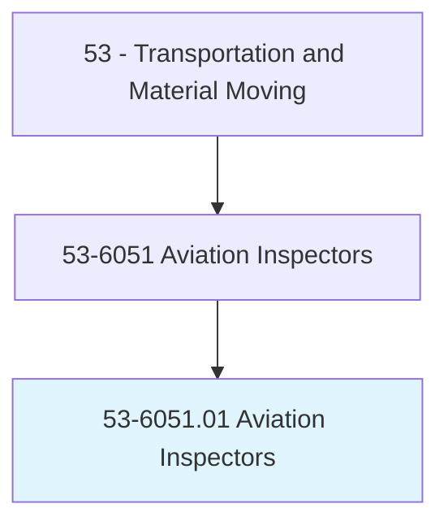
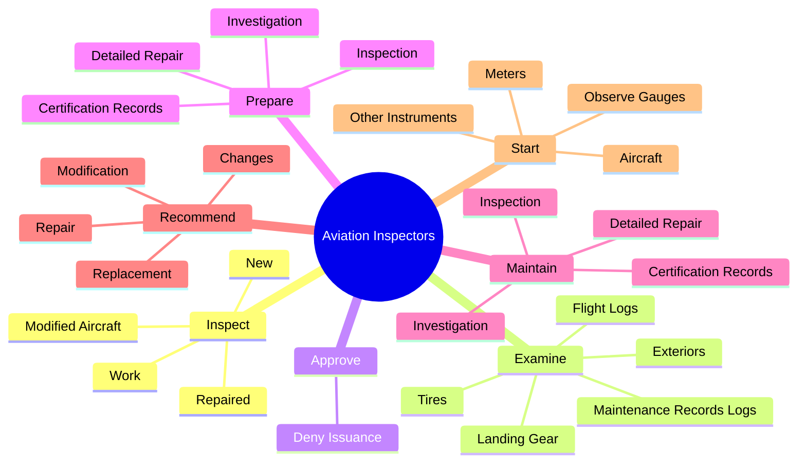
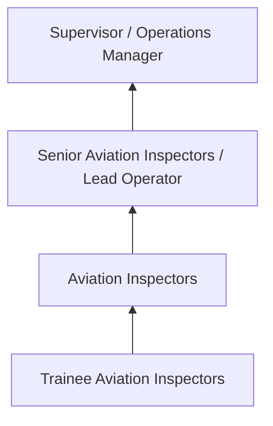
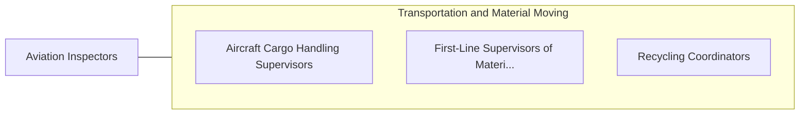

# Aviation Inspectors

> Inspect aircraft, maintenance procedures, air navigational aids, air traffic controls, and communications equipment to ensure conformance with Federal safety regulations.

## Overview

Aviation Inspectors professionals inspect aircraft, maintenance procedures, air navigational aids, air traffic controls, and communications equipment to ensure conformance with Federal safety regulations.. This occupation falls within the Transportation and Material Moving category and requires a combination of specialized knowledge, technical skills, and practical experience.

These professionals work across diverse settings and organizational contexts, applying their expertise to meet the demands of their field. They must stay current with industry standards, emerging practices, and regulatory requirements that affect their work. The role demands both independent judgment and collaborative skills, as practitioners regularly interact with colleagues, stakeholders, and the public.

As the field continues to evolve, Aviation Inspectors professionals increasingly leverage technology and data-driven approaches to enhance their effectiveness. Career opportunities span the public and private sectors, with demand influenced by economic conditions, demographic shifts, and technological advancement.

## Classification Hierarchy



## Key Statistics

| Metric | Value |
|--------|-------|
| SOC Code | 53-6051.01 |
| Job Zone | N/A |
| Category | [Transportation and Material Moving](/occupations/Transportation/index) |
| Core Tasks | 79+ |
| Salary Range | $30,000 - $75,000 |
| Median Salary | $45,000 |
| Growth Outlook | 6% (As fast as average) |
| Source | O*NET |

## Core Tasks



### inspect.Work

Aviation Inspectors inspect work as part of their core responsibilities.

**Actions:**
- `inspect.Work.of.AircraftMechanicsPerformingMaintenance` - Inspect work of aircraft mechanics performing maintenance, modification, or r...
- `inspect.Work.of.Modification` - Inspect work of aircraft mechanics performing maintenance, modification, or r...
- `inspect.Work.of.RepairOfAircraftAircraftMechanicalSystems.to.ensure.AdherenceToStandardsProcedures` - Inspect work of aircraft mechanics performing maintenance, modification, or r...
- `inspect.Work.of.OverhaulOfAircraftAircraftMechanicalSystems.to.ensure.AdherenceToStandardsProcedures` - Inspect work of aircraft mechanics performing maintenance, modification, or r...
- `inspect.New.to.identify.DamageToAssessAirworthinessConformanceToStandards` - Inspect new, repaired, or modified aircraft to identify damage or defects and...

### examine.MaintenanceRecordsLogs

Aviation Inspectors examine maintenance records logs as part of their core responsibilities.

**Actions:**
- `examine.MaintenanceRecordsLogs.to.determine.IfServiceChecksOverhaulsWerePerformedAtPrescribedIntervals` - Examine maintenance records and flight logs to determine if service and maint...
- `examine.MaintenanceRecordsLogs.to.MaintenanceChecksOverhaulsWerePerformedAtPrescribedIntervals` - Examine maintenance records and flight logs to determine if service and maint...
- `examine.FlightLogs.to.determine.IfServiceChecksOverhaulsWerePerformedAtPrescribedIntervals` - Examine maintenance records and flight logs to determine if service and maint...
- `examine.FlightLogs.to.MaintenanceChecksOverhaulsWerePerformedAtPrescribedIntervals` - Examine maintenance records and flight logs to determine if service and maint...
- `examine.LandingGear.of.Fuselage` - Examine landing gear, tires, and exteriors of fuselage, wings, and engines fo...

### recommend.Replacement

Aviation Inspectors recommend replacement as part of their core responsibilities.

**Actions:**
- `recommend.Replacement.of.AircraftEquipment` - Recommend replacement, repair, or modification of aircraft equipment.
- `recommend.Repair.of.AircraftEquipment` - Recommend replacement, repair, or modification of aircraft equipment.
- `recommend.Modification.of.AircraftEquipment` - Recommend replacement, repair, or modification of aircraft equipment.
- `recommend.Changes.in.Rules` - Recommend changes in rules, policies, standards, and regulations, based on kn...
- `recommend.Changes.in.Policies` - Recommend changes in rules, policies, standards, and regulations, based on kn...

### analyze.TrainingPrograms

Aviation Inspectors analyze training programs as part of their core responsibilities.

**Actions:**
- `analyze.TrainingPrograms.to.ensure.CompetencyOfPersonsOperating` - Analyze training programs and conduct oral and written examinations to ensure...
- `analyze.TrainingPrograms.to.Installing` - Analyze training programs and conduct oral and written examinations to ensure...
- `analyze.TrainingPrograms.to.RepairingAircraftEquipment` - Analyze training programs and conduct oral and written examinations to ensure...
- `analyze.ConductOralExaminations.to.ensure.CompetencyOfPersonsOperating` - Analyze training programs and conduct oral and written examinations to ensure...
- `analyze.ConductOralExaminations.to.Installing` - Analyze training programs and conduct oral and written examinations to ensure...


## Skills & Competencies

### Technical Skills
- **Equipment Operation** - Advanced
- **Safety Procedures** - Advanced
- **Navigation Systems** - Proficient
- **Load Management** - Proficient
- **Vehicle Inspection** - Proficient
- **Regulatory Compliance** - Proficient

### Soft Skills
- **Situational Awareness** - Critical
- **Reliability** - Critical
- **Time Management** - Essential
- **Communication** - Essential
- **Physical Stamina** - Essential

## Education & Certifications

| Requirement | Details |
|-------------|---------|
| Typical Education | High school diploma or equivalent; some positions require post-secondary training |
| Work Experience | 0-2 years on-the-job experience |
| On-the-Job Training | Moderate - safety and equipment operation training |
| Certifications | CDL, hazmat endorsements, or transportation-specific licenses |

## Career Progression



## Industry Variations

### Freight and Logistics
Commercial transportation of goods. Aviation Inspectors professionals focus on efficiency, safety, and timely delivery across supply chains.

### Public Transit
Passenger transportation services. Emphasis on schedules, safety, and customer service in public-facing roles.

### Warehousing and Distribution
Material handling and storage operations. Focus on inventory management and order fulfillment efficiency.

### Specialized Transport
Hazardous materials, oversized loads, or temperature-controlled transport requiring additional certifications and safety protocols.

## Technology & Tools

- **GPS and navigation systems**
- **Fleet management software**
- **Electronic logging devices (ELD)**
- **Warehouse management systems (WMS)**
- **Transportation management systems (TMS)**

## Related Occupations



## Industries

- [Trucking and Freight](/industries/Trucking) - High Employment
- [Warehousing and Storage](/industries/Warehousing) - High Employment
- [Air Transportation](/industries/AirTransportation) - Moderate Employment
- [Rail Transportation](/industries/RailTransportation) - Moderate Employment

## Departments

This occupation typically works in:
- [Operations](/departments/Operations/index)
- [Logistics](/departments/SupplyChain)
- Fleet Management

## GraphDL Semantic Structure

```graphdl
Aviation Inspectors perform:
- inspect.Work.of.AircraftMechanicsPerformingMaintenance
- inspect.Work.of.Modification
- inspect.Work.of.RepairOfAircraftAircraftMechanicalSystems.to.ensure.AdherenceToStandardsProcedures
- inspect.Work.of.OverhaulOfAircraftAircraftMechanicalSystems.to.ensure.AdherenceToStandardsProcedures
- examine.MaintenanceRecordsLogs.to.determine.IfServiceChecksOverhaulsWerePerformedAtPrescribedIntervals
- examine.MaintenanceRecordsLogs.to.MaintenanceChecksOverhaulsWerePerformedAtPrescribedIntervals
```

---

*Source: O*NET 53-6051.01 - ONETOccupation*
