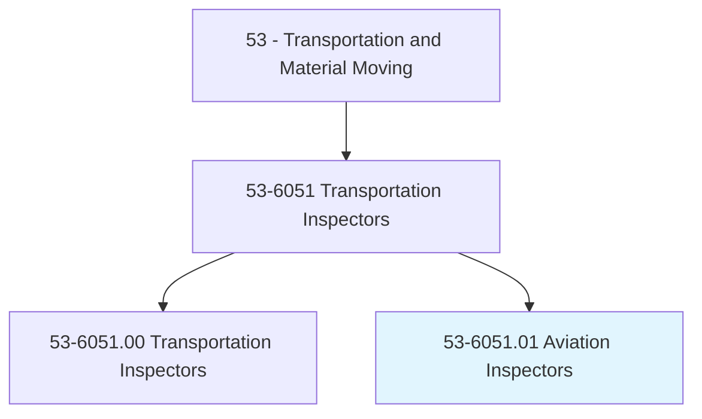
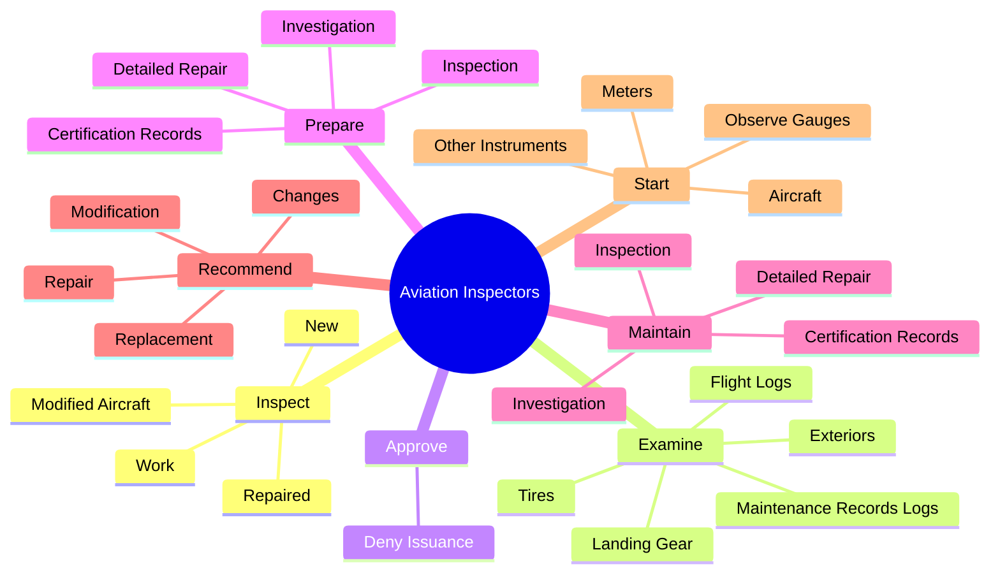
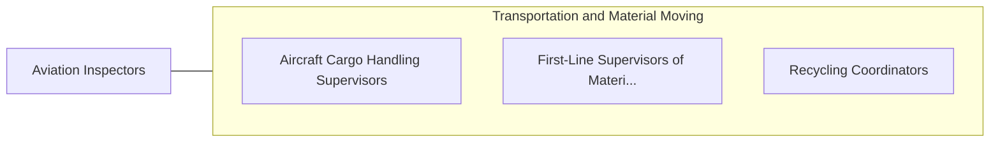

# Aviation Inspectors

> Inspect aircraft, maintenance procedures, air navigational aids, air traffic controls, and communications equipment to ensure conformance with Federal safety regulations.

## Overview

Aviation Inspectors is classified under Transportation and Material Moving (SOC 53). Inspect aircraft, maintenance procedures, air navigational aids, air traffic controls, and communications equipment to ensure conformance with Federal safety regulations.

## Classification Hierarchy

## Key Statistics

| Metric | Value |
|--------|-------|
| SOC Code | 53-6051.01 |
| Category | [Transportation and Material Moving](/occupations/Transportation) |
| Task Count | 79 |
| Source | O*NET |

## Core Tasks

### inspect.Work

Aviation Inspectors inspect work as part of their core responsibilities.

**Actions:**
- `inspect.Work.of.AircraftMechanicsPerformingMaintenance`
- `inspect.Work.of.Modification`
- `inspect.Work.of.RepairOfAircraftAircraftMechanicalSystems.to.ensure.AdherenceToStandardsProcedures`
- `inspect.Work.of.OverhaulOfAircraftAircraftMechanicalSystems.to.ensure.AdherenceToStandardsProcedures`

### examine.MaintenanceRecordsLogs

Aviation Inspectors examine maintenance records logs as part of their core responsibilities.

**Actions:**
- `examine.MaintenanceRecordsLogs.to.determine.IfServiceChecksOverhaulsWerePerformedAtPrescribedIntervals`
- `examine.MaintenanceRecordsLogs.to.MaintenanceChecksOverhaulsWerePerformedAtPrescribedIntervals`
- `examine.FlightLogs.to.determine.IfServiceChecksOverhaulsWerePerformedAtPrescribedIntervals`
- `examine.FlightLogs.to.MaintenanceChecksOverhaulsWerePerformedAtPrescribedIntervals`

### approve.DenyIssuance

Aviation Inspectors approve deny issuance as part of their core responsibilities.

**Actions:**
- `approve.DenyIssuance.of.Certificates.of.Airworthiness`

## Skills & Competencies

### Technical Skills
- **Vehicle Operation** - Advanced
- **Logistics** - Advanced
- **Safety Compliance** - Advanced

### Soft Skills
- **Communication** - Essential
- **Problem Solving** - Essential
- **Critical Thinking** - Important
- **Teamwork** - Important
- **Adaptability** - Important

## Related Occupations

## Industries

This occupation is found across multiple industries. See [Industries](/industries) for sector-specific employment data.

## Career Progression

---

*Source: O*NET 53-6051.01 - ONETOccupation*
