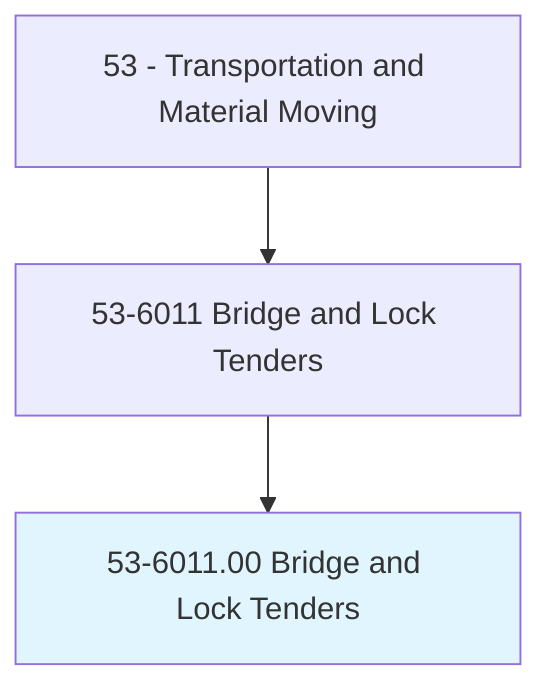
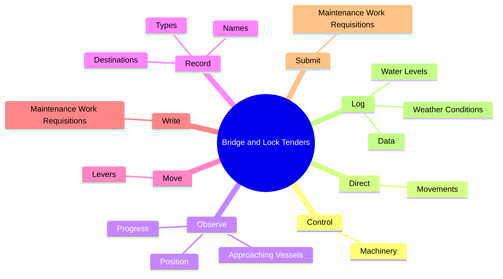
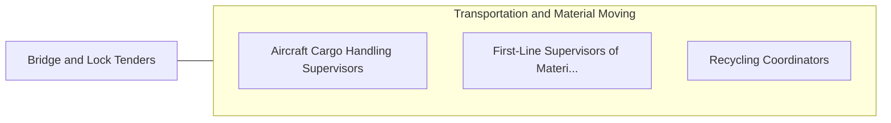

# Bridge and Lock Tenders

> Operate and tend bridges, canal locks, and lighthouses to permit marine passage on inland waterways, near shores, and at danger points in waterway passages. May supervise such operations. Includes drawbridge operators, lock operators, and slip bridge operators.

## Overview

Bridge and Lock Tenders is an occupation within the Transportation and Material Moving category. Operate and tend bridges, canal locks, and lighthouses to permit marine passage on inland waterways, near shores, and at danger points in waterway passages. May supervise such operations.

## Classification Hierarchy

## Key Statistics

| Metric | Value |
|--------|-------|
| SOC Code | 53-6011.00 |
| Category | [Transportation and Material Moving](/occupations/Transportation/index) |
| Task Count | 83 |
| Source | O*NET |

## Core Tasks

### control.Machinery

Bridge and Lock Tenders control machinery as part of their core responsibilities.

**Actions:**
- `control.Machinery.to.open.CanalLocksDams`
- `control.Machinery.to.close.CanalLocksDams`
- `control.Machinery.to.Railroad`
- `control.Machinery.to.HighwayDrawbridges`

### direct.Movements

Bridge and Lock Tenders direct movements as part of their core responsibilities.

**Actions:**
- `direct.Movements.of.Vessels.in.Locks`
- `direct.Movements.of.BridgeAreas`
- `direct.Movements.of.UsingSignals`
- `direct.Movements.of.TelecommunicationEquipment`

### observe.Position

Bridge and Lock Tenders observe position as part of their core responsibilities.

**Actions:**
- `observe.Position.of.Vessels.to.ensure.BestUseOfLockSpaces`
- `observe.Position.of.BridgeOpeningSpaces`
- `observe.Progress.of.Vessels.to.ensure.BestUseOfLockSpaces`
- `observe.Progress.of.BridgeOpeningSpaces`

## Skills & Competencies

### Technical Skills
- **Vehicle Operation** - Advanced
- **Logistics** - Advanced
- **Safety Compliance** - Advanced

### Soft Skills
- **Communication** - Essential
- **Problem Solving** - Essential
- **Critical Thinking** - Important
- **Teamwork** - Important
- **Adaptability** - Important

## Related Occupations

## Industries

This occupation is found across multiple industries. See [Industries](/industries) for sector-specific employment data.

## Career Progression

---

*Source: O*NET 53-6011.00 - ONETOccupation*
