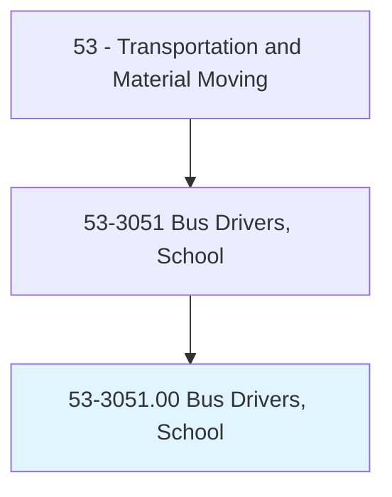
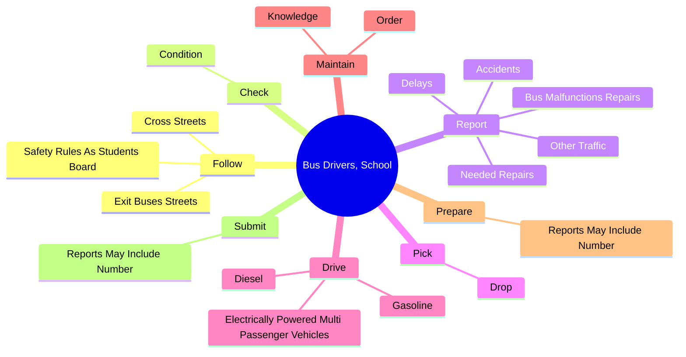
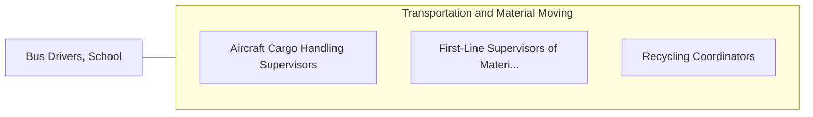

# Bus Drivers, School

> Drive a school bus to transport students. Ensure adherence to safety rules. May assist students in boarding or exiting.

## Overview

Bus Drivers, School is an occupation within the Transportation and Material Moving category. Drive a school bus to transport students. Ensure adherence to safety rules.

## Classification Hierarchy

## Key Statistics

| Metric | Value |
|--------|-------|
| SOC Code | 53-3051.00 |
| Category | [Transportation and Material Moving](/occupations/Transportation/index) |
| Task Count | 50 |
| Source | O*NET |

## Core Tasks

### follow.SafetyRulesAsStudentsBoard

Bus Drivers, School follow safety rules as students board as part of their core responsibilities.

**Actions:**
- `follow.SafetyRulesAsStudentsBoard`
- `follow.ExitBusesStreets.near.BusStops`
- `follow.CrossStreets.near.BusStops`

### check.Condition

Bus Drivers, School check condition as part of their core responsibilities.

**Actions:**
- `check.Condition.of.VehiclesTires`
- `check.Condition.of.Brakes`
- `check.Condition.of.WindshieldWipers`
- `check.Condition.of.Lights`

### report.BusMalfunctionsRepairs

Bus Drivers, School report bus malfunctions repairs as part of their core responsibilities.

**Actions:**
- `report.BusMalfunctionsRepairs`
- `report.NeededRepairs`
- `report.Delays`
- `report.Accidents`

## Skills & Competencies

### Technical Skills
- **Vehicle Operation** - Advanced
- **Logistics** - Advanced
- **Safety Compliance** - Advanced

### Soft Skills
- **Communication** - Essential
- **Problem Solving** - Essential
- **Critical Thinking** - Important
- **Teamwork** - Important
- **Adaptability** - Important

## Related Occupations

## Industries

This occupation is found across multiple industries. See [Industries](/industries) for sector-specific employment data.

## Career Progression

---

*Source: O*NET 53-3051.00 - ONETOccupation*
