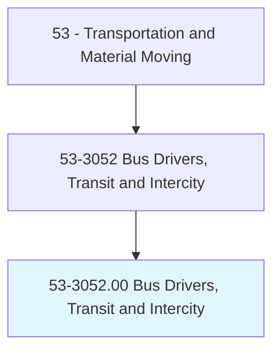
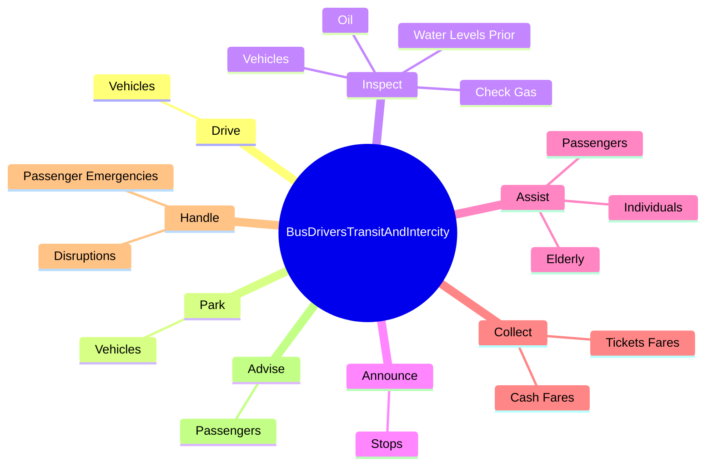
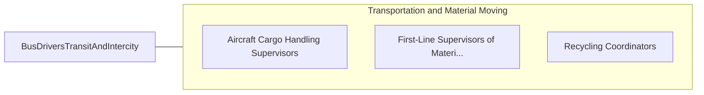

# Bus Drivers, Transit and Intercity

> Drive bus or motor coach, including regular route operations, charters, and private carriage. May assist passengers with baggage. May collect fares or tickets.

## Overview

Bus Drivers, Transit and Intercity is an occupation within the Transportation and Material Moving category. Drive bus or motor coach, including regular route operations, charters, and private carriage. May assist passengers with baggage.

## Classification Hierarchy

## Key Statistics

| Metric | Value |
|--------|-------|
| SOC Code | 53-3052.00 |
| Category | [Transportation and Material Moving](/occupations/Transportation) |
| Task Count | 48 |
| Source | O*NET |

## Core Tasks

### drive.Vehicles

Bus Drivers, Transit and Intercity drive vehicles as part of their core responsibilities.

**Actions:**
- `drive.Vehicles.over.SpecifiedRoutes.to.specified.DestinationsAccordingToTimeSchedules`
- `drive.Vehicles.over.SpecifiedRoutesToComplyingWithTrafficRegulationsToEnsurePassengersHaveSmooth`
- `drive.Vehicles.over.SpecifiedRoutesToSafeRide`

### park.Vehicles

Bus Drivers, Transit and Intercity park vehicles as part of their core responsibilities.

**Actions:**
- `park.Vehicles.at.LoadingAreasSoPassengersCanBoard`

### inspect.Vehicles

Bus Drivers, Transit and Intercity inspect vehicles as part of their core responsibilities.

**Actions:**
- `inspect.Vehicles.to.Departure`
- `inspect.CheckGas.to.Departure`
- `inspect.Oil.to.Departure`
- `inspect.WaterLevelsPrior.to.Departure`

## Skills & Competencies

### Technical Skills
- **Vehicle Operation** - Advanced
- **Logistics** - Advanced
- **Safety Compliance** - Advanced

### Soft Skills
- **Communication** - Essential
- **Problem Solving** - Essential
- **Critical Thinking** - Important
- **Teamwork** - Important
- **Adaptability** - Important

## Related Occupations

## Industries

This occupation is found across multiple industries. See [Industries](/industries) for sector-specific employment data.

## Career Progression

---

*Source: O*NET 53-3052.00 - ONETOccupation*
