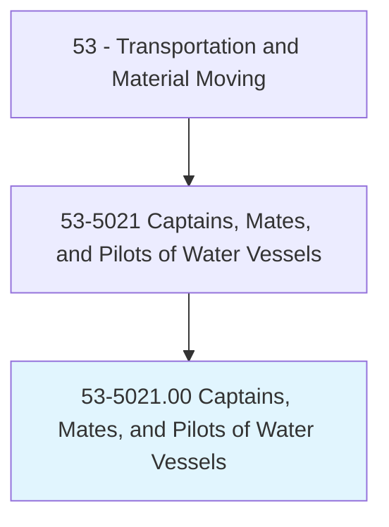
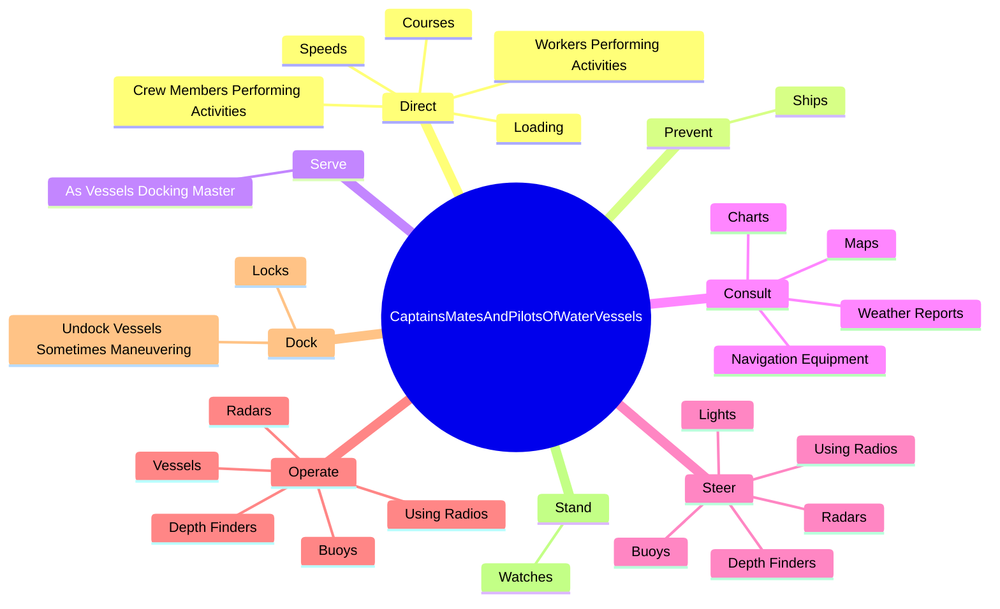
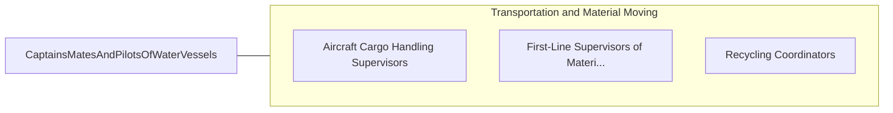

# Captains, Mates, and Pilots of Water Vessels

> Command or supervise operations of ships and water vessels, such as tugboats and ferryboats. Required to hold license issued by U.S. Coast Guard.

## Overview

Captains, Mates, and Pilots of Water Vessels is an occupation within the Transportation and Material Moving category. Command or supervise operations of ships and water vessels, such as tugboats and ferryboats. Required to hold license issued by U.S.

## Classification Hierarchy

## Key Statistics

| Metric | Value |
|--------|-------|
| SOC Code | 53-5021.00 |
| Category | [Transportation and Material Moving](/occupations/Transportation) |
| Task Count | 134 |
| Source | O*NET |

## Core Tasks

### direct.Courses

Captains, Mates, and Pilots of Water Vessels direct courses as part of their core responsibilities.

**Actions:**
- `direct.Courses.of.Ships`
- `direct.Courses.of.Based.on.SpecializedKnowledgeOfLocalWinds`
- `direct.Courses.of.Weather`
- `direct.Courses.of.WaterDepths`

### prevent.Ships

Captains, Mates, and Pilots of Water Vessels prevent ships as part of their core responsibilities.

**Actions:**
- `prevent.Ships.under.NavigationalControl.from.EngagingInUnsafeOperations`

### serve.AsVesselsDockingMaster

Captains, Mates, and Pilots of Water Vessels serve as vessels docking master as part of their core responsibilities.

**Actions:**
- `serve.AsVesselsDockingMaster.upon.Arrival.at.PortBerth`
- `serve.AsVesselsDockingMaster.upon.Arrival.at.AtBerth`

## Skills & Competencies

### Technical Skills
- **Vehicle Operation** - Advanced
- **Logistics** - Advanced
- **Safety Compliance** - Advanced

### Soft Skills
- **Communication** - Essential
- **Problem Solving** - Essential
- **Critical Thinking** - Important
- **Teamwork** - Important
- **Adaptability** - Important

## Related Occupations

## Industries

This occupation is found across multiple industries. See [Industries](/industries) for sector-specific employment data.

## Career Progression

---

*Source: O*NET 53-5021.00 - ONETOccupation*
