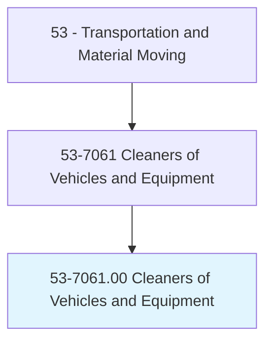
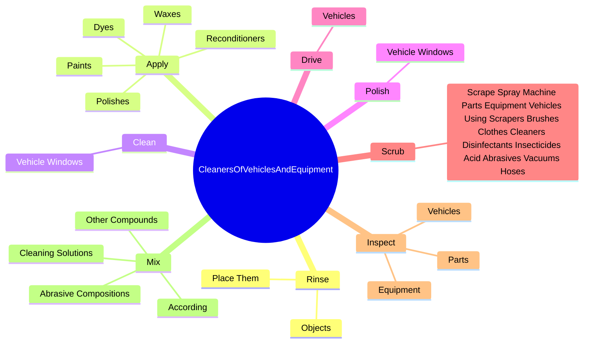
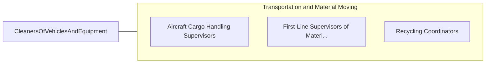

# Cleaners of Vehicles and Equipment

> Wash or otherwise clean vehicles, machinery, and other equipment. Use such materials as water, cleaning agents, brushes, cloths, and hoses.

## Overview

Cleaners of Vehicles and Equipment is an occupation within the Transportation and Material Moving category. Wash or otherwise clean vehicles, machinery, and other equipment. 

## Classification Hierarchy

## Key Statistics

| Metric | Value |
|--------|-------|
| SOC Code | 53-7061.00 |
| Category | [Transportation and Material Moving](/occupations/Transportation) |
| Task Count | 102 |
| Source | O*NET |

## Core Tasks

### rinse.Objects

Cleaners of Vehicles and Equipment rinse objects as part of their core responsibilities.

**Actions:**
- `rinse.Objects.on.DryingRacks`
- `rinse.Objects.on.UseCloth`
- `rinse.Objects.on.Squeegees`
- `rinse.Objects.on.AirCompressors.to.dry.Surfaces`

### apply.Paints

Cleaners of Vehicles and Equipment apply paints as part of their core responsibilities.

**Actions:**
- `apply.Paints.to.VehiclesToPreserve`
- `apply.Paints.to.protect`
- `apply.Paints.to.restore.Color`
- `apply.Paints.to.Condition`

### clean.VehicleWindows

Cleaners of Vehicles and Equipment clean vehicle windows as part of their core responsibilities.

**Actions:**
- `clean.VehicleWindows`

## Skills & Competencies

### Technical Skills
- **Vehicle Operation** - Advanced
- **Logistics** - Advanced
- **Safety Compliance** - Advanced

### Soft Skills
- **Communication** - Essential
- **Problem Solving** - Essential
- **Critical Thinking** - Important
- **Teamwork** - Important
- **Adaptability** - Important

## Related Occupations

## Industries

This occupation is found across multiple industries. See [Industries](/industries) for sector-specific employment data.

## Career Progression

---

*Source: O*NET 53-7061.00 - ONETOccupation*
