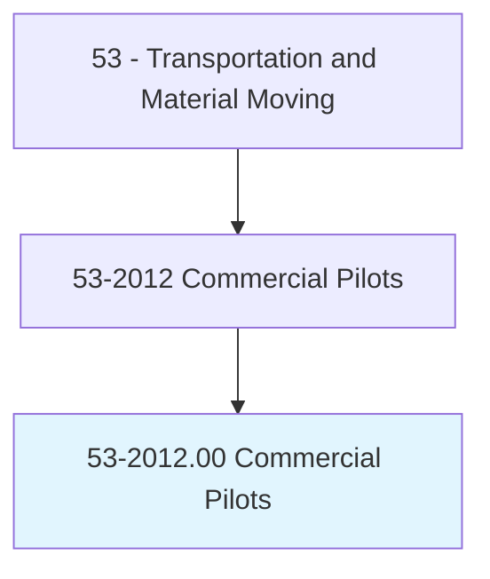
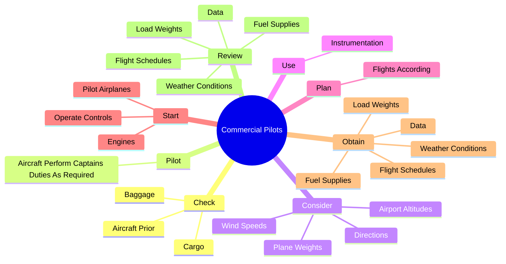
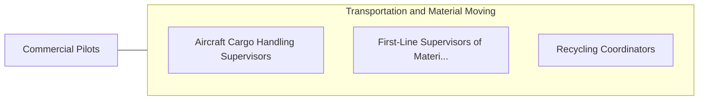

# Commercial Pilots

> Pilot and navigate the flight of fixed-wing aircraft on nonscheduled air carrier routes, or helicopters. Requires Commercial Pilot certificate. Includes charter pilots with similar certification, and air ambulance and air tour pilots. Excludes regional, national, and international airline pilots.

## Overview

Commercial Pilots is an occupation within the Transportation and Material Moving category. Pilot and navigate the flight of fixed-wing aircraft on nonscheduled air carrier routes, or helicopters. Requires Commercial Pilot certificate.

## Classification Hierarchy

## Key Statistics

| Metric | Value |
|--------|-------|
| SOC Code | 53-2012.00 |
| Category | [Transportation and Material Moving](/occupations/Transportation/index) |
| Task Count | 58 |
| Source | O*NET |

## Core Tasks

### check.AircraftPrior

Commercial Pilots check aircraft prior as part of their core responsibilities.

**Actions:**
- `check.AircraftPrior.to.FlightsToEnsureEngines`
- `check.AircraftPrior.to.controls`
- `check.AircraftPrior.to.Instruments`
- `check.AircraftPrior.to.OtherSystemsAreFunctioningProperly`

### pilot.AircraftPerformCaptainsDutiesAsRequired

Commercial Pilots pilot aircraft perform captains duties as required as part of their core responsibilities.

**Actions:**
- `pilot.AircraftPerformCaptainsDutiesAsRequired`

### consider.AirportAltitudes

Commercial Pilots consider airport altitudes as part of their core responsibilities.

**Actions:**
- `consider.AirportAltitudes.to.calculate.SpeedNeededToBecomeAirborne`
- `consider.PlaneWeights.to.calculate.SpeedNeededToBecomeAirborne`
- `consider.WindSpeeds.to.calculate.SpeedNeededToBecomeAirborne`
- `consider.Directions.to.calculate.SpeedNeededToBecomeAirborne`

## Skills & Competencies

### Technical Skills
- **Vehicle Operation** - Advanced
- **Logistics** - Advanced
- **Safety Compliance** - Advanced

### Soft Skills
- **Communication** - Essential
- **Problem Solving** - Essential
- **Critical Thinking** - Important
- **Teamwork** - Important
- **Adaptability** - Important

## Related Occupations

## Industries

This occupation is found across multiple industries. See [Industries](/industries) for sector-specific employment data.

## Career Progression

---

*Source: O*NET 53-2012.00 - ONETOccupation*
