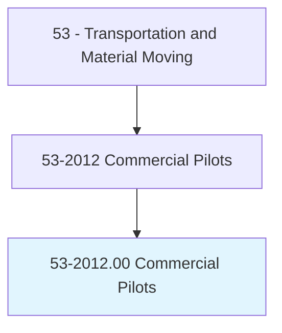
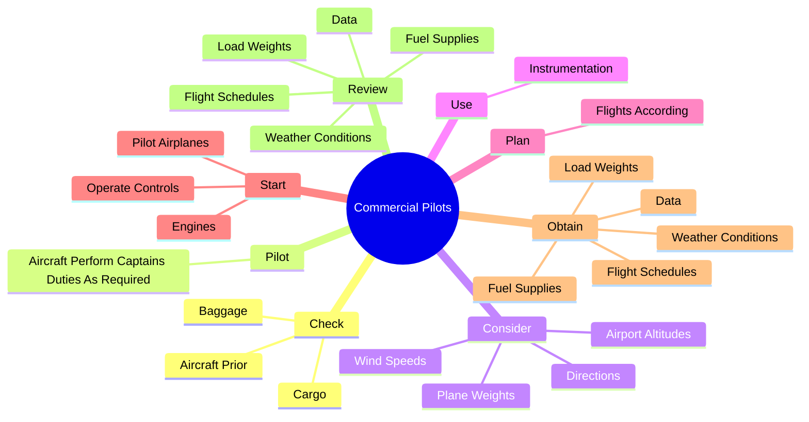
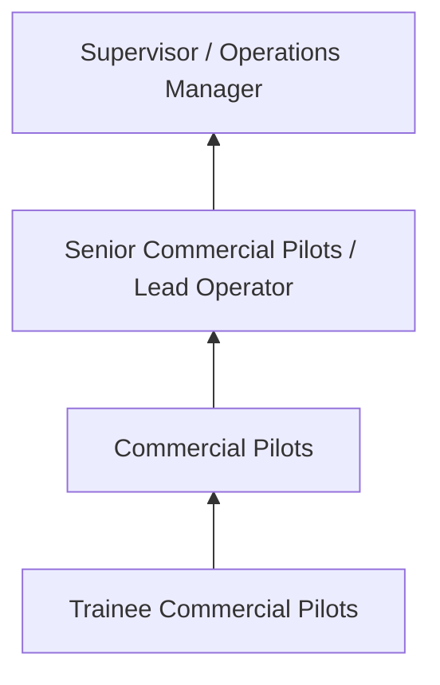
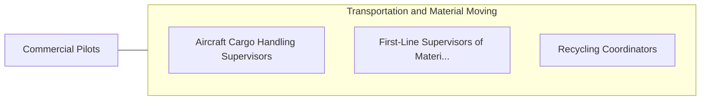

# Commercial Pilots

> Pilot and navigate the flight of fixed-wing aircraft on nonscheduled air carrier routes, or helicopters. Requires Commercial Pilot certificate. Includes charter pilots with similar certification, and air ambulance and air tour pilots. Excludes regional, national, and international airline pilots.

## Overview

Commercial Pilots professionals pilot and navigate the flight of fixed-wing aircraft on nonscheduled air carrier routes, or helicopters. This occupation falls within the Transportation and Material Moving category and requires a combination of specialized knowledge, technical skills, and practical experience.

These professionals work across diverse settings and organizational contexts, applying their expertise to meet the demands of their field. They must stay current with industry standards, emerging practices, and regulatory requirements that affect their work. The role demands both independent judgment and collaborative skills, as practitioners regularly interact with colleagues, stakeholders, and the public.

As the field continues to evolve, Commercial Pilots professionals increasingly leverage technology and data-driven approaches to enhance their effectiveness. Career opportunities span the public and private sectors, with demand influenced by economic conditions, demographic shifts, and technological advancement.

## Classification Hierarchy



## Key Statistics

| Metric | Value |
|--------|-------|
| SOC Code | 53-2012.00 |
| Job Zone | N/A |
| Category | [Transportation and Material Moving](/occupations/Transportation/index) |
| Core Tasks | 58+ |
| Salary Range | $30,000 - $75,000 |
| Median Salary | $45,000 |
| Growth Outlook | 6% (As fast as average) |
| Source | O*NET |

## Core Tasks



### obtain.Data

Commercial Pilots obtain data as part of their core responsibilities.

**Actions:**
- `obtain.Data.to.determine.FlightPlans` - Obtain and review data such as load weights, fuel supplies, weather condition...
- `obtain.Data.to.identify.NeededChanges` - Obtain and review data such as load weights, fuel supplies, weather condition...
- `obtain.LoadWeights.to.determine.FlightPlans` - Obtain and review data such as load weights, fuel supplies, weather condition...
- `obtain.LoadWeights.to.identify.NeededChanges` - Obtain and review data such as load weights, fuel supplies, weather condition...
- `obtain.FuelSupplies.to.determine.FlightPlans` - Obtain and review data such as load weights, fuel supplies, weather condition...

### review.Data

Commercial Pilots review data as part of their core responsibilities.

**Actions:**
- `review.Data.to.determine.FlightPlans` - Obtain and review data such as load weights, fuel supplies, weather condition...
- `review.Data.to.identify.NeededChanges` - Obtain and review data such as load weights, fuel supplies, weather condition...
- `review.LoadWeights.to.determine.FlightPlans` - Obtain and review data such as load weights, fuel supplies, weather condition...
- `review.LoadWeights.to.identify.NeededChanges` - Obtain and review data such as load weights, fuel supplies, weather condition...
- `review.FuelSupplies.to.determine.FlightPlans` - Obtain and review data such as load weights, fuel supplies, weather condition...

### check.AircraftPrior

Commercial Pilots check aircraft prior as part of their core responsibilities.

**Actions:**
- `check.AircraftPrior.to.FlightsToEnsureEngines` - Check aircraft prior to flights to ensure that the engines, controls, instrum...
- `check.AircraftPrior.to.controls` - Check aircraft prior to flights to ensure that the engines, controls, instrum...
- `check.AircraftPrior.to.Instruments` - Check aircraft prior to flights to ensure that the engines, controls, instrum...
- `check.AircraftPrior.to.OtherSystemsAreFunctioningProperly` - Check aircraft prior to flights to ensure that the engines, controls, instrum...
- `check.Baggage.to.ensure.ItHasBeenLoadedCorrectly` - Check baggage or cargo to ensure that it has been loaded correctly.

### consider.AirportAltitudes

Commercial Pilots consider airport altitudes as part of their core responsibilities.

**Actions:**
- `consider.AirportAltitudes.to.calculate.SpeedNeededToBecomeAirborne` - Consider airport altitudes, outside temperatures, plane weights, and wind spe...
- `consider.PlaneWeights.to.calculate.SpeedNeededToBecomeAirborne` - Consider airport altitudes, outside temperatures, plane weights, and wind spe...
- `consider.WindSpeeds.to.calculate.SpeedNeededToBecomeAirborne` - Consider airport altitudes, outside temperatures, plane weights, and wind spe...
- `consider.Directions.to.calculate.SpeedNeededToBecomeAirborne` - Consider airport altitudes, outside temperatures, plane weights, and wind spe...


## Skills & Competencies

### Technical Skills
- **Equipment Operation** - Advanced
- **Safety Procedures** - Advanced
- **Navigation Systems** - Proficient
- **Load Management** - Proficient
- **Vehicle Inspection** - Proficient
- **Regulatory Compliance** - Proficient

### Soft Skills
- **Situational Awareness** - Critical
- **Reliability** - Critical
- **Time Management** - Essential
- **Communication** - Essential
- **Physical Stamina** - Essential

## Education & Certifications

| Requirement | Details |
|-------------|---------|
| Typical Education | High school diploma or equivalent; some positions require post-secondary training |
| Work Experience | 0-2 years on-the-job experience |
| On-the-Job Training | Moderate - safety and equipment operation training |
| Certifications | CDL, hazmat endorsements, or transportation-specific licenses |

## Career Progression



## Industry Variations

### Freight and Logistics
Commercial transportation of goods. Commercial Pilots professionals focus on efficiency, safety, and timely delivery across supply chains.

### Public Transit
Passenger transportation services. Emphasis on schedules, safety, and customer service in public-facing roles.

### Warehousing and Distribution
Material handling and storage operations. Focus on inventory management and order fulfillment efficiency.

### Specialized Transport
Hazardous materials, oversized loads, or temperature-controlled transport requiring additional certifications and safety protocols.

## Technology & Tools

- **GPS and navigation systems**
- **Fleet management software**
- **Electronic logging devices (ELD)**
- **Warehouse management systems (WMS)**
- **Transportation management systems (TMS)**

## Related Occupations



## Industries

- [Trucking and Freight](/industries/Trucking) - High Employment
- [Warehousing and Storage](/industries/Warehousing) - High Employment
- [Air Transportation](/industries/AirTransportation) - Moderate Employment
- [Rail Transportation](/industries/RailTransportation) - Moderate Employment

## Departments

This occupation typically works in:
- [Operations](/departments/Operations/index)
- [Logistics](/departments/SupplyChain)
- Fleet Management

## GraphDL Semantic Structure

```graphdl
Commercial Pilots perform:
- check.AircraftPrior.to.FlightsToEnsureEngines
- check.AircraftPrior.to.controls
- check.AircraftPrior.to.Instruments
- check.AircraftPrior.to.OtherSystemsAreFunctioningProperly
- pilot.AircraftPerformCaptainsDutiesAsRequired
- consider.AirportAltitudes.to.calculate.SpeedNeededToBecomeAirborne
```

---

*Source: O*NET 53-2012.00 - ONETOccupation*
