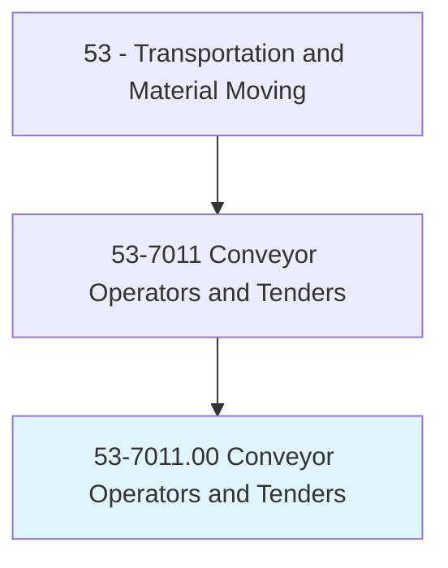
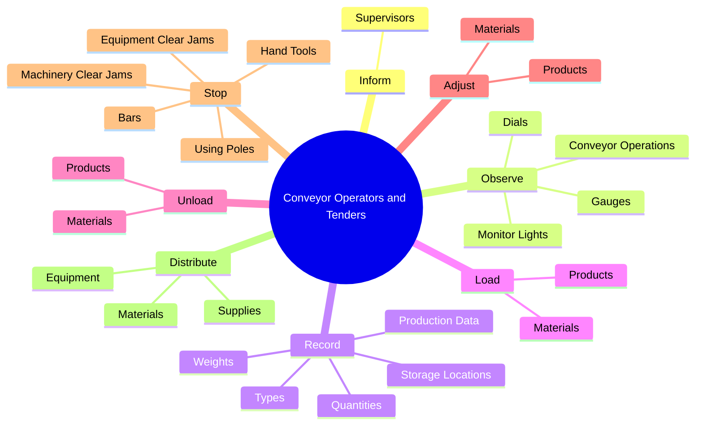
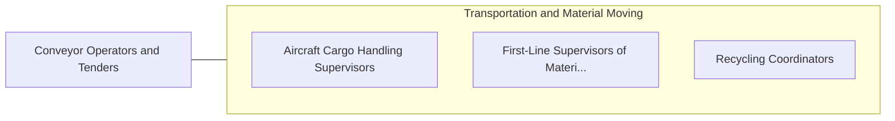

# Conveyor Operators and Tenders

> Control or tend conveyors or conveyor systems that move materials or products to and from stockpiles, processing stations, departments, or vehicles. May control speed and routing of materials or products.

## Overview

Conveyor Operators and Tenders is an occupation within the Transportation and Material Moving category. Control or tend conveyors or conveyor systems that move materials or products to and from stockpiles, processing stations, departments, or vehicles. 

## Classification Hierarchy

## Key Statistics

| Metric | Value |
|--------|-------|
| SOC Code | 53-7011.00 |
| Category | [Transportation and Material Moving](/occupations/Transportation) |
| Task Count | 231 |
| Source | O*NET |

## Core Tasks

### inform.Supervisors

Conveyor Operators and Tenders inform supervisors as part of their core responsibilities.

**Actions:**
- `inform.Supervisors.of.EquipmentMalfunctionsNeedToBeAddressed`

### observe.ConveyorOperations

Conveyor Operators and Tenders observe conveyor operations as part of their core responsibilities.

**Actions:**
- `observe.ConveyorOperations.to.maintain.SpecifiedOperatingLevelsDetectEquipmentMalfunctions`
- `observe.ConveyorOperations.to.ToDetectEquipmentMalfunctions`
- `observe.MonitorLights.to.maintain.SpecifiedOperatingLevelsDetectEquipmentMalfunctions`
- `observe.MonitorLights.to.ToDetectEquipmentMalfunctions`

### record.ProductionData

Conveyor Operators and Tenders record production data as part of their core responsibilities.

**Actions:**
- `record.ProductionData.of.Materials`
- `record.ProductionData.of.AsWellAsEquipmentPerformanceProblems`
- `record.ProductionData.of.Downtime`
- `record.Weights.of.Materials`

## Skills & Competencies

### Technical Skills
- **Vehicle Operation** - Advanced
- **Logistics** - Advanced
- **Safety Compliance** - Advanced

### Soft Skills
- **Communication** - Essential
- **Problem Solving** - Essential
- **Critical Thinking** - Important
- **Teamwork** - Important
- **Adaptability** - Important

## Related Occupations

## Industries

This occupation is found across multiple industries. See [Industries](/industries) for sector-specific employment data.

## Career Progression

---

*Source: O*NET 53-7011.00 - ONETOccupation*
