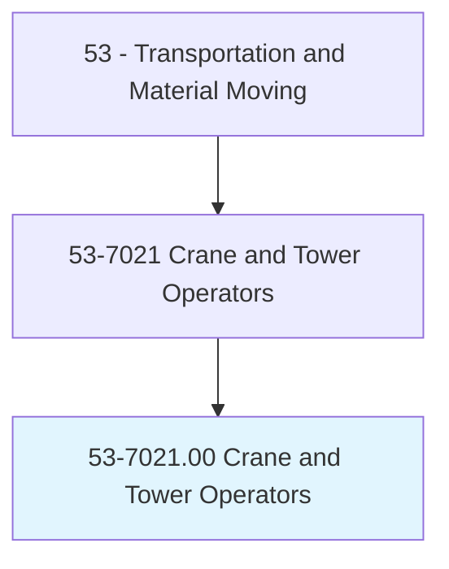
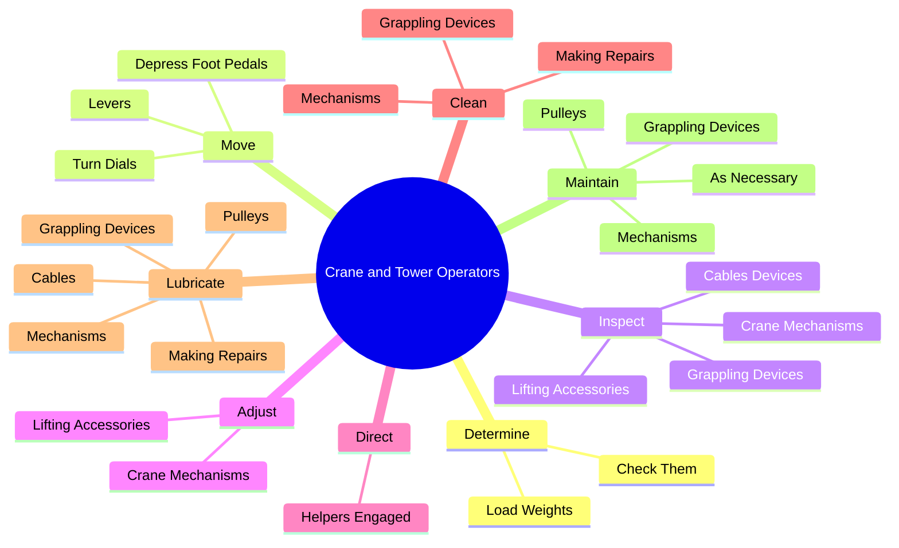
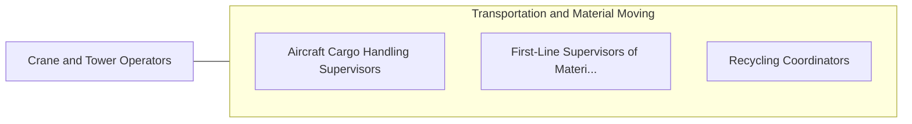

# Crane and Tower Operators

> Operate mechanical boom and cable or tower and cable equipment to lift and move materials, machines, or products in many directions.

## Overview

Crane and Tower Operators is classified under Transportation and Material Moving (SOC 53). Operate mechanical boom and cable or tower and cable equipment to lift and move materials, machines, or products in many directions.

## Classification Hierarchy

## Key Statistics

| Metric | Value |
|--------|-------|
| SOC Code | 53-7021.00 |
| Category | [Transportation and Material Moving](/occupations/Transportation/index) |
| Task Count | 71 |
| Source | O*NET |

## Core Tasks

### determine.LoadWeights

Crane and Tower Operators determine load weights as part of their core responsibilities.

**Actions:**
- `determine.LoadWeights.to.prevent.Overload`
- `determine.CheckThem.against.LiftingCapacities.to.prevent.Overload`

### move.Levers

Crane and Tower Operators move levers as part of their core responsibilities.

**Actions:**
- `move.Levers.to.operate.Cranes`
- `move.Levers.to.CherryPickers`
- `move.Levers.to.Electromagnets`
- `move.Levers.to.OtherMovingEquipmentForLifting`

### inspect.CraneMechanisms

Crane and Tower Operators inspect crane mechanisms as part of their core responsibilities.

**Actions:**
- `inspect.CraneMechanisms.to.prevent.Malfunctions`
- `inspect.CraneMechanisms.to.Damage`
- `inspect.LiftingAccessories.to.prevent.Malfunctions`
- `inspect.LiftingAccessories.to.Damage`

## Skills & Competencies

### Technical Skills
- **Vehicle Operation** - Advanced
- **Logistics** - Advanced
- **Safety Compliance** - Advanced

### Soft Skills
- **Communication** - Essential
- **Problem Solving** - Essential
- **Critical Thinking** - Important
- **Teamwork** - Important
- **Adaptability** - Important

## Related Occupations

## Industries

This occupation is found across multiple industries. See [Industries](/industries) for sector-specific employment data.

## Career Progression

---

*Source: O*NET 53-7021.00 - ONETOccupation*
