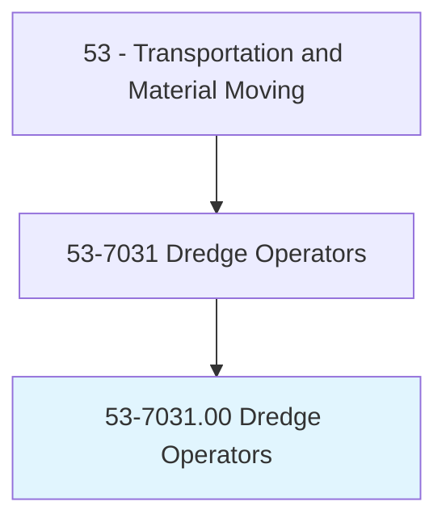
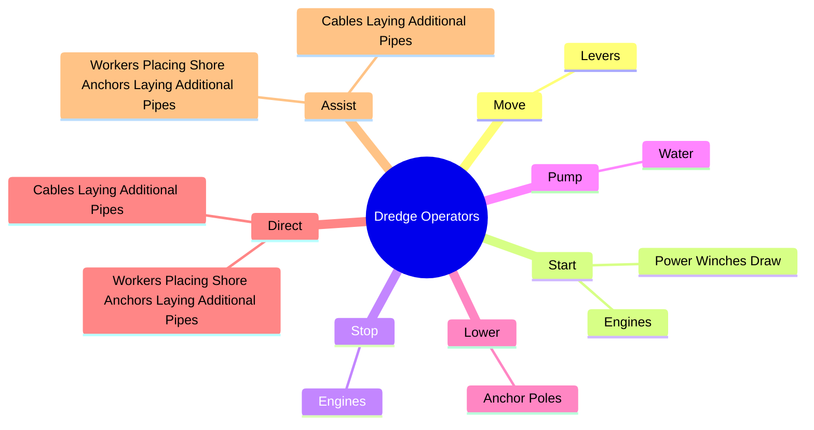
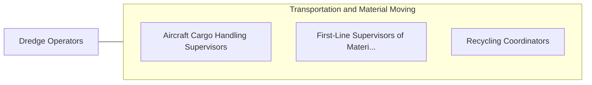

# Dredge Operators

> Operate dredge to remove sand, gravel, or other materials in order to excavate and maintain navigable channels in waterways.

## Overview

Dredge Operators is classified under Transportation and Material Moving (SOC 53). Operate dredge to remove sand, gravel, or other materials in order to excavate and maintain navigable channels in waterways.

## Classification Hierarchy

## Key Statistics

| Metric | Value |
|--------|-------|
| SOC Code | 53-7031.00 |
| Category | [Transportation and Material Moving](/occupations/Transportation) |
| Task Count | 21 |
| Source | O*NET |

## Core Tasks

### move.Levers

Dredge Operators move levers as part of their core responsibilities.

**Actions:**
- `move.Levers.to.position.DredgesForExcavation`
- `move.Levers.to.ToEngageHydraulicPumps`
- `move.Levers.to.lower.SuctionBooms`
- `move.Levers.to.ToControlRotationOfCutterheads`

### start.Engines

Dredge Operators start engines as part of their core responsibilities.

**Actions:**
- `start.Engines.to.operate.Equipment`
- `start.PowerWinchesDraw.in.LetOutCables.to.change.PositionsOfDredges`
- `start.PowerWinchesDraw.in.PullIn`
- `start.PowerWinchesDraw.in.LetOutCablesManually`

### stop.Engines

Dredge Operators stop engines as part of their core responsibilities.

**Actions:**
- `stop.Engines.to.operate.Equipment`

## Skills & Competencies

### Technical Skills
- **Vehicle Operation** - Advanced
- **Logistics** - Advanced
- **Safety Compliance** - Advanced

### Soft Skills
- **Communication** - Essential
- **Problem Solving** - Essential
- **Critical Thinking** - Important
- **Teamwork** - Important
- **Adaptability** - Important

## Related Occupations

## Industries

This occupation is found across multiple industries. See [Industries](/industries) for sector-specific employment data.

## Career Progression

---

*Source: O*NET 53-7031.00 - ONETOccupation*
