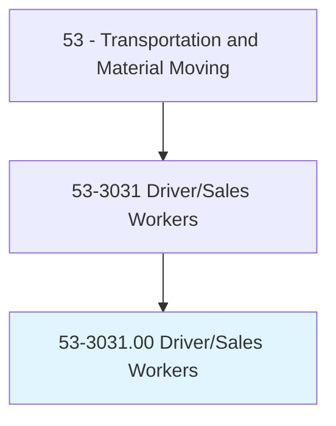
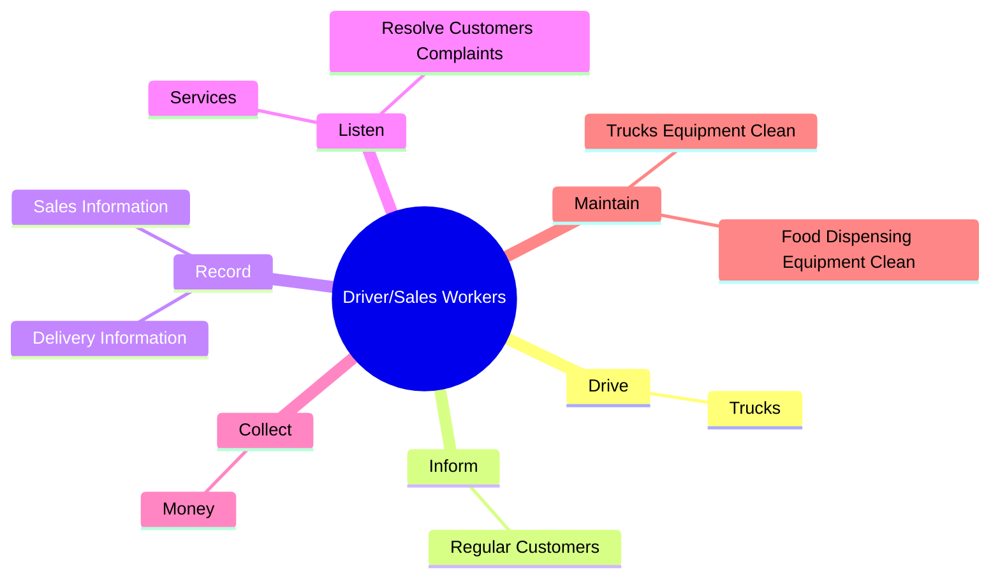
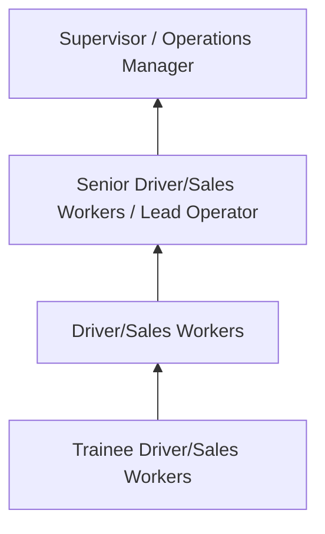
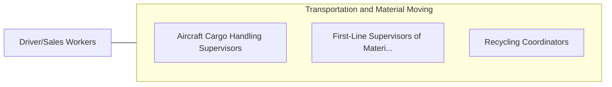

# Driver/Sales Workers

> Drive truck or other vehicle over established routes or within an established territory and sell or deliver goods, such as food products, including restaurant take-out items, or pick up or deliver items such as commercial laundry. May also take orders, collect payment, or stock merchandise at point of delivery.

## Overview

Driver/Sales Workers professionals drive truck or other vehicle over established routes or within an established territory and sell or deliver goods, such as food products, including restaurant take-out items, or pick up or deliver items such as commercial laundry. This occupation falls within the Transportation and Material Moving category and requires a combination of specialized knowledge, technical skills, and practical experience.

These professionals work across diverse settings and organizational contexts, applying their expertise to meet the demands of their field. They must stay current with industry standards, emerging practices, and regulatory requirements that affect their work. The role demands both independent judgment and collaborative skills, as practitioners regularly interact with colleagues, stakeholders, and the public.

As the field continues to evolve, Driver/Sales Workers professionals increasingly leverage technology and data-driven approaches to enhance their effectiveness. Career opportunities span the public and private sectors, with demand influenced by economic conditions, demographic shifts, and technological advancement.

## Classification Hierarchy



## Key Statistics

| Metric | Value |
|--------|-------|
| SOC Code | 53-3031.00 |
| Job Zone | N/A |
| Category | [Transportation and Material Moving](/occupations/Transportation/index) |
| Core Tasks | 36+ |
| Salary Range | $30,000 - $75,000 |
| Median Salary | $45,000 |
| Growth Outlook | 6% (As fast as average) |
| Source | O*NET |

## Core Tasks



### collect.Money

Driver/Sales Workers collect money as part of their core responsibilities.

**Actions:**
- `collect.Money.from.Customers` - Collect money from customers, make change, and record transactions on custome...
- `collect.Money.from.MakeChange` - Collect money from customers, make change, and record transactions on custome...
- `collect.Money.from.RecordTransactions.on.CustomerReceipts` - Collect money from customers, make change, and record transactions on custome...
- `collect.Coins.from.VendingMachines` - Collect coins from vending machines, refill machines, and remove aged merchan...
- `collect.Coins.from.RefillMachines` - Collect coins from vending machines, refill machines, and remove aged merchan...

### sell.FoodSpecialties

Driver/Sales Workers sell food specialties as part of their core responsibilities.

**Actions:**
- `sell.FoodSpecialties.to.OfficeWorkersOfSportsEvents` - Sell food specialties, such as sandwiches and beverages, to office workers an...
- `sell.FoodSpecialties.to.PatronsOfSportsEvents` - Sell food specialties, such as sandwiches and beverages, to office workers an...
- `sell.Sandwiches.to.OfficeWorkersOfSportsEvents` - Sell food specialties, such as sandwiches and beverages, to office workers an...
- `sell.Sandwiches.to.PatronsOfSportsEvents` - Sell food specialties, such as sandwiches and beverages, to office workers an...
- `sell.Beverages.to.OfficeWorkersOfSportsEvents` - Sell food specialties, such as sandwiches and beverages, to office workers an...

### record.SalesInformation

Driver/Sales Workers record sales information as part of their core responsibilities.

**Actions:**
- `record.SalesInformation.on.DailySalesRecord` - Record sales or delivery information on daily sales or delivery record.
- `record.SalesInformation.on.DeliveryRecord` - Record sales or delivery information on daily sales or delivery record.
- `record.DeliveryInformation.on.DailySalesRecord` - Record sales or delivery information on daily sales or delivery record.
- `record.DeliveryInformation.on.DeliveryRecord` - Record sales or delivery information on daily sales or delivery record.

### maintain.TrucksEquipmentClean

Driver/Sales Workers maintain trucks equipment clean as part of their core responsibilities.

**Actions:**
- `maintain.TrucksEquipmentClean.inside.OfMachinesDispenseFood` - Maintain trucks and food-dispensing equipment and clean inside of machines th...
- `maintain.TrucksEquipmentClean.inside.OfBeverages` - Maintain trucks and food-dispensing equipment and clean inside of machines th...
- `maintain.FoodDispensingEquipmentClean.inside.OfMachinesDispenseFood` - Maintain trucks and food-dispensing equipment and clean inside of machines th...
- `maintain.FoodDispensingEquipmentClean.inside.OfBeverages` - Maintain trucks and food-dispensing equipment and clean inside of machines th...


## Skills & Competencies

### Technical Skills
- **Equipment Operation** - Advanced
- **Safety Procedures** - Advanced
- **Navigation Systems** - Proficient
- **Load Management** - Proficient
- **Vehicle Inspection** - Proficient
- **Regulatory Compliance** - Proficient

### Soft Skills
- **Situational Awareness** - Critical
- **Reliability** - Critical
- **Time Management** - Essential
- **Communication** - Essential
- **Physical Stamina** - Essential

## Education & Certifications

| Requirement | Details |
|-------------|---------|
| Typical Education | High school diploma or equivalent; some positions require post-secondary training |
| Work Experience | 0-2 years on-the-job experience |
| On-the-Job Training | Moderate - safety and equipment operation training |
| Certifications | CDL, hazmat endorsements, or transportation-specific licenses |

## Career Progression



## Industry Variations

### Freight and Logistics
Commercial transportation of goods. Driver/Sales Workers professionals focus on efficiency, safety, and timely delivery across supply chains.

### Public Transit
Passenger transportation services. Emphasis on schedules, safety, and customer service in public-facing roles.

### Warehousing and Distribution
Material handling and storage operations. Focus on inventory management and order fulfillment efficiency.

### Specialized Transport
Hazardous materials, oversized loads, or temperature-controlled transport requiring additional certifications and safety protocols.

## Technology & Tools

- **GPS and navigation systems**
- **Fleet management software**
- **Electronic logging devices (ELD)**
- **Warehouse management systems (WMS)**
- **Transportation management systems (TMS)**

## Related Occupations



## Industries

- [Trucking and Freight](/industries/Trucking) - High Employment
- [Warehousing and Storage](/industries/Warehousing) - High Employment
- [Air Transportation](/industries/AirTransportation) - Moderate Employment
- [Rail Transportation](/industries/RailTransportation) - Moderate Employment

## Departments

This occupation typically works in:
- [Operations](/departments/Operations/index)
- [Logistics](/departments/SupplyChain)
- Fleet Management

## GraphDL Semantic Structure

```graphdl
Driver/Sales Workers perform:
- drive.Trucks.to.deliver.SuchItemsAsFood
- drive.Trucks.to.MedicalSupplies
- drive.Trucks.to.Newspapers
- inform.RegularCustomers.of.NewProducts
- inform.RegularCustomers.of.ServicesChanges
- inform.RegularCustomers.of.PriceChanges
```

---

*Source: O*NET 53-3031.00 - ONETOccupation*
