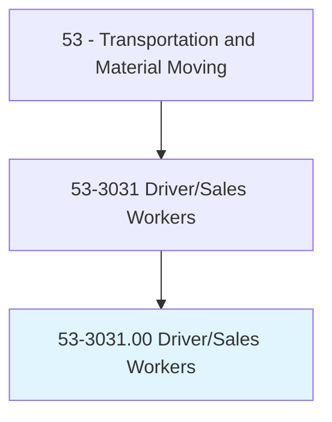
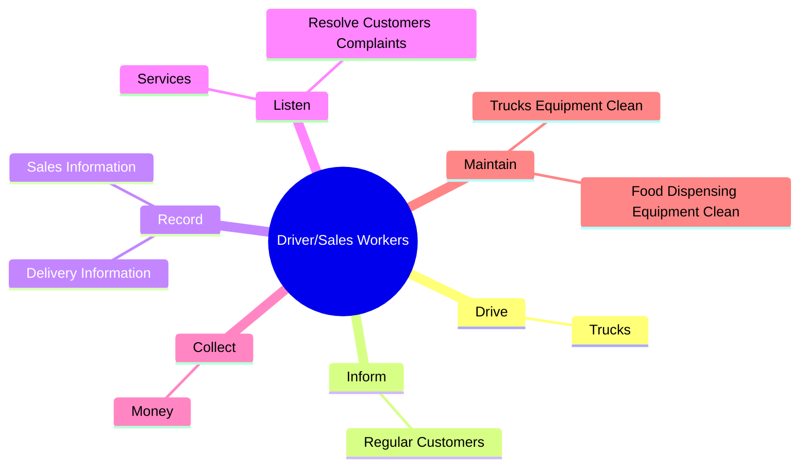
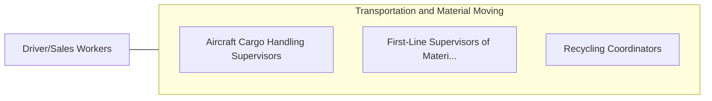

# Driver/Sales Workers

> Drive truck or other vehicle over established routes or within an established territory and sell or deliver goods, such as food products, including restaurant take-out items, or pick up or deliver items such as commercial laundry. May also take orders, collect payment, or stock merchandise at point of delivery.

## Overview

Driver/Sales Workers is an occupation within the Transportation and Material Moving category. Drive truck or other vehicle over established routes or within an established territory and sell or deliver goods, such as food products, including restaurant take-out items, or pick up or deliver items such as commercial laundry. 

## Classification Hierarchy

## Key Statistics

| Metric | Value |
|--------|-------|
| SOC Code | 53-3031.00 |
| Category | [Transportation and Material Moving](/occupations/Transportation/index) |
| Task Count | 36 |
| Source | O*NET |

## Core Tasks

### drive.Trucks

Driver/Sales Workers drive trucks as part of their core responsibilities.

**Actions:**
- `drive.Trucks.to.deliver.SuchItemsAsFood`
- `drive.Trucks.to.MedicalSupplies`
- `drive.Trucks.to.Newspapers`

### inform.RegularCustomers

Driver/Sales Workers inform regular customers as part of their core responsibilities.

**Actions:**
- `inform.RegularCustomers.of.NewProducts`
- `inform.RegularCustomers.of.ServicesChanges`
- `inform.RegularCustomers.of.PriceChanges`

### record.SalesInformation

Driver/Sales Workers record sales information as part of their core responsibilities.

**Actions:**
- `record.SalesInformation.on.DailySalesRecord`
- `record.SalesInformation.on.DeliveryRecord`
- `record.DeliveryInformation.on.DailySalesRecord`
- `record.DeliveryInformation.on.DeliveryRecord`

## Skills & Competencies

### Technical Skills
- **Vehicle Operation** - Advanced
- **Logistics** - Advanced
- **Safety Compliance** - Advanced

### Soft Skills
- **Communication** - Essential
- **Problem Solving** - Essential
- **Critical Thinking** - Important
- **Teamwork** - Important
- **Adaptability** - Important

## Related Occupations

## Industries

This occupation is found across multiple industries. See [Industries](/industries) for sector-specific employment data.

## Career Progression

---

*Source: O*NET 53-3031.00 - ONETOccupation*
