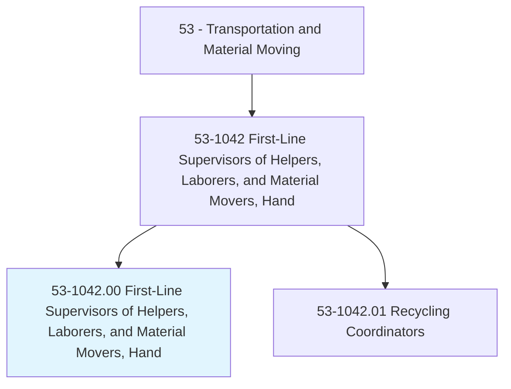
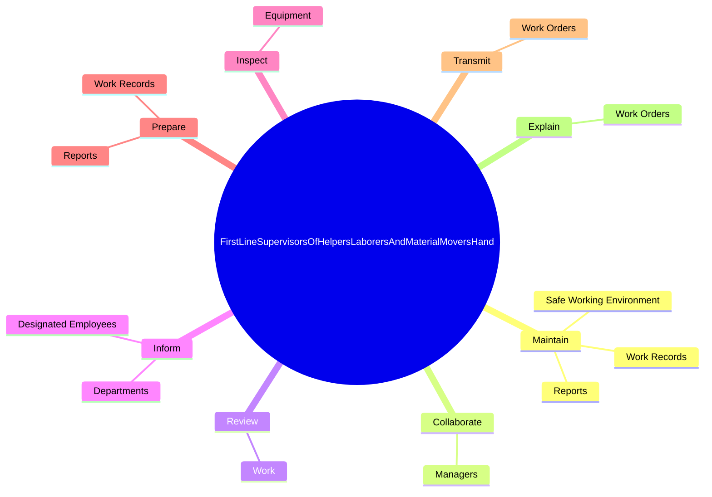
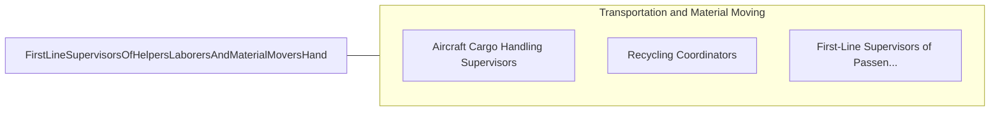

# First-Line Supervisors of Helpers, Laborers, and Material Movers, Hand

> Directly supervise and coordinate the activities of helpers, laborers, or material movers, hand.

## Overview

First-Line Supervisors of Helpers, Laborers, and Material Movers, Hand is classified under Transportation and Material Moving (SOC 53). Directly supervise and coordinate the activities of helpers, laborers, or material movers, hand.

## Classification Hierarchy

## Key Statistics

| Metric | Value |
|--------|-------|
| SOC Code | 53-1042.00 |
| Category | [Transportation and Material Moving](/occupations/Transportation) |
| Task Count | 82 |
| Source | O*NET |

## Core Tasks

### maintain.SafeWorkingEnvironment

First-Line Supervisors of Helpers, Laborers, and Material Movers, Hand maintain safe working environment as part of their core responsibilities.

**Actions:**
- `maintain.SafeWorkingEnvironment.by.MonitoringSafetyProcedures`
- `maintain.SafeWorkingEnvironment.by.Equipment`
- `maintain.WorkRecords.of.Information`
- `maintain.WorkRecords.of.EmployeeTime`

### collaborate.Managers

First-Line Supervisors of Helpers, Laborers, and Material Movers, Hand collaborate managers as part of their core responsibilities.

**Actions:**
- `collaborate.Managers.to.solve.WorkRelatedProblems`

### review.Work

First-Line Supervisors of Helpers, Laborers, and Material Movers, Hand review work as part of their core responsibilities.

**Actions:**
- `review.Work.throughout.WorkProcessAtCompletion.to.ensure.ItHasBeenPerformedProperly`

## Skills & Competencies

### Technical Skills
- **Vehicle Operation** - Advanced
- **Logistics** - Advanced
- **Safety Compliance** - Advanced

### Soft Skills
- **Communication** - Essential
- **Problem Solving** - Essential
- **Critical Thinking** - Important
- **Teamwork** - Important
- **Adaptability** - Important

## Related Occupations

## Industries

This occupation is found across multiple industries. See [Industries](/industries) for sector-specific employment data.

## Career Progression

---

*Source: O*NET 53-1042.00 - ONETOccupation*
