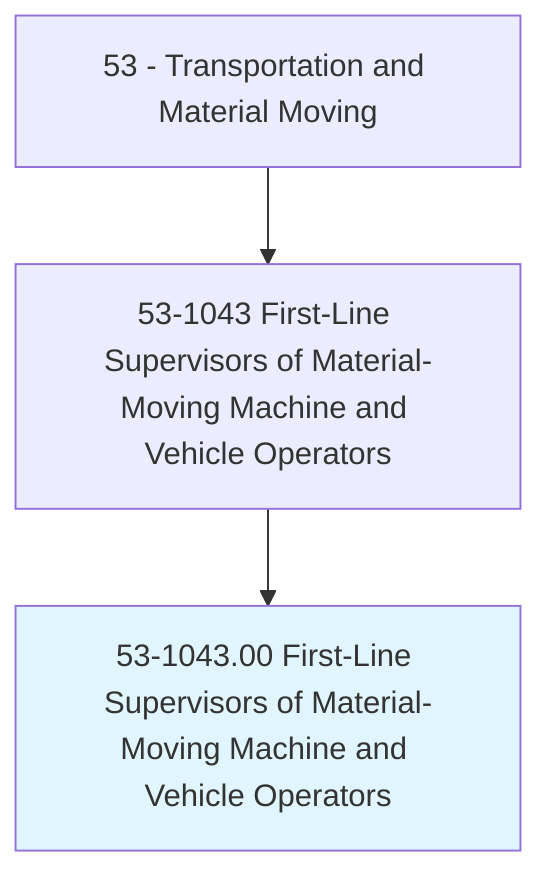
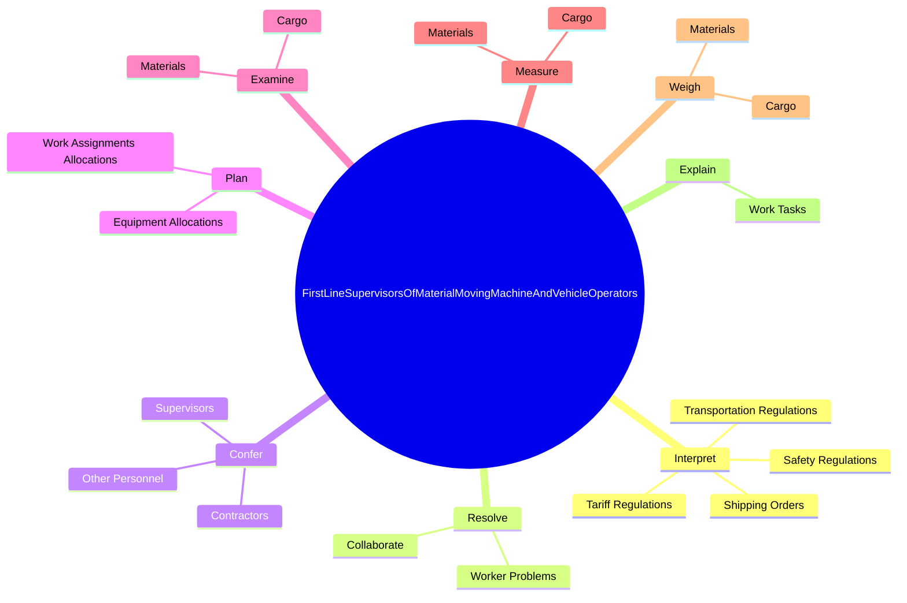
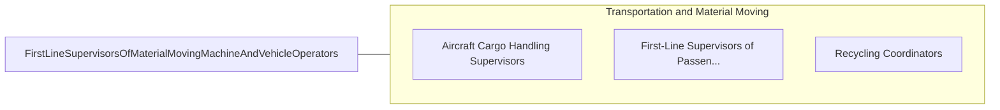

# First-Line Supervisors of Material-Moving Machine and Vehicle Operators

> Directly supervise and coordinate activities of material-moving machine and vehicle operators and helpers.

## Overview

First-Line Supervisors of Material-Moving Machine and Vehicle Operators is classified under Transportation and Material Moving (SOC 53). Directly supervise and coordinate activities of material-moving machine and vehicle operators and helpers.

## Classification Hierarchy

## Key Statistics

| Metric | Value |
|--------|-------|
| SOC Code | 53-1043.00 |
| Category | [Transportation and Material Moving](/occupations/Transportation) |
| Task Count | 145 |
| Source | O*NET |

## Core Tasks

### interpret.TransportationRegulations

First-Line Supervisors of Material-Moving Machine and Vehicle Operators interpret transportation regulations as part of their core responsibilities.

**Actions:**
- `interpret.TransportationRegulations.for.Workers`
- `interpret.TariffRegulations.for.Workers`
- `interpret.ShippingOrders.for.Workers`
- `interpret.SafetyRegulations.for.Workers`

### resolve.WorkerProblems

First-Line Supervisors of Material-Moving Machine and Vehicle Operators resolve worker problems as part of their core responsibilities.

**Actions:**
- `resolve.WorkerProblems.with.Employees.to.assist.InProblemResolution`
- `resolve.Collaborate.with.Employees.to.assist.InProblemResolution`

### confer.Supervisors

First-Line Supervisors of Material-Moving Machine and Vehicle Operators confer supervisors as part of their core responsibilities.

**Actions:**
- `confer.Supervisors.to.exchange.InformationResolveProblems`
- `confer.Supervisors.to.ToResolveProblems`
- `confer.Contractors.to.exchange.InformationResolveProblems`
- `confer.OtherPersonnel.to.exchange.InformationResolveProblems`

## Skills & Competencies

### Technical Skills
- **Vehicle Operation** - Advanced
- **Logistics** - Advanced
- **Safety Compliance** - Advanced

### Soft Skills
- **Communication** - Essential
- **Problem Solving** - Essential
- **Critical Thinking** - Important
- **Teamwork** - Important
- **Adaptability** - Important

## Related Occupations

## Industries

This occupation is found across multiple industries. See [Industries](/industries) for sector-specific employment data.

## Career Progression

---

*Source: O*NET 53-1043.00 - ONETOccupation*
