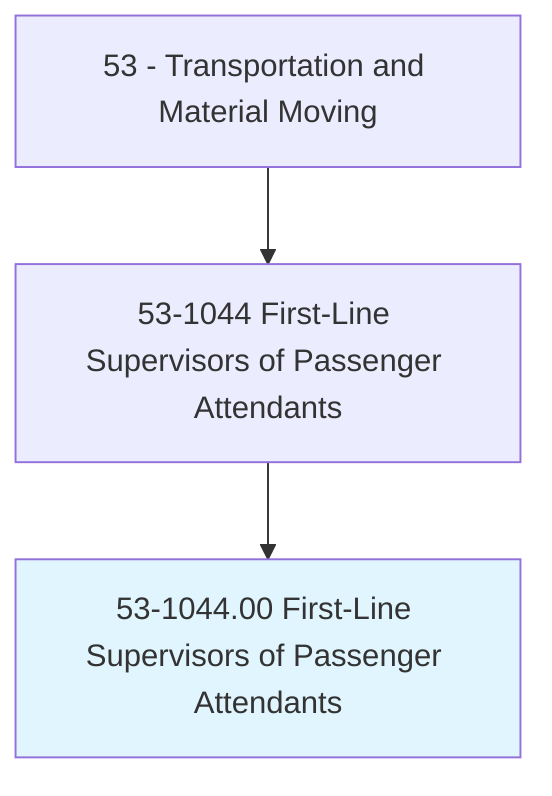
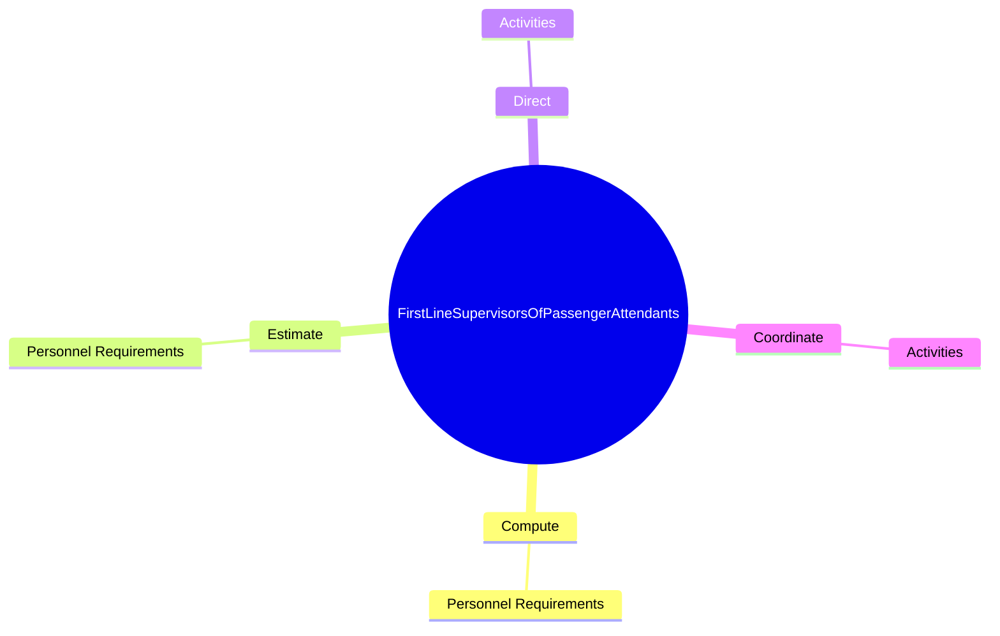
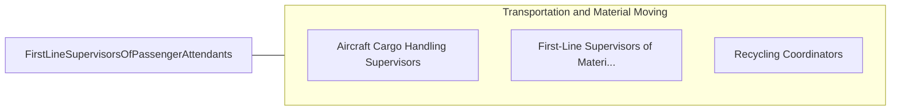

# First-Line Supervisors of Passenger Attendants

> Supervise and coordinate activities of passenger attendants.

## Overview

First-Line Supervisors of Passenger Attendants is classified under Transportation and Material Moving (SOC 53). Supervise and coordinate activities of passenger attendants.

## Classification Hierarchy

## Key Statistics

| Metric | Value |
|--------|-------|
| SOC Code | 53-1044.00 |
| Category | [Transportation and Material Moving](/occupations/Transportation) |
| Task Count | 6 |
| Source | O*NET |

## Core Tasks

### compute.PersonnelRequirements

First-Line Supervisors of Passenger Attendants compute personnel requirements as part of their core responsibilities.

**Actions:**
- `compute.PersonnelRequirements`

### estimate.PersonnelRequirements

First-Line Supervisors of Passenger Attendants estimate personnel requirements as part of their core responsibilities.

**Actions:**
- `estimate.PersonnelRequirements`

### direct.Activities

First-Line Supervisors of Passenger Attendants direct activities as part of their core responsibilities.

**Actions:**
- `direct.Activities.of.Flight`
- `direct.Activities.of.CarAttendants`

## Skills & Competencies

### Technical Skills
- **Vehicle Operation** - Advanced
- **Logistics** - Advanced
- **Safety Compliance** - Advanced

### Soft Skills
- **Communication** - Essential
- **Problem Solving** - Essential
- **Critical Thinking** - Important
- **Teamwork** - Important
- **Adaptability** - Important

## Related Occupations

## Industries

This occupation is found across multiple industries. See [Industries](/industries) for sector-specific employment data.

## Career Progression

---

*Source: O*NET 53-1044.00 - ONETOccupation*
