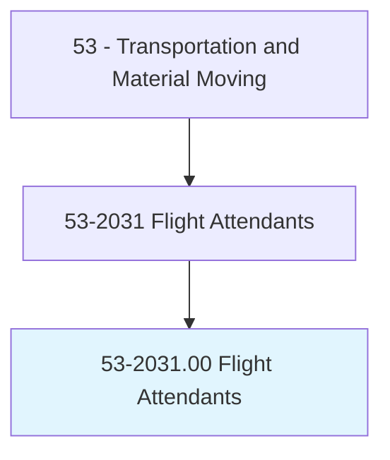
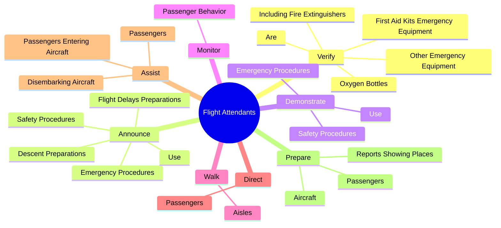
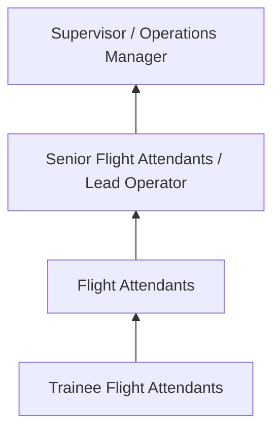
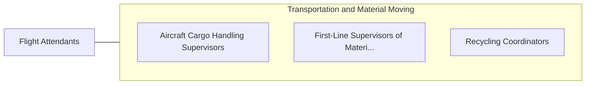

# Flight Attendants

> Monitor safety of the aircraft cabin. Provide services to airline passengers, explain safety information, serve food and beverages, and respond to emergency incidents.

## Overview

Flight Attendants professionals monitor safety of the aircraft cabin. This occupation falls within the Transportation and Material Moving category and requires a combination of specialized knowledge, technical skills, and practical experience.

These professionals work across diverse settings and organizational contexts, applying their expertise to meet the demands of their field. They must stay current with industry standards, emerging practices, and regulatory requirements that affect their work. The role demands both independent judgment and collaborative skills, as practitioners regularly interact with colleagues, stakeholders, and the public.

As the field continues to evolve, Flight Attendants professionals increasingly leverage technology and data-driven approaches to enhance their effectiveness. Career opportunities span the public and private sectors, with demand influenced by economic conditions, demographic shifts, and technological advancement.

## Classification Hierarchy



## Key Statistics

| Metric | Value |
|--------|-------|
| SOC Code | 53-2031.00 |
| Job Zone | N/A |
| Category | [Transportation and Material Moving](/occupations/Transportation/index) |
| Core Tasks | 120+ |
| Salary Range | $30,000 - $75,000 |
| Median Salary | $45,000 |
| Growth Outlook | 6% (As fast as average) |
| Source | O*NET |

## Core Tasks



### attend.PreflightBriefings

Flight Attendants attend preflight briefings as part of their core responsibilities.

**Actions:**
- `attend.PreflightBriefings.concerning.Weather.of.Flights` - Attend preflight briefings concerning weather, altitudes, routes, emergency p...
- `attend.PreflightBriefings.concerning.Weather.of.Food` - Attend preflight briefings concerning weather, altitudes, routes, emergency p...
- `attend.PreflightBriefings.concerning.Weather.of.BeverageServicesOffered` - Attend preflight briefings concerning weather, altitudes, routes, emergency p...
- `attend.PreflightBriefings.concerning.Weather.of.NumbersOfPassengers` - Attend preflight briefings concerning weather, altitudes, routes, emergency p...
- `attend.Altitudes.of.Flights` - Attend preflight briefings concerning weather, altitudes, routes, emergency p...

### announce.SafetyProcedures

Flight Attendants announce safety procedures as part of their core responsibilities.

**Actions:**
- `announce.SafetyProcedures.of.OxygenMasks` - Announce and demonstrate safety and emergency procedures, such as the use of ...
- `announce.SafetyProcedures.of.SeatBelts` - Announce and demonstrate safety and emergency procedures, such as the use of ...
- `announce.SafetyProcedures.of.LifeJackets` - Announce and demonstrate safety and emergency procedures, such as the use of ...
- `announce.EmergencyProcedures.of.OxygenMasks` - Announce and demonstrate safety and emergency procedures, such as the use of ...
- `announce.EmergencyProcedures.of.SeatBelts` - Announce and demonstrate safety and emergency procedures, such as the use of ...

### prepare.Passengers

Flight Attendants prepare passengers as part of their core responsibilities.

**Actions:**
- `prepare.Passengers.for.Landing` - Prepare passengers and aircraft for landing, following procedures.
- `prepare.Passengers.for.FollowingProcedures` - Prepare passengers and aircraft for landing, following procedures.
- `prepare.Aircraft.for.Landing` - Prepare passengers and aircraft for landing, following procedures.
- `prepare.Aircraft.for.FollowingProcedures` - Prepare passengers and aircraft for landing, following procedures.
- `prepare.ReportsShowingPlaces.of.Departure` - Prepare reports showing places of departure and destination, passenger ticket...

### demonstrate.SafetyProcedures

Flight Attendants demonstrate safety procedures as part of their core responsibilities.

**Actions:**
- `demonstrate.SafetyProcedures.of.OxygenMasks` - Announce and demonstrate safety and emergency procedures, such as the use of ...
- `demonstrate.SafetyProcedures.of.SeatBelts` - Announce and demonstrate safety and emergency procedures, such as the use of ...
- `demonstrate.SafetyProcedures.of.LifeJackets` - Announce and demonstrate safety and emergency procedures, such as the use of ...
- `demonstrate.EmergencyProcedures.of.OxygenMasks` - Announce and demonstrate safety and emergency procedures, such as the use of ...
- `demonstrate.EmergencyProcedures.of.SeatBelts` - Announce and demonstrate safety and emergency procedures, such as the use of ...


## Skills & Competencies

### Technical Skills
- **Equipment Operation** - Advanced
- **Safety Procedures** - Advanced
- **Navigation Systems** - Proficient
- **Load Management** - Proficient
- **Vehicle Inspection** - Proficient
- **Regulatory Compliance** - Proficient

### Soft Skills
- **Situational Awareness** - Critical
- **Reliability** - Critical
- **Time Management** - Essential
- **Communication** - Essential
- **Physical Stamina** - Essential

## Education & Certifications

| Requirement | Details |
|-------------|---------|
| Typical Education | High school diploma or equivalent; some positions require post-secondary training |
| Work Experience | 0-2 years on-the-job experience |
| On-the-Job Training | Moderate - safety and equipment operation training |
| Certifications | CDL, hazmat endorsements, or transportation-specific licenses |

## Career Progression



## Industry Variations

### Freight and Logistics
Commercial transportation of goods. Flight Attendants professionals focus on efficiency, safety, and timely delivery across supply chains.

### Public Transit
Passenger transportation services. Emphasis on schedules, safety, and customer service in public-facing roles.

### Warehousing and Distribution
Material handling and storage operations. Focus on inventory management and order fulfillment efficiency.

### Specialized Transport
Hazardous materials, oversized loads, or temperature-controlled transport requiring additional certifications and safety protocols.

## Technology & Tools

- **GPS and navigation systems**
- **Fleet management software**
- **Electronic logging devices (ELD)**
- **Warehouse management systems (WMS)**
- **Transportation management systems (TMS)**

## Related Occupations



## Industries

- [Trucking and Freight](/industries/Trucking) - High Employment
- [Warehousing and Storage](/industries/Warehousing) - High Employment
- [Air Transportation](/industries/AirTransportation) - Moderate Employment
- [Rail Transportation](/industries/RailTransportation) - Moderate Employment

## Departments

This occupation typically works in:
- [Operations](/departments/Operations/index)
- [Logistics](/departments/Logistics)
- [Fleet Management](/departments/FleetManagement)

## GraphDL Semantic Structure

```
Flight Attendants perform:
- verify.FirstAidKitsEmergencyEquipment.in.WorkingOrder
- verify.OtherEmergencyEquipment.in.WorkingOrder
- verify.IncludingFireExtinguishers.in.WorkingOrder
- verify.OxygenBottles.in.WorkingOrder
- verify.Are.in.WorkingOrder
- announce.SafetyProcedures.of.OxygenMasks
```

---

*Source: O*NET 53-2031.00 - ONETOccupation*
