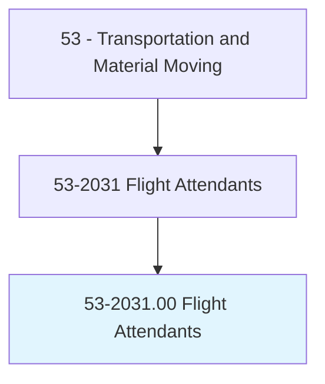
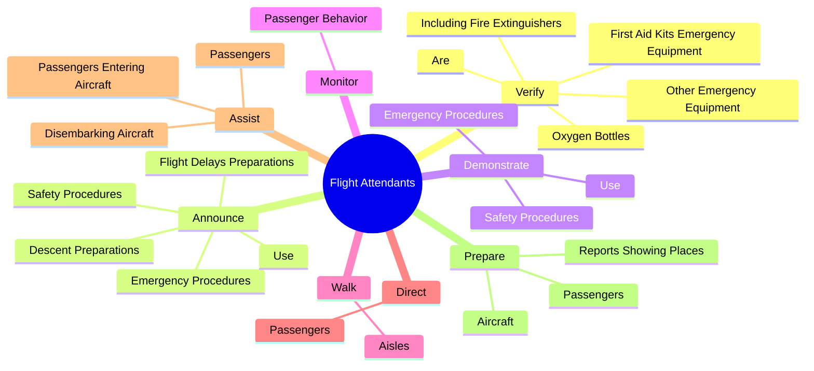
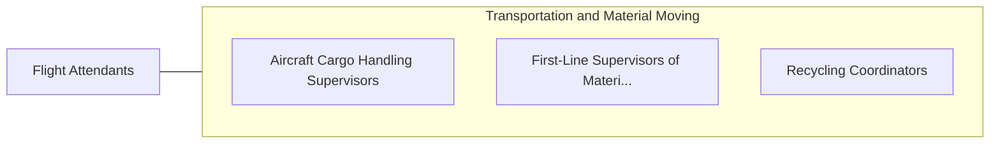

# Flight Attendants

> Monitor safety of the aircraft cabin. Provide services to airline passengers, explain safety information, serve food and beverages, and respond to emergency incidents.

## Overview

Flight Attendants is an occupation within the Transportation and Material Moving category. Monitor safety of the aircraft cabin. 

## Classification Hierarchy

## Key Statistics

| Metric | Value |
|--------|-------|
| SOC Code | 53-2031.00 |
| Category | [Transportation and Material Moving](/occupations/Transportation/index) |
| Task Count | 120 |
| Source | O*NET |

## Core Tasks

### verify.FirstAidKitsEmergencyEquipment

Flight Attendants verify first aid kits emergency equipment as part of their core responsibilities.

**Actions:**
- `verify.FirstAidKitsEmergencyEquipment.in.WorkingOrder`
- `verify.OtherEmergencyEquipment.in.WorkingOrder`
- `verify.IncludingFireExtinguishers.in.WorkingOrder`
- `verify.OxygenBottles.in.WorkingOrder`

### announce.SafetyProcedures

Flight Attendants announce safety procedures as part of their core responsibilities.

**Actions:**
- `announce.SafetyProcedures.of.OxygenMasks`
- `announce.SafetyProcedures.of.SeatBelts`
- `announce.SafetyProcedures.of.LifeJackets`
- `announce.EmergencyProcedures.of.OxygenMasks`

### demonstrate.SafetyProcedures

Flight Attendants demonstrate safety procedures as part of their core responsibilities.

**Actions:**
- `demonstrate.SafetyProcedures.of.OxygenMasks`
- `demonstrate.SafetyProcedures.of.SeatBelts`
- `demonstrate.SafetyProcedures.of.LifeJackets`
- `demonstrate.EmergencyProcedures.of.OxygenMasks`

## Skills & Competencies

### Technical Skills
- **Vehicle Operation** - Advanced
- **Logistics** - Advanced
- **Safety Compliance** - Advanced

### Soft Skills
- **Communication** - Essential
- **Problem Solving** - Essential
- **Critical Thinking** - Important
- **Teamwork** - Important
- **Adaptability** - Important

## Related Occupations

## Industries

This occupation is found across multiple industries. See [Industries](/industries) for sector-specific employment data.

## Career Progression

---

*Source: O*NET 53-2031.00 - ONETOccupation*
