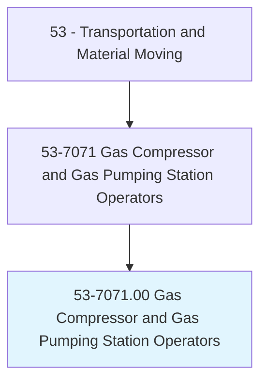
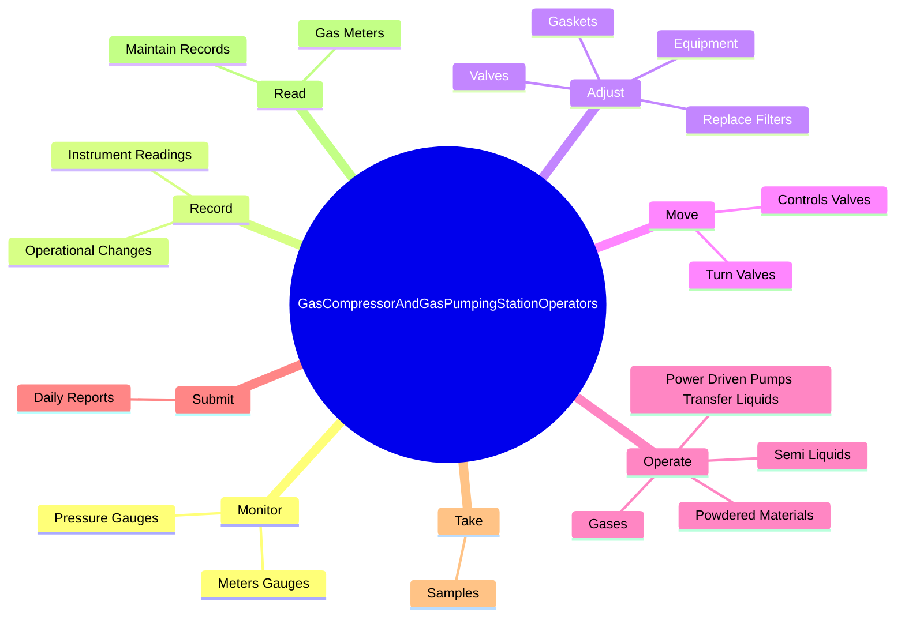
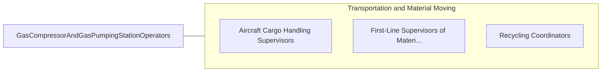

# Gas Compressor and Gas Pumping Station Operators

> Operate steam-, gas-, electric motor-, or internal combustion-engine driven compressors. Transmit, compress, or recover gases, such as butane, nitrogen, hydrogen, and natural gas.

## Overview

Gas Compressor and Gas Pumping Station Operators is an occupation within the Transportation and Material Moving category. Operate steam-, gas-, electric motor-, or internal combustion-engine driven compressors. 

## Classification Hierarchy

## Key Statistics

| Metric | Value |
|--------|-------|
| SOC Code | 53-7071.00 |
| Category | [Transportation and Material Moving](/occupations/Transportation/index) |
| Task Count | 45 |
| Source | O*NET |

## Core Tasks

### monitor.MetersGauges

Gas Compressor and Gas Pumping Station Operators monitor meters gauges as part of their core responsibilities.

**Actions:**
- `monitor.MetersGauges.to.determine.ConsumptionRateVariations`
- `monitor.MetersGauges.to.Temperatures`
- `monitor.MetersGauges.to.Pressures`
- `monitor.PressureGauges.to.determine.ConsumptionRateVariations`

### record.InstrumentReadings

Gas Compressor and Gas Pumping Station Operators record instrument readings as part of their core responsibilities.

**Actions:**
- `record.InstrumentReadings.in.OperatingLogs`
- `record.OperationalChanges.in.OperatingLogs`

### adjust.Valves

Gas Compressor and Gas Pumping Station Operators adjust valves as part of their core responsibilities.

**Actions:**
- `adjust.Valves.to.obtain.SpecifiedPerformance`
- `adjust.Equipment.to.obtain.SpecifiedPerformance`
- `adjust.ReplaceFilters`
- `adjust.Gaskets`

## Skills & Competencies

### Technical Skills
- **Vehicle Operation** - Advanced
- **Logistics** - Advanced
- **Safety Compliance** - Advanced

### Soft Skills
- **Communication** - Essential
- **Problem Solving** - Essential
- **Critical Thinking** - Important
- **Teamwork** - Important
- **Adaptability** - Important

## Related Occupations

## Industries

This occupation is found across multiple industries. See [Industries](/industries) for sector-specific employment data.

## Career Progression

---

*Source: O*NET 53-7071.00 - ONETOccupation*
