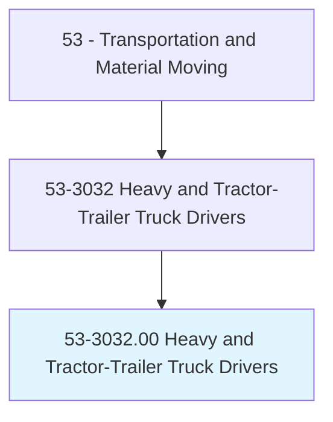
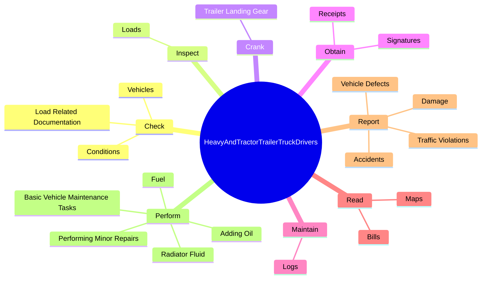
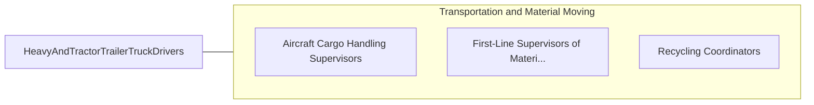

# Heavy and Tractor-Trailer Truck Drivers

> Drive a tractor-trailer combination or a truck with a capacity of at least 26,001 pounds Gross Vehicle Weight (GVW). May be required to unload truck. Requires commercial drivers' license. Includes tow truck drivers.

## Overview

Heavy and Tractor-Trailer Truck Drivers is an occupation within the Transportation and Material Moving category. Drive a tractor-trailer combination or a truck with a capacity of at least 26,001 pounds Gross Vehicle Weight (GVW). May be required to unload truck.

## Classification Hierarchy

## Key Statistics

| Metric | Value |
|--------|-------|
| SOC Code | 53-3032.00 |
| Category | [Transportation and Material Moving](/occupations/Transportation/index) |
| Task Count | 151 |
| Source | O*NET |

## Core Tasks

### check.LoadRelatedDocumentation

Heavy and Tractor-Trailer Truck Drivers check load related documentation as part of their core responsibilities.

**Actions:**
- `check.LoadRelatedDocumentation.for.Completeness`
- `check.LoadRelatedDocumentation.for.Accuracy`
- `check.Vehicles.to.ensure.Mechanical`
- `check.Vehicles.to.Safety`

### inspect.Loads

Heavy and Tractor-Trailer Truck Drivers inspect loads as part of their core responsibilities.

**Actions:**
- `inspect.Loads.to.ensure.CargoIsSecure`

### crank.TrailerLandingGear

Heavy and Tractor-Trailer Truck Drivers crank trailer landing gear as part of their core responsibilities.

**Actions:**
- `crank.TrailerLandingGear.up.ToSafelySecureVehicles`

## Skills & Competencies

### Technical Skills
- **Vehicle Operation** - Advanced
- **Logistics** - Advanced
- **Safety Compliance** - Advanced

### Soft Skills
- **Communication** - Essential
- **Problem Solving** - Essential
- **Critical Thinking** - Important
- **Teamwork** - Important
- **Adaptability** - Important

## Related Occupations

## Industries

This occupation is found across multiple industries. See [Industries](/industries) for sector-specific employment data.

## Career Progression

---

*Source: O*NET 53-3032.00 - ONETOccupation*
