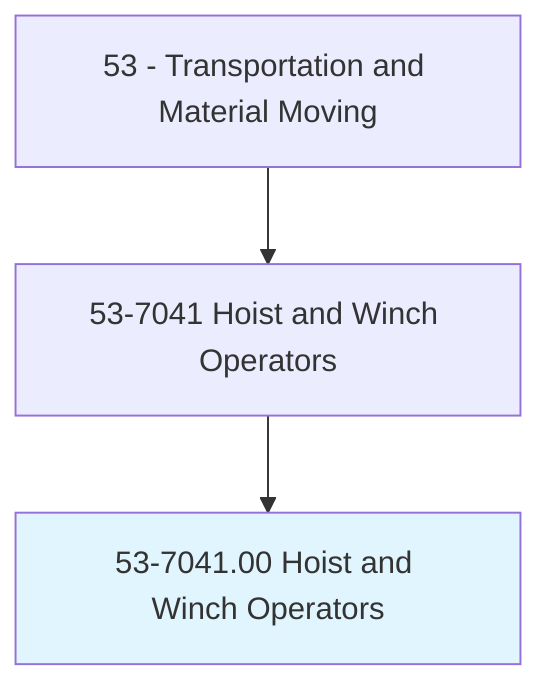
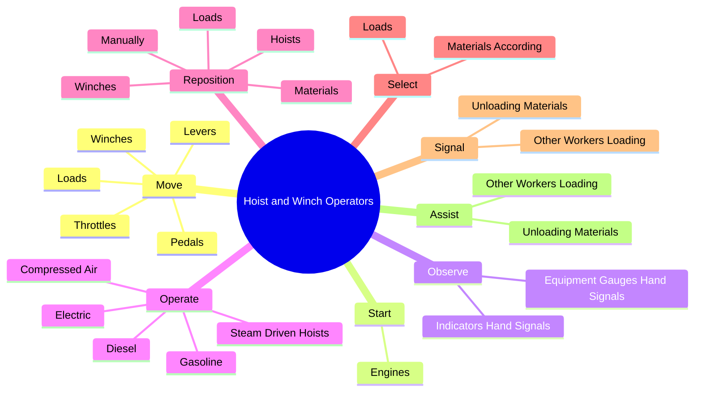
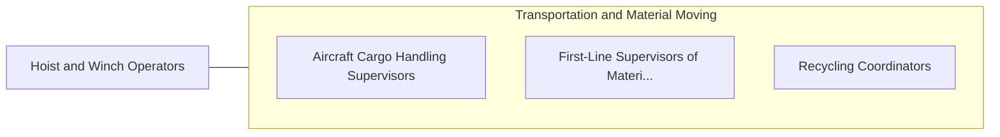

# Hoist and Winch Operators

> Operate or tend hoists or winches to lift and pull loads using power-operated cable equipment.

## Overview

Hoist and Winch Operators is classified under Transportation and Material Moving (SOC 53). Operate or tend hoists or winches to lift and pull loads using power-operated cable equipment.

## Classification Hierarchy

## Key Statistics

| Metric | Value |
|--------|-------|
| SOC Code | 53-7041.00 |
| Category | [Transportation and Material Moving](/occupations/Transportation/index) |
| Task Count | 124 |
| Source | O*NET |

## Core Tasks

### move.Levers

Hoist and Winch Operators move levers as part of their core responsibilities.

**Actions:**
- `move.Levers.to.stop`
- `move.Levers.to.start`
- `move.Levers.to.regulate.SpeedsOfHoistDrumsInResponseToHand`
- `move.Levers.to.WinchDrumsInResponseToHand`

### start.Engines

Hoist and Winch Operators start engines as part of their core responsibilities.

**Actions:**
- `start.Engines.of.HoistsUseLeversPedals.to.wind.UnwindCableOnDrums`
- `start.Engines.of.WinchesUseLeversPedals.to.wind.UnwindCableOnDrums`

### observe.EquipmentGaugesHandSignals

Hoist and Winch Operators observe equipment gauges hand signals as part of their core responsibilities.

**Actions:**
- `observe.EquipmentGaugesHandSignals.of.OtherWorkers.to.verify.LoadPositions`
- `observe.EquipmentGaugesHandSignals.of.Depths`
- `observe.IndicatorsHandSignals.of.OtherWorkers.to.verify.LoadPositions`
- `observe.IndicatorsHandSignals.of.Depths`

## Skills & Competencies

### Technical Skills
- **Vehicle Operation** - Advanced
- **Logistics** - Advanced
- **Safety Compliance** - Advanced

### Soft Skills
- **Communication** - Essential
- **Problem Solving** - Essential
- **Critical Thinking** - Important
- **Teamwork** - Important
- **Adaptability** - Important

## Related Occupations

## Industries

This occupation is found across multiple industries. See [Industries](/industries) for sector-specific employment data.

## Career Progression

---

*Source: O*NET 53-7041.00 - ONETOccupation*
